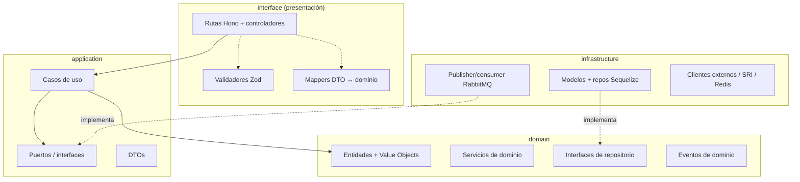

# Clean Architecture (por servicio)

[← Volver al índice](../README.md) · [← Multiorganizacional](./multiorganizacional.md)

Cada microservicio se construye con **arquitectura limpia**: el dominio en el centro, sin saber que existen Hono, Sequelize ni RabbitMQ. Las dependencias apuntan **hacia adentro**.

## Las cuatro capas



### 1. Domain (núcleo)

- **Entidades y Value Objects**: la lógica de negocio pura. Ej.: `Invoice`, `Money`, `TaxRate`, `Ruc` (con su validación de dígito verificador).
- **Interfaces de repositorio**: `InvoiceRepository` (qué se puede hacer), sin implementación.
- **Eventos de dominio**: `InvoiceIssued`.
- **Servicios de dominio**: lógica que no encaja en una sola entidad (ej. cálculo de impuestos combinando varias líneas).
- **No importa nada** de framework. Cero `import` de Hono o Sequelize.

### 2. Application (casos de uso)

- **Casos de uso** orquestan el dominio: `IssueInvoiceUseCase`, `CreateCustomerUseCase`.
- Definen **puertos** (interfaces) hacia el exterior: `EventPublisher`, `TaxRatesProvider`, `Clock`.
- Reciben DTOs, devuelven DTOs; no exponen entidades crudas hacia afuera.
- Aquí vive la **transacción** y la escritura al **Outbox** (ver [comunicación](./comunicacion.md#patrón-outbox-entrega-confiable)).

### 3. Infrastructure (detalles)

- **Sequelize**: modelos y la *implementación* de los repositorios del dominio.
- **RabbitMQ**: implementación de `EventPublisher` y consumidores.
- **Clientes externos**: adaptadores fiscales (SRI/DIAN), Redis, almacenamiento.
- Implementa las interfaces que define el dominio/aplicación (inversión de dependencias).

### 4. Interface / Presentation (borde)

- **Hono**: define rutas, llama al caso de uso, traduce errores a HTTP.
- **Validadores Zod**: validan el request en el borde (ver [validación](./validacion.md)).
- **Mappers**: convierten request → DTO y dominio → response.
- **Middleware**: tenant context, auth de cabeceras, correlation id.

## Regla de dependencia

> El código de una capa solo puede depender de capas **más internas**.
>
> `interface → application → domain` ✅
> `domain → infrastructure` ❌ (jamás)

Sequelize y RabbitMQ están en el borde exterior; el dominio solo conoce **interfaces**. Esto permite testear el dominio sin base de datos y cambiar Sequelize por otra cosa sin tocar la lógica.

## Estructura de carpetas (plantilla por servicio)

```
service-name/
├── src/
│   ├── domain/
│   │   ├── entities/            # Invoice.ts, Customer.ts
│   │   ├── value-objects/       # Money.ts, Ruc.ts, CountryCode.ts
│   │   ├── events/              # InvoiceIssued.ts
│   │   ├── repositories/        # InvoiceRepository.ts (interface)
│   │   └── services/            # TaxCalculator.ts
│   ├── application/
│   │   ├── use-cases/           # IssueInvoice.ts
│   │   ├── ports/               # EventPublisher.ts, Clock.ts
│   │   └── dtos/                # IssueInvoiceInput.ts
│   ├── infrastructure/
│   │   ├── persistence/
│   │   │   ├── models/          # InvoiceModel.ts (Sequelize)
│   │   │   ├── repositories/    # SequelizeInvoiceRepository.ts
│   │   │   └── outbox/          # OutboxModel.ts, OutboxRelay.ts
│   │   ├── messaging/           # RabbitPublisher.ts, consumers/
│   │   └── external/            # SriClient.ts, RedisCache.ts
│   ├── interface/
│   │   └── http/
│   │       ├── routes/          # invoice.routes.ts (Hono)
│   │       ├── controllers/
│   │       ├── validators/      # invoice.schema.ts (Zod)
│   │       ├── mappers/
│   │       └── middleware/      # tenant.ts, auth-headers.ts
│   ├── shared/                  # errores, tipos, utils del servicio
│   └── main.ts                  # composición / inyección de dependencias
├── tests/
└── package.json
```

> El archivo `main.ts` es el **composition root**: ahí se instancian las implementaciones concretas (Sequelize, RabbitMQ) y se inyectan en los casos de uso. Es el único lugar que "conoce" todo.

## Paquetes compartidos (monorepo)

Recomendado un monorepo (pnpm/turbo o nx) con paquetes reutilizables:

| Paquete | Contenido | Lo usan |
|---------|-----------|---------|
| `@crm/contracts` | Esquemas Zod + tipos de eventos y DTOs públicos | back y front |
| `@crm/messaging` | Wrapper de RabbitMQ con Outbox/reconexión/idempotencia | todos los servicios |
| `@crm/tenant` | Middleware de tenant context + repo base con filtro `organization_id` | todos los servicios |
| `@crm/http` | Helpers de Hono (errores, auth de cabeceras, correlation id) | todos los servicios |
| `@crm/result` | Tipo `Result<T, E>` para errores de dominio sin excepciones | back |

`@crm/contracts` es clave: las mismas reglas de validación se comparten entre [validación](./validacion.md) del back y del [front](../frontend/arquitectura-frontend.md).

## Manejo de errores

- **Dominio**: errores de negocio tipados (`InvoiceAlreadyVoided`), sin lanzar `Error` genérico.
- **Aplicación**: devuelve `Result<T, DomainError>` o lanza errores de dominio controlados.
- **Interface**: traduce el error de dominio a código HTTP (`409`, `422`, `404`) con un cuerpo de error estándar `{ code, message, details }`.

## Por qué esta arquitectura aquí

- **Testabilidad**: el cálculo de IVA por país se prueba sin tocar MySQL.
- **Reemplazo de detalles**: cambiar de MySQL, de broker o de proveedor fiscal no toca el dominio.
- **Consistencia entre servicios**: todos siguen la misma plantilla → el equipo navega cualquier servicio igual.

## Siguiente

- Cómo se valida en cada capa y en el front → [validación](./validacion.md)
- Cómo se aplica esta plantilla a un servicio real → [billing-service](../servicios/billing-service.md)
