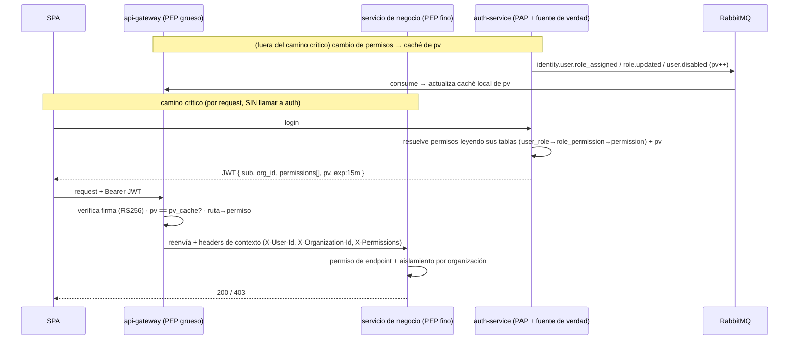
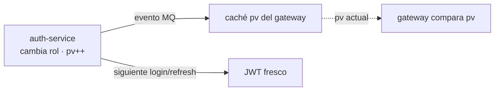

# Autorización (RBAC · permisos · revocación)

[← Volver al índice](../README.md) · [auth-service](../servicios/auth-service.md) · [api-gateway](../servicios/api-gateway.md) · [validación](./validacion.md) · [comunicación](./comunicacion.md)

> **Resumen ejecutivo.** La autorización de este sistema es **híbrida y descentralizada**: el **dato** de roles/permisos vive en MySQL dentro de [auth-service](../servicios/auth-service.md) (único dueño del dominio de identidad y fuente de verdad), **viaja** en los claims del JWT (que firma el propio auth-service leyendo sus tablas), y se **hace cumplir** en el borde ([gateway](../servicios/api-gateway.md), grueso) y dentro de cada servicio (fino, por recurso). **No** se consulta a un servicio de autorización por cada request. La frescura se resuelve con **TTL corto (15 min)** para lo normal y una **versión de permisos (`pv`)** verificada contra una caché local para la revocación instantánea. Este documento justifica esa decisión frente a las alternativas y detalla la implementación a nivel de aplicación.

---

## 1. El problema, en cuatro preguntas

Toda decisión de autorización se reduce a responder cuatro cosas. Confundirlas es la causa de casi todos los diseños malos:

| Pregunta | Responsable en este sistema |
|----------|------------------------------|
| ¿Dónde **vive** el permiso (fuente de verdad)? | **auth-service** (MySQL, dominio de identidad) |
| ¿Cómo **viaja** hasta quien decide? | En los **claims del JWT** (+ header de contexto que inyecta el gateway) |
| ¿Dónde se **decide** (allow/deny)? | **Gateway** (grueso, ruta→permiso) + **cada servicio** (fino, por recurso) |
| ¿Cómo se **revoca** antes de que expire? | **TTL corto** (auto-sana) + **`pv`** (revocación instantánea, chequeo local) |

**Clave conceptual:** *centralizar el dato* **≠** *centralizar la decisión por red*. La fuente de verdad es única (auth-service), pero la **decisión** se toma local, sin salto de red, para no acoplar todo el sistema a un único servicio en el camino crítico.

---

## 2. Vocabulario estándar (modelo XACML)

Estos términos aparecen en toda la literatura (OWASP, papers) y conviene usarlos con precisión:

| Sigla | Nombre | Qué es | En este sistema |
|-------|--------|--------|-----------------|
| **PEP** | Policy **Enforcement** Point | Donde se *aplica* el allow/deny (intercepta la petición) | Middleware del **gateway** y de **cada servicio** |
| **PDP** | Policy **Decision** Point | Donde se *evalúa* la política y se decide | Lógica local en gateway/servicio (no un servicio remoto) |
| **PIP** | Policy **Information** Point | De dónde salen los datos (roles, atributos) | **Tablas RBAC** de auth + claims del JWT |
| **PAP** | Policy **Administration** Point | Donde se *administran* las reglas | **auth-service** (roles, permisos, asignaciones) |

Un error común es fusionar PDP y PIP en un servicio remoto al que se le pregunta por cada request. Nosotros mantenemos **PAP centralizado** (auth) pero **PDP/PEP embebidos** (locales), que es el patrón recomendado para microservicios.

---

## 3. Las cuatro estrategias posibles

Un servicio que necesita decidir `isAllowed(usuario, acción, recurso)` puede obtener los datos de autorización de cuatro formas (taxonomía de Chris Richardson / microservices.io):

| Estrategia | Cómo | Pro | Contra |
|-----------|------|-----|--------|
| **1. Claims en el token** | Los permisos van dentro del JWT | Sin red, rápido, resiliente | Claims obsoletos hasta expirar; token más grande |
| **2. Fetch** | Preguntar al servicio dueño por request | Siempre fresco | Latencia + acoplamiento + punto único de fallo |
| **3. Replicate** | Cada servicio replica los datos vía eventos | Fresco y local | Complejidad de sincronización |
| **4. Delegate** | Delegar la decisión a un servicio central de authz (PDP remoto) | Política unificada, auditable | Latencia por request; ese servicio **debe** ser ultrarrápido y siempre estar arriba |

**Decisión: estrategia 1 (claims en el token).** El JWT lleva los permisos; auth-service los resuelve **leyendo sus propias tablas** al firmar (es la fuente de verdad: no necesita fetch ni replicación entre servicios). Evitamos la 2 y la 4 como mecanismo por defecto porque pondrían a un servicio de autorización en el camino crítico de cada request.

---

## 4. La pregunta central: ¿JWT o consultar MySQL en cada request?

Esta es la duda que hay que resolver bien. Hay tres modelos; el nombre engaña porque **en los tres el dato vive en MySQL** — lo que cambia es *cómo se consulta en el momento de decidir*.

### Opción A — Permisos en el JWT (stateless) ✅ elegido como base

auth firma el token con `org_id` + `permissions`. El gateway/servicio decide leyendo un claim. **Cero red** para autorizar.

- ✅ Latencia casi nula; escala horizontal sin cuello de botella; **resiliente** (autoriza aunque auth esté caído).
- ✅ Es el estándar de facto para microservicios (statelessness + escalabilidad).
- ❌ Los cambios de permiso tardan hasta que expira el token → se mitiga con **TTL corto** (§7).
- ❌ Si la lista de permisos es enorme, el token se infla → se mitiga acotando el catálogo y, si crece, pasando a la Opción C.

### Opción B — PDP remoto / lookup por request (introspección) ❌ no por defecto

El gateway/servicio pregunta a auth (o a la DB) *"¿U tiene `customer:create`?"* en **cada** petición.

- ✅ Frescura total: un cambio aplica al instante; política 100% centralizada y auditable.
- ❌ **Un salto de red por request** → latencia acumulada.
- ❌ auth-service se vuelve **punto único de fallo en el camino crítico**: si se cae, *nada* autoriza. Acopla todo el sistema y escala peor.
- ❌ Cachear las *decisiones* para acelerar reintroduce el problema de obsolescencia (y encima sin control fino).

> Cambiar una ventana de obsolescencia de 15 min *(caso raro)* por un costo de red y una fragilidad **permanentes en cada clic** es mal negocio para un CRM.

### Opción C — Read-model cacheado local (PDP embebido) — evolución futura

Si algún día el token no alcanza (permisos por recurso individual, listas enormes), cada servicio (o el gateway) mantiene una **caché local** de permisos (memoria/Redis) **sincronizada por eventos**, y decide contra esa caché — sin llamar a un servicio central por request.

- ✅ Fresco (se invalida al instante con el evento) **y** local (sin red por request).
- ✅ Es el patrón "centralizado con PDP embebido" que recomiendan los papers: la **política/datos** se mantienen actualizados en el servicio, no las decisiones.
- ❌ Más complejidad operativa (un store por servicio).

**Regla de oro (Oso):** *construye la autorización alrededor de tu aplicación, no al revés.* Para roles básicos que caben en un JWT, el enforcement en el borde/servicio es óptimo. Solo cuando la granularidad supera lo que cabe en un token conviene un servicio/motor dedicado.

**Veredicto para este proyecto:** **Opción A** como base (permisos en el JWT), con la **Opción C** documentada como camino de evolución si el modelo se vuelve fino. La Opción B (preguntar por red en cada request) queda descartada como mecanismo por defecto.

---

## 5. Arquitectura elegida (vista de conjunto)



**En una frase:** el dato vive en auth-service, viaja en el JWT, se hace cumplir en el borde y se afina en cada servicio; auth nunca está en el camino crítico de una petición (solo se toca al hacer login/refresh).

---

## 6. Qué va (y qué NO va) dentro del JWT

El token es un **caché firmado** del estado de autorización. Hay que tratarlo con disciplina:

**Claims que incluimos (access token):**

```json
{
  "iss": "auth-service",
  "aud": "crm-api",
  "sub": "uuid-del-usuario",
  "email": "user@org.com",
  "org_id": "uuid-de-la-organizacion-activa",
  "country_code": "EC",
  "permissions": ["customer:read", "customer:create", "invoice:read"],
  "pv": 7,
  "iat": 1893456000,
  "exp": 1893456900
}
```

**Reglas:**

- **Access token 15 min**, refresh token largo (rotativo, hasheado en DB — ya implementado en auth).
- **Nunca** metas contraseñas, secretos, ni PII sensible: el payload es base64, se lee trivialmente (no está cifrado, solo firmado).
- **No infles** el token con listas gigantes. El catálogo de permisos de un CRM es acotado (decenas). Si algún día explota, migra a Opción C (§4) y deja en el token solo `sub` + `org_id` + `pv`.
- **`org_id`** define la organización activa de la sesión. Si el usuario pertenece a varias, cambiar de organización = re-emitir token con otro `org_id` y sus permisos.
- **`pv`** (permissions version) es el gancho de revocación instantánea (§7).
- Firma **RS256** (asimétrica): auth firma con la privada, todos verifican con la pública. Nunca `alg: none`; fija el algoritmo esperado explícitamente al verificar (evita el ataque de confusión de algoritmo).

> **Nota de diseño (roles vs. permisos en el token):** metemos **permisos** (`recurso:acción`), no roles. El mapeo rol→permisos se resuelve en auth al construir el token y se mantiene server-side. Así, si cambian los permisos de un rol, el cambio entra al refrescar sin depender de traducir roles en cada servicio.

---

## 7. Revocación: las dos capas

El punto sensible. Un JWT es válido hasta que expira; si le quitas un permiso a alguien, su token vigente todavía lo trae. Se resuelve en dos capas según la urgencia:

### Capa 1 — TTL corto (auto-sana lo normal)

Cambios cotidianos (ajustar un rol, quitar `invoice:void`): se toleran hasta 15 min. Al refrescar, auth resuelve los permisos frescos leyendo sus tablas y firma un token nuevo. **No requiere nada extra.** Es el modelo OAuth 2.0: revocar = dejar de emitir nuevos access tokens desde el refresh.

### Capa 2 — `permissions_version` (revocación instantánea, sin red)

Para "sácalo YA" (despido, cuenta comprometida) sin esperar 15 min:

1. auth guarda un contador `pv` por usuario (columna en `user`) y lo mete como claim.
2. Cuando auth registra un cambio de seguridad (`role_assigned` / `user.disabled` / `role.updated`), ese contador **se incrementa** en la fila del usuario y se emite el evento.
3. El PEP (gateway) compara el `pv` del token contra el `pv` **actual cacheado local** (memoria o Redis, actualizado por el evento de RabbitMQ).
4. ¿No coinciden? → token obsoleto → `401` → el cliente refresca → token nuevo con permisos y `pv` frescos.

**Lo crítico:** ese chequeo es un **lookup local** (memoria/Redis), **no** una llamada a auth por request. Sigue siendo rápido y resiliente; solo "reacciona" cuando de verdad hubo un cambio de seguridad.

Y ya tenemos media solución: auth **guarda los refresh tokens rotativos hasheados** → revocación a nivel de sesión existe. `pv` completa la revocación a nivel de access token.

| Evento | Mecanismo | Latencia de aplicación |
|--------|-----------|------------------------|
| Cambio de rol / permiso normal | TTL corto (refresh) | ≤ 15 min |
| Despido / compromiso / baja | `pv` desincronizado → 401 forzado | Siguiente request |
| Logout / cierre de sesión | Refresh token revocado (denylist en DB) | Inmediato (no re-emite) |

> **Alternativa considerada y descartada por defecto:** denylist de `jti` en Redis chequeado en cada request. Da revocación inmediata pero **reintroduce un lookup por request** — justo lo que el JWT venía a evitar. `pv` logra el mismo efecto reaccionando solo ante cambios reales, no en cada petición.

---

## 8. Implementación a nivel de aplicación

Referencias de código orientativas (stack: Node + TypeScript + Hono + jose + Sequelize + RabbitMQ). No es copy-paste literal; fija la estructura.

### 8.1 auth-service — fuente de verdad (RBAC) + eventos hacia afuera

Administra en `auth_db` las tablas `user` (con `permissions_version`), `role`, `permission`, `user_role`, `role_permission`, `organization_membership` (ver [auth-service](../servicios/auth-service.md)). Ante un cambio de seguridad, **incrementa `pv`** del usuario y publica en el Outbox (para la caché de `pv` de los PEP y para otros servicios):

```
identity.user.role_assigned   { userId, organizationId, roleId }
identity.role.updated         { roleId, organizationId }
identity.user.disabled        { userId }
```

Es el **PAP**. No expone endpoint de "¿tiene permiso?" en el camino crítico: la decisión se toma con los claims del token.

### 8.2 auth-service — emisión del JWT (leyendo sus propias tablas)

No hay read-model ni consumidor interno: al firmar, se **resuelven los permisos efectivos con un JOIN** sobre las tablas RBAC de la misma base, y el `pv` se lee de la fila del usuario.

```ts
// auth-service/src/infrastructure/security/token-issuer.ts
async function effectivePermissions(userId: string, orgId: string): Promise<string[]> {
  const rows = await sequelize.query(`
    SELECT DISTINCT p.code
    FROM user_role ur
    JOIN role_permission rp ON rp.role_id = ur.role_id
    JOIN permission p       ON p.id = rp.permission_id
    WHERE ur.user_id = :userId AND ur.organization_id = :orgId
  `, { replacements: { userId, orgId }, type: QueryTypes.SELECT });
  return rows.map((r: any) => r.code);
}

async function issueAccessToken(user, orgId, countryCode) {
  const permissions = await effectivePermissions(user.id, orgId);
  return new SignJWT({
    email: user.email,
    org_id: orgId,
    country_code: countryCode,
    permissions,
    pv: user.permissions_version,   // columna en la fila del usuario
  })
    .setProtectedHeader({ alg: 'RS256' })
    .setSubject(user.id)
    .setIssuer('auth-service')
    .setAudience('crm-api')
    .setIssuedAt()
    .setExpirationTime('15m')
    .sign(privateKey);
}
```

Al cambiar un rol/permiso, auth hace `UPDATE user SET permissions_version = permissions_version + 1` y emite el evento; el siguiente login/refresh ya firma con permisos y `pv` frescos.

### 8.3 gateway — PEP grueso (ruta→permiso) + chequeo de `pv`

El gateway ya verifica la firma RS256 e inyecta contexto. Se le añade: (a) chequeo de `pv` contra caché local, (b) mapa ruta→permiso.

```ts
// api-gateway-node/src/core/authorizer.ts
export function authorize(routePermission: string | null) {
  return async (c, next) => {
    const claims = c.get('claims');              // ya verificado (RS256)

    // (a) revocación instantánea: pv del token vs pv cacheado (memoria/Redis)
    const currentPv = pvCache.get(claims.sub, claims.org_id); // sync por evento MQ
    if (currentPv !== undefined && claims.pv < currentPv) {
      return c.json({ code: 'TOKEN_STALE', message: 'Refresca la sesión' }, 401);
    }

    // (b) enforcement grueso: la ruta exige un permiso concreto
    if (routePermission && !claims.permissions?.includes(routePermission)) {
      return c.json({ code: 'FORBIDDEN', message: 'Permiso insuficiente' }, 403);
    }
    await next();
  };
}
```

Mapa declarativo (config-driven, en `gateway.config.ts`):

```ts
routes: [
  { method: 'POST',   path: '/customers',     service: 'customer', permission: 'customer:create' },
  { method: 'GET',    path: '/customers',     service: 'customer', permission: 'customer:read'   },
  { method: 'DELETE', path: '/customers/:id', service: 'customer', permission: 'customer:delete' },
]
```

Anti-spoofing (ya implementado): el gateway **elimina** cualquier `X-User-Id` / `X-Organization-Id` / `X-Permissions` que venga del cliente y los **reescribe** desde los claims verificados. Los servicios internos no están expuestos directamente; confían en estos headers porque el único ingreso es el gateway.

### 8.4 cada servicio — PEP fino (por recurso) + aislamiento

El servicio **no** verifica el JWT (confía en los headers del gateway). Hace dos cosas:

```ts
// customer-service/src/interface/middleware/require-permission.ts
export const requirePermission = (perm: string) => async (c, next) => {
  const perms = (c.req.header('X-Permissions') ?? '').split(',');
  if (!perms.includes(perm)) {
    return c.json({ code: 'FORBIDDEN', message: 'Permiso insuficiente' }, 403);
  }
  await next();
};
```

Y el **aislamiento por organización** (lo que el gateway no puede saber: que el recurso pertenezca a la org del usuario) se aplica **siempre** en el repositorio, no como un `if` suelto:

```ts
// toda query filtra por la organización del contexto
const org = c.req.header('X-Organization-Id');
const customer = await Customer.findOne({ where: { id, organization_id: org } });
if (!customer) return c.json({ code: 'NOT_FOUND' }, 404); // no revela cross-org
```

> El permiso (`customer:update`) se valida arriba; la **pertenencia** del dato a la organización se valida aquí. Son controles distintos y ambos son obligatorios.

### 8.5 propagación de cambios (el "pegamento")



Al cambiar un rol/permiso, auth incrementa `pv` en la fila del usuario y emite el evento; el gateway actualiza su caché local de `pv`. El JWT fresco se obtiene en el siguiente login/refresh. Nada de esto está en el camino crítico de una petición normal.

---

## 9. Tabla de tradeoffs (resumen)

| Criterio | A. JWT claims (elegido) | B. PDP remoto por request | C. Read-model local (evolución) |
|----------|-------------------------|---------------------------|----------------------------------|
| Latencia de autorizar | Nula (lee claim) | Alta (red por request) | Baja (lookup local) |
| Resiliencia si el authz central cae | Total | Nula (bloquea todo) | Total |
| Frescura de cambios | ≤15 min (o `pv` inmediato) | Inmediata | Inmediata |
| Escalabilidad | Excelente | Limitada por el PDP | Excelente |
| Complejidad | Baja | Media | Media-alta |
| Tamaño del token | Crece con permisos | Mínimo | Mínimo |
| Punto único de fallo | No | **Sí** | No |

---

## 10. ¿Cuándo migrar a un motor de autorización dedicado?

Construir RBAC a mano (lo que hacemos) es correcto para un CRM. Un motor externo se justifica cuando el modelo se vuelve **ABAC** (atributos/condiciones) o **ReBAC** (relaciones tipo "el usuario es dueño del documento X"). Panorama actual:

| Herramienta | Modelo | Despliegue | Cuándo |
|-------------|--------|-----------|--------|
| **Cerbos** | RBAC/ABAC, YAML+CEL | Sidecar / librería / servicio, stateless, sub-ms | Si quieres externalizar políticas sin aprender Rego; baja curva |
| **OPA** | Propósito general, Rego | Sidecar / embebido | Política de **infraestructura** (K8s admission, CI/CD); curva alta |
| **OpenFGA / SpiceDB** | ReBAC (modelo Google Zanzibar) | Servicio con DB | Permisos por relación a gran escala (millones de tuplas) |
| **Permit.io / AWS Verified Permissions** | Authz como servicio | Gestionado | Si prefieres no operar el motor |

Notas: OPA quedó con incertidumbre de gobernanza tras la contratación de sus creadores por Apple (ago-2025). Si se adopta un motor, el patrón sano es **sidecar/embebido** (decisión local, sub-ms), no un servicio central en el camino crítico — coherente con todo este documento. **Regla:** no adoptes un motor hasta que el RBAC+JWT deje de alcanzar; la mayoría de CRMs nunca llega a ese punto.

---

## 11. Checklist de seguridad (JWT)

- [ ] Firma **RS256**; algoritmo fijado explícitamente al verificar; `alg: none` rechazado.
- [ ] Access token **≤15 min**; refresh largo, **rotativo** y **hasheado** en DB.
- [ ] `iss` = `auth-service`, `aud` = `crm-api` validados en cada verificación.
- [ ] Sin PII sensible ni secretos en el payload.
- [ ] `pv` presente y comparado contra caché local en el PEP.
- [ ] Gateway **elimina** headers `X-*` entrantes del cliente y los reescribe desde claims.
- [ ] Servicios internos no expuestos directamente (solo vía gateway).
- [ ] Aislamiento por `organization_id` aplicado en **todas** las queries, no solo en el permiso.
- [ ] Clave pública distribuida vía archivo/secret; privada solo en auth-service.

---

## 12. Referencias

Prácticas verificadas (2025–2026):

- microservices.io — *Authn/authz part 3: JWT-based access tokens* (las 4 estrategias).
- arxiv 2009.02114 — *Authn/authz in microservice-based systems: survey of architecture patterns* (PDP embebido).
- arxiv 2201.05825 — *Decision models for selecting patterns in microservices* (impacto en latencia del PDP remoto).
- Oso — *Microservices authorization patterns* ("construye la autorización alrededor de tu app").
- WorkOS / JSONCraft / env.dev / devtoolkit.cloud (2026) — *JWT best practices* (TTL corto, denylist, versioned claims, scopes en token, no PII).
- FusionAuth / SuperTokens — revocación de JWT y refresh tokens.
- Cerbos / AuthZed / Permit.io — motores de autorización externalizada (Cerbos, OPA, OpenFGA, SpiceDB).

> Ver también: [auth-service](../servicios/auth-service.md) (modelo RBAC, emisión de tokens y eventos), [api-gateway](../servicios/api-gateway.md) (PEP de borde), [multiorganizacional](./multiorganizacional.md) (aislamiento por organización), [validación](./validacion.md) (validación en el borde y dominio).
