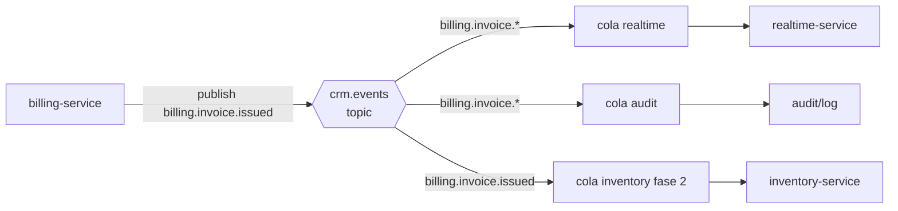
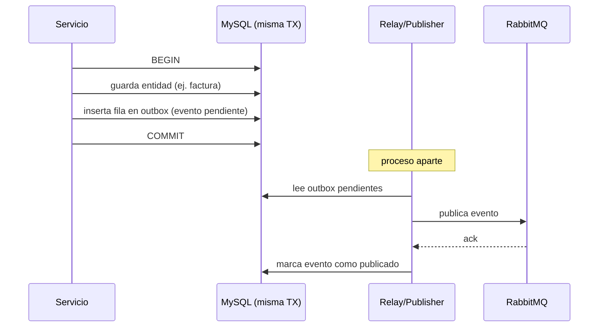
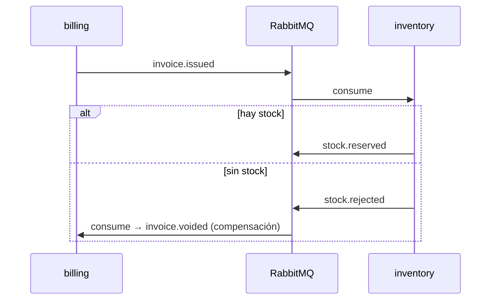

# Comunicación entre Servicios

[← Volver al índice](../README.md) · [← Microservicios](./microservicios.md)

Dos canales, dos propósitos:

| Canal | Cuándo | Tecnología | Ejemplo |
|-------|--------|------------|---------|
| **Síncrono (REST)** | Necesito una respuesta ahora para continuar | HTTP a través del [gateway](../servicios/api-gateway.md) | El front pide la lista de clientes |
| **Asíncrono (eventos)** | Algo pasó y otros deben enterarse, pero no bloqueo | RabbitMQ | Se emitió una factura → notificar, auditar, descontar stock |

Regla: **comandos del usuario** entran por REST; **propagación de cambios** sale por eventos.

> **Estado al 2026-09-14.** El patrón Outbox y los reintentos del consumidor ya no se implementan a mano en cada servicio: viven en la librería [@facturero/outbox-relay](../servicios/outbox-relay.md), **cableada en todos los servicios que publican** (todos menos notification, audit y assistant, que solo consumen).
>
> Tres cosas que conviene leer allí antes de tocar mensajería: la **escalera de reintentos** (inmediatos → cola de espera con TTL → estado `failed` en la tabla de idempotencia, no una DLQ de RabbitMQ); el **cambio de topología de 0.1.x a 0.2.x**, que exige borrar a mano las colas `<queue>.retry` heredadas; y el **`ActorContext`**, que propaga *quién* origina la acción hasta el outbox — sin él la bitácora de auditoría queda con `user_id` e `ip` en NULL.
>
> ⚠️ **Latencia real de los eventos:** la publicación inmediata tras el commit **no está cableada en ningún servicio**, así que hoy todo evento sale por el temporizador de respaldo del relay: **de 0 a 30 s de retraso**. Detalle y arreglo en [outbox-relay](../servicios/outbox-relay.md).
>
> Para las llamadas **síncronas entre servicios** (no del frontend) el mecanismo es el secreto compartido `internal-service-secret` en la cabecera `X-Internal-Secret`, que el gateway **borra** de cualquier petición que venga de fuera.

## Comunicación síncrona

Todo el tráfico del cliente pasa por el [API Gateway](../servicios/api-gateway.md), que:

1. Valida el JWT (emitido por [auth-service](../servicios/auth-service.md)).
2. Extrae `userId`, `organizationId` y permisos del token.
3. Inyecta cabeceras de contexto al servicio destino: `X-User-Id`, `X-Organization-Id`, `X-Country-Code`, `X-Request-Id`.
4. Enruta a la ruta interna del servicio.

Los servicios **evitan llamarse en cadena** de forma síncrona (acoplamiento + latencia + fallos en cascada). Si billing-service necesita un dato de otro servicio, lo prefiere vía read-model local alimentado por eventos. Solo se permite una llamada síncrona servicio→servicio cuando el dato es imprescindible y no replicable (raro).

## Comunicación asíncrona (RabbitMQ)

### Topología

- **Exchange principal:** `crm.events` de tipo `topic`.
- **Routing keys:** `{contexto}.{evento}`, ej. `billing.invoice.issued`, `customer.customer.created`, `identity.user.role_assigned`.
- **Una cola por (servicio consumidor × interés).** Cada servicio declara sus colas y bindea los routing keys que le importan.
- **Metadatos obligatorios en cada mensaje:** `eventId`, `organizationId`, `occurredAt`, `version`, `correlationId`.

### Patrón Outbox (entrega confiable)

Problema: si guardo en MySQL y luego publico en RabbitMQ por separado, un fallo entre ambos pasos pierde o duplica eventos.

Solución: **Outbox transaccional**.

Así el evento se persiste **en la misma transacción** que el cambio de negocio. El relay reintenta hasta confirmar. Esto encaja con la librería de resiliencia de RabbitMQ que ya manejas (Outbox + reconexión + fast-path).

### Idempotencia en consumidores

Cada consumidor guarda los `eventId` ya procesados (tabla `processed_events`). Si llega un duplicado, lo descarta. Indispensable porque RabbitMQ garantiza *at-least-once*, no *exactly-once*.

## Catálogo de eventos del sistema

| Evento (routing key) | Lo publica | Lo consumen | Para qué |
|----------------------|-----------|-------------|----------|
| `identity.user.created` | auth | realtime | Dar bienvenida / notificar |
| `identity.user.role_assigned` | auth | gateway (caché de `pv`) | Invalidar tokens con permisos viejos |
| `identity.user.disabled` | auth | gateway, realtime | Revocar acceso del usuario |
| `organization.org.updated` | organization | auth, billing | auth: refrescar `country_code` del token · billing: snapshot del emisor |
| `organization.establishment.created` | organization | billing | Registrar punto de facturación válido |
| `organization.billing_point.created` | organization | billing | Habilitar secuencial |
| `customer.customer.created` | customer | realtime | Refrescar listas en vivo |
| `customer.customer.updated` | customer | billing | Actualizar snapshot en borradores |
| `product.product.updated` | product | billing | Actualizar precio en borradores |
| `tax.tax_rate.upserted` | tax | product, billing | Upsert de tasas en read-models locales |
| `billing.invoice.issued` | billing | realtime, audit, (inventory, payment) | Notificar, auditar, descontar stock, cuentas por cobrar |
| `billing.invoice.authorized` | billing | realtime | Avisar autorización del SRI/DIAN/etc. |
| `billing.invoice.voided` | billing | realtime, audit, (inventory) | Reversar |

> Convención: eventos siempre en **pasado** y nombrados por el hecho de negocio, no por la tabla.

## Saga: procesos que cruzan servicios

Cuando una operación abarca varios servicios y no puede ser una sola transacción, se usa una **coreografía de saga** (cada servicio reacciona a eventos y, si falla, emite un evento compensatorio).

Ejemplo — emisión con descuento de inventario (fase 2):

No usamos transacciones distribuidas (2PC); preferimos **consistencia eventual** con compensaciones.

## Auditoría

Un consumidor de auditoría (o `audit-service`) bindea `#` (todos los eventos) del exchange `crm.events` y los persiste con `userId`, `organizationId`, `occurredAt` y payload. Esto da la **bitácora de cumplimiento** sin acoplar cada servicio al registro de auditoría. Crítico para facturación electrónica. → Ver el servicio diseñado: [audit-log-service](../servicios/audit-log-service.md).

## Resiliencia

- **Reintentos con backoff** en publicación y consumo.
- **Dead Letter Exchange (DLX):** mensajes que fallan N veces van a `crm.events.dlx` para inspección manual.
- **Reconexión automática** ante caída del broker (la librería que ya tienes).
- **Circuit breaker** en las pocas llamadas síncronas servicio→servicio.

## Siguiente

- Cómo viaja el `organizationId` en cada request y evento → [multiorganizacional](./multiorganizacional.md)
- Quién valida qué en cada frontera → [validación](./validacion.md)
