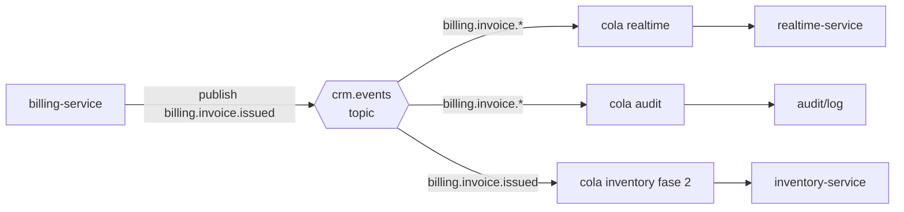
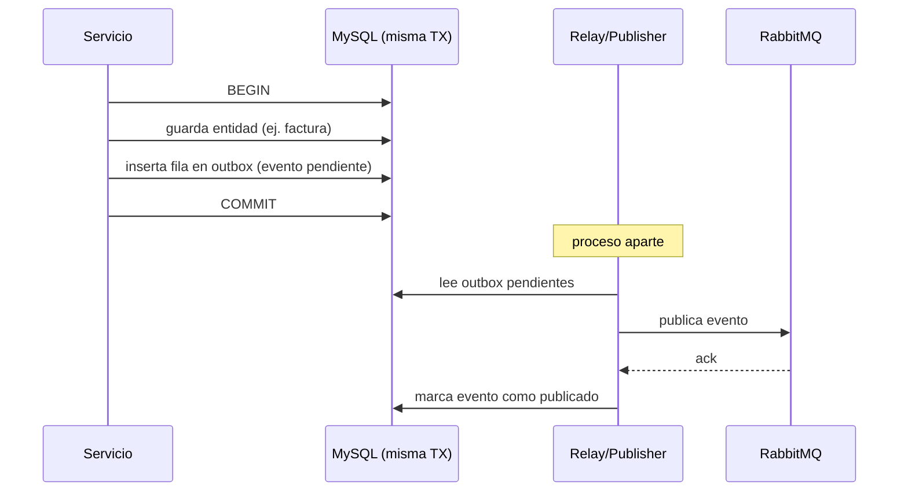
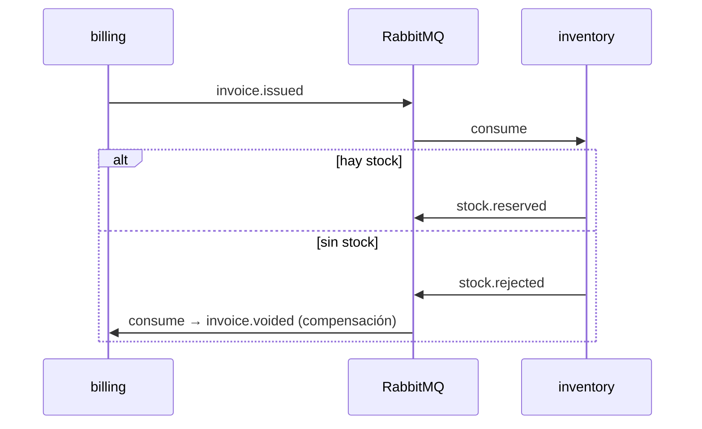

# Comunicación entre Servicios

[← Volver al índice](../README.md) · [← Microservicios](./microservicios.md)

Dos canales, dos propósitos:

| Canal | Cuándo | Tecnología | Ejemplo |
|-------|--------|------------|---------|
| **Síncrono (REST)** | Necesito una respuesta ahora para continuar | HTTP a través del [gateway](../servicios/api-gateway.md) | El front pide la lista de clientes |
| **Asíncrono (eventos)** | Algo pasó y otros deben enterarse, pero no bloqueo | RabbitMQ | Se emitió una factura → notificar, auditar, descontar stock |

Regla: **comandos del usuario** entran por REST; **propagación de cambios** sale por eventos.

> **Estado al 2026-09-16.** El patrón Outbox y los reintentos del consumidor ya no se implementan a mano en cada servicio: viven en la librería [@facturero/outbox-relay](../servicios/outbox-relay.md), **cableada en todos los servicios que publican** (todos menos notification, audit y assistant, que solo consumen).
>
> Tres cosas que conviene leer allí antes de tocar mensajería: la **escalera de reintentos** (inmediatos → cola de espera con TTL → estado `failed` en la tabla de idempotencia, no una DLQ de RabbitMQ); el **cambio de topología de 0.1.x a 0.2.x**, que exige borrar a mano las colas `<queue>.retry` heredadas; y el **`ActorContext`**, que propaga *quién* origina la acción hasta el outbox — sin él la bitácora de auditoría queda con `user_id` e `ip` en NULL.
>
> **Latencia de los eventos (2026-09-15):** los 10 servicios que publican enganchan la transacción al relay en su unidad de trabajo (`attachToTransaction`), así que cada evento sale **justo tras el COMMIT**. El temporizador de 30 s queda solo como red de seguridad. Hasta el 2026-09-14 no era así y todo evento tardaba entre 0 y 30 s: un servicio nuevo sin ese enganche vuelve a ese comportamiento. Detalle en [outbox-relay](../servicios/outbox-relay.md).
>
> Para las llamadas **síncronas entre servicios** (no del frontend) el mecanismo es el secreto compartido `internal-service-secret` en la cabecera `X-Internal-Secret`, que el gateway **borra** de cualquier petición que venga de fuera.

## Comunicación síncrona

Todo el tráfico del cliente pasa por el [API Gateway](../servicios/api-gateway.md), que:

1. Valida el JWT (emitido por [auth-service](../servicios/auth-service.md)).
2. Extrae `userId`, `organizationId` y permisos del token.
3. Inyecta cabeceras de contexto al servicio destino: `X-User-Id`, `X-Organization-Id`, `X-Country-Code`, `X-Request-Id`.
4. Enruta a la ruta interna del servicio.

Los servicios **evitan llamarse en cadena** de forma síncrona (acoplamiento + latencia + fallos en cascada). Si billing-service necesita un dato de otro servicio, lo prefiere vía read-model local alimentado por eventos. Solo se permite una llamada síncrona servicio→servicio cuando el dato es imprescindible y no replicable (raro).

> ⚠️ **La realidad (2026-09-16) es la contraria para el núcleo de facturación.** billing-service consulta **por HTTP** a organization, customer, product y tax en cada operación; product-service consulta a tax y organization; fiscal-ecuador a document, tax y organization. Los únicos read-models por eventos son los de customer-service (tipos de identificación), auth-service (país de la organización) e inventory-service (productos, plugins). Consecuencia: **si customer-service, product-service o tax-service están caídos, no se pueden crear facturas ni añadirles líneas**. Las llamadas internas llevan `X-Internal-Secret` o cabeceras de contexto.

## Comunicación asíncrona (RabbitMQ)

### Topología

- **Exchange principal:** `crm.events` de tipo `topic`.
- **Routing keys:** `{contexto}.{evento}`, ej. `billing.invoice.issued`, `customer.customer.created`, `identity.user.role_assigned`.
- **Una cola por (servicio consumidor × interés).** Cada servicio declara sus colas y bindea los routing keys que le importan.
- **Metadatos obligatorios en cada mensaje:** `eventId`, `organizationId`, `occurredAt`, `version`, `correlationId`.

```mermaid
graph LR
    BILL[billing-service] -->|publish billing.invoice.issued| EX{{crm.events<br/>topic}}
    EX -->|billing.invoice.*| Q1[cola realtime]
    EX -->|billing.invoice.*| Q2[cola audit]
    EX -->|billing.invoice.issued| Q3[cola inventory fase 2]
    Q1 --> RT[realtime-service]
    Q2 --> AUD[audit/log]
    Q3 --> INV[inventory-service]
```

### Patrón Outbox (entrega confiable)

Problema: si guardo en MySQL y luego publico en RabbitMQ por separado, un fallo entre ambos pasos pierde o duplica eventos.

Solución: **Outbox transaccional**.

```mermaid
sequenceDiagram
    participant S as Servicio
    participant DB as MySQL (misma TX)
    participant REL as Relay/Publisher
    participant MQ as RabbitMQ

    S->>DB: BEGIN
    S->>DB: guarda entidad (ej. factura)
    S->>DB: inserta fila en outbox (evento pendiente)
    S->>DB: COMMIT
    Note over REL: proceso aparte
    REL->>DB: lee outbox pendientes
    REL->>MQ: publica evento
    MQ-->>REL: ack
    REL->>DB: marca evento como publicado
```

Así el evento se persiste **en la misma transacción** que el cambio de negocio. El relay reintenta hasta confirmar. Esto encaja con la librería de resiliencia de RabbitMQ que ya manejas (Outbox + reconexión + fast-path).

### Idempotencia en consumidores

Cada consumidor guarda los `eventId` ya procesados (tabla `processed_events`). Si llega un duplicado, lo descarta. Indispensable porque RabbitMQ garantiza *at-least-once*, no *exactly-once*.

## Catálogo de eventos del sistema

> **Verificado contra el código el 2026-09-16.** El diseño original hacía que billing, product y organization mantuvieran read-models alimentados por eventos; **no se construyó así**: esos servicios consultan por HTTP. Por eso casi todo lo que ellos "consumían" en el diseño hoy no lo consume nadie salvo la bitácora. El catálogo de lo que publica cada servicio está en su ficha.

[audit-log-service](../servicios/audit-log-service.md) consume **todos** (`#`) y no se repite en la tabla. Solo aparecen los eventos con algún otro consumidor:

| Evento (routing key) | Lo publica | Lo consumen | Para qué |
|----------------------|-----------|-------------|----------|
| `identity.#` (todos) | auth | gateway | Invalidar la caché de `pv` y emitir `permissions.changed` por el socket |
| `identity.user.invited` · `.enabled` · `.disabled` · `.password_reset_requested` | auth | notification | Correo y campana |
| `organization.org.updated` | organization | auth, customer, inventory | auth: `country_code` del token · customer: crear CONSUMIDOR FINAL · inventory: datos de la organización |
| `organization.establishment.created` | organization | inventory | Crear la bodega del establecimiento |
| `organization.billing_point.#` | organization | gateway | `.unlinked` → `pos.unlink` al POS |
| `tax.identification_type.upserted` | tax | customer | Read-model de tipos de identificación |
| `product.product.#` | product | gateway, inventory | gateway: `catalog.changed` (el POS y el front hacen pull) · inventory: read-model de productos |
| `plugin.#` | plugin-catalog | gateway | Invalidar la caché de plugins y emitir `plugins.changed` |
| `plugin.activated` · `.deactivated` | plugin-catalog | inventory | Réplica local de `organization_plugins` |
| `billing.invoice.issued` | billing | fiscal-ecuador, inventory, notification, billing, gateway | fiscal: XML + SRI · inventory: descontar stock · notification: aviso guardado y correo · billing: PDF/XML comerciales · gateway: empuja la notificación a la campana (`user:<uid>`) si el canal `app` está activo |
| `billing.invoice.voided` | billing | fiscal-ecuador, inventory, notification, gateway | fiscal: marca anulada / `void_requires_action` · inventory: reponer stock · aviso |
| `fiscal.ec.invoice.attention_required` | fiscal-ecuador | notification, gateway | Campana: un comprobante necesita a una persona |

Publicados sin consumidor de negocio (solo auditoría): el resto de `customer.*`, `product.category.*`, `product.unit.*`, `tax.*`, `document.file.*`, `inventory.*` y los demás `fiscal.ec.invoice.*` (`pending`, `sent`, `authorized`, `rejected`, `error`, `sequence_gap`…).

No existe `billing.invoice.authorized`: la autorización del SRI la publica fiscal-ecuador como `fiscal.ec.invoice.authorized`, y billing no la escucha.

> Convención: eventos siempre en **pasado** y nombrados por el hecho de negocio, no por la tabla.

## Saga: procesos que cruzan servicios

Cuando una operación abarca varios servicios y no puede ser una sola transacción, se usa una **coreografía de saga** (cada servicio reacciona a eventos y, si falla, emite un evento compensatorio).

Ejemplo — emisión con descuento de inventario (fase 2):

```mermaid
sequenceDiagram
    participant B as billing
    participant MQ as RabbitMQ
    participant I as inventory

    B->>MQ: invoice.issued
    MQ->>I: consume
    alt hay stock
        I->>MQ: stock.reserved
    else sin stock
        I->>MQ: stock.rejected
        MQ->>B: consume → invoice.voided (compensación)
    end
```

No usamos transacciones distribuidas (2PC); preferimos **consistencia eventual** con compensaciones.

> ⚠️ **Ese diagrama es diseño; lo construido no compensa.** [inventory-service](../servicios/inventory-service.md) **no rechaza** una factura por falta de stock ni publica `stock.reserved`/`stock.rejected`: descuenta igualmente, deja la existencia en negativo y publica `inventory.stock.negative` para que una persona lo revise. Una venta ya cobrada (sobre todo desde el POS) no se anula por un descuadre de inventario. Hoy no hay ninguna saga con compensación en el sistema.

## Auditoría

Un consumidor de auditoría (o `audit-service`) bindea `#` (todos los eventos) del exchange `crm.events` y los persiste con `userId`, `organizationId`, `occurredAt` y payload. Esto da la **bitácora de cumplimiento** sin acoplar cada servicio al registro de auditoría. Crítico para facturación electrónica. → Ver el servicio diseñado: [audit-log-service](../servicios/audit-log-service.md).

## Resiliencia

Lo construido (2026-09-16), todo en [@facturero/outbox-relay](../servicios/outbox-relay.md):

- **Publicación:** outbox en la misma transacción, publicado tras el COMMIT, con el temporizador de 30 s como red de seguridad.
- **Consumo:** reintentos inmediatos → cola de espera con TTL (`<queue>.retry.wait`) → estado `failed` en `processed_events`. **No hay DLX** tipo `crm.events.dlx`: lo que falla del todo se consulta por SQL.
- **Reconexión automática** ante caída del broker.
- **Sin circuit breaker** en las llamadas síncronas entre servicios, que además son más de las previstas (ver arriba).

## Siguiente

- Cómo viaja el `organizationId` en cada request y evento → [multiorganizacional](./multiorganizacional.md)
- Quién valida qué en cada frontera → [validación](./validacion.md)
