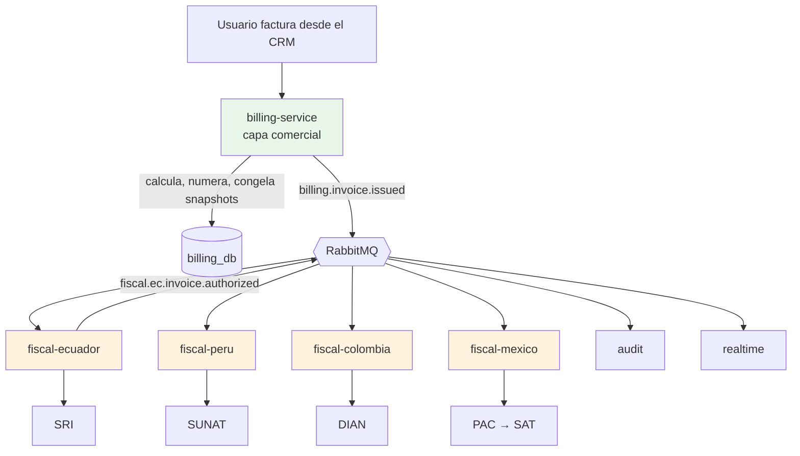

# Estrategia Multipaís

[← Volver al índice](../README.md) · [multiorganizacional](./multiorganizacional.md) · [billing-service](../servicios/billing-service.md) · [tax-service](../servicios/tax-service.md) · [fiscal-ecuador](../servicios/fiscal-ecuador.md)

> **Principio rector:** un **núcleo de facturación comercial idéntico** en todos los países, más **servicios fiscales separados por país** que se enchufan por eventos. Billing no contiene `if (país === 'EC')` ni conoce SRI/DIAN/SUNAT/SAT. Agregar un país = **un servicio nuevo** que consume eventos + filas de configuración fiscal en `tax`.

## La decisión

Este documento captura cuatro decisiones que se tomaron juntas:

1. **billing-service** es puro **flujo comercial**: emite, calcula con Dinero.js, congela snapshots, asigna secuencial. Ciclo `draft → issued → voided`. **No conoce autoridades fiscales.**
2. **Servicios fiscales por país** (`fiscal-ecuador`, `fiscal-peru`, `fiscal-colombia`, `fiscal-mexico`) — cada uno responsable de la firma, envío y autorización ante SU autoridad. **Servicios separados**, no módulos internos de billing.
3. **Comunicación por eventos**: billing publica `billing.invoice.issued`; los servicios fiscales lo consumen. Nadie llama a nadie por HTTP en el camino crítico.
4. **`organization_id` como aislamiento**; **`country_code` como dimensión fiscal**. Multi-moneda desde el diseño (cada factura con su `currency_code`).

Esta arquitectura permite:
- **Vender billing solo** a clientes que no necesitan facturación electrónica.
- **Construir un país a la vez** sin tocar billing.
- **Fallo aislado**: si `fiscal-ecuador` se cae, billing sigue emitiendo comercialmente; las facturas se autorizan cuando el servicio vuelve.

## Núcleo invariante + servicios fiscales por país

El **núcleo** ([billing-service](../servicios/billing-service.md)) sabe de: factura, líneas, impuestos como concepto, cálculo con Dinero.js, snapshots inmutables y máquina de estados **puramente comercial** (`draft → issued → voided`). **No conoce** ningún ente fiscal.

Todo lo fiscal (firma, transmisión, autorización, formato XML/CFDI, RIDE con QR, contingencia) vive en un **servicio dedicado por país**. Consumen eventos de billing y publican eventos fiscales de vuelta.

| Costura | Cómo se resuelve | Agregar país = |
|---------|------------------|----------------|
| **Config fiscal** (impuestos, tipos de ID, tipos de comprobante, moneda, decimales) | **Datos** en [tax-service](../servicios/tax-service.md), filas por `country_code` | Insertar filas. **Cero código.** |
| **Numeración fiscal** (formato del número, alcance del secuencial) | Configuración leída del read-model de tax | Filas de tipo comprobante + doc en el servicio fiscal |
| **Integración fiscal** (firmar, transmitir, autorizar, generar RIDE) | **Servicio dedicado** (`fiscal-<país>`) | Un servicio nuevo |

El ~80% de "soportar un país" es **filas en una tabla**. El 20% restante es un servicio fiscal que ya está aislado del core.

## Los dos niveles: comercial vs. fiscal

Toda venta atraviesa dos capas independientes:



**Capa comercial (billing):**
- Existe siempre, en todos los países.
- Emite facturas con secuencial atómico y snapshots inmutables.
- Cálculos exactos con Dinero.js + centavos BIGINT.
- Reportes de ventas, cobros, dashboards.
- Si nunca se integra un servicio fiscal, el sistema sigue siendo útil comercialmente.

**Capa fiscal (por país):**
- Es opcional (solo si el cliente factura electrónicamente en ese país).
- Consume `billing.invoice.issued` y arma el XML/CFDI correspondiente.
- Firma con el certificado del emisor, envía, recibe autorización.
- Publica `fiscal.<país>.invoice.authorized` con el ID legal (clave de acceso, CUFE, UUID).
- Genera el PDF fiscal (RIDE con QR de autorización).

**Billing NO consume** los eventos `fiscal.*` — el estado fiscal no le pertenece. Si algún consumidor (audit, notificaciones, cliente) quiere saber el estado fiscal, escucha `fiscal.<país>.*` directamente.

## El detalle del secuencial

El número comercial se compone así:

| País | Formato | Scope del secuencial atómico |
|------|---------|------------------------------|
| **Ecuador** | `001-001-000000001` (3-3-9) | `(establishment, emission_point, document_type)` |
| **Perú** | `F001-00000123` | `(serie, document_type)` |
| **Colombia** | `prefijo+consecutivo` | `(prefijo, resolución DIAN)` |
| **México** | Serie+Folio interno opcional | Sin secuencial fiscal — el UUID lo asigna el PAC |

Todo esto vive en `billing.sequences` con clave compuesta flexible. **El secuencial comercial es siempre de billing** (lock atómico, sin huecos). El **ID legal** (clave de acceso, CUFE, UUID) es del servicio fiscal correspondiente.

En Ecuador la clave de acceso de 49 dígitos incluye el secuencial comercial + más datos. En México el UUID lo asigna el PAC **al timbrar** — el número que billing lleva es solo un folio interno. Este detalle importa: `fiscal-ecuador` recibe el número de billing y lo firma; `fiscal-mexico` recibe el CFDI de billing y espera un UUID de vuelta.

## Multi-moneda desde el diseño

Cada factura lleva su `currency_code` (ISO 4217). Los montos van en centavos BIGINT (con Dinero.js). La convención universal del proyecto:

- Montos = enteros en unidad mínima (centavos para USD, céntimos para EUR…) + `currency_code`.
- Tasas de impuesto = decimal string (`"15.00"`).
- Cálculos = Dinero.js v2.

Para reportería en varias monedas simultáneamente (ej. un grupo con entidades en EC/USD y CO/COP), el approach es **agregar en la analítica**, no en el operativo:
- Cada factura registra `currency_code` real.
- Un futuro `analytics-service` mantiene una tabla de tasas de cambio históricas y consolida a una **moneda de reporte** (típicamente USD).
- El operativo nunca convierte moneda — solo reporta lo emitido.

## La estructura: organización → establecimiento → punto de emisión

Una **entidad legal** (contribuyente) está registrada en **un solo país**. Un negocio multipaís tiene **una organización por país**, cada una aislada por `organization_id`.

```
Organización (entidad legal)        ← 1 país · unidad de AISLAMIENTO · EMITE
   └── Establecimiento              ← numerado (001, 002…)
         └── Punto de emisión       ← numerado (001, 002…)
```

Cada organización tiene su `country_code` fijo. Un usuario con acceso a varias organizaciones dispara la estrategia fiscal del país de la organización activa — no de su ubicación.

> **Grupo/tenant como evolución futura.** Consolidar varias entidades bajo un mismo cliente con reporting unificado y usuarios cross-país requeriría añadir una capa `tenant` por encima y subir el aislamiento a `tenant_id`. Se documenta como opción; **hoy no se implementa**. Retrofitearlo sería una migración acotada.

## Qué construir ahora vs. después

| Hazlo ahora (barato hoy, caro después) | NO lo hagas todavía (barato añadirlo) |
|---------------------------------------|--------------------------------------|
| `organization_id` como aislamiento (ya en el código) | Servicios fiscales de PE/CO/MX |
| `country_code` como dimensión fiscal + parte del scope del secuencial | Capa `tenant`/grupo (consolidación cross-país) |
| **Dinero.js + centavos BIGINT + `currency_code`** en billing | Conversión de moneda operativa |
| Contrato de eventos `billing.invoice.*` limpio (para que fiscal-* lo consuma después) | Contingencia offline de países que no sean EC |
| Multi-moneda en el modelo (cada factura con su `currency_code`) | Residencia de datos por jurisdicción |

**Recomendación de secuencia:**

1. **Fase 1 (hoy):** billing-service completo, con Dinero.js, multi-moneda, secuencial atómico. Ciclo `draft → issued → voided`. Sin ningún servicio fiscal.
2. ✅ **Fase 2, hecha (2026-09):** `fiscal-ecuador` — consume eventos de billing, firma XAdES, envía al SRI, genera RIDE y publica la autorización. Estado real, reglas y pendientes en [facturación electrónica](../facturacion-electronica/README.md). **La estrategia se sostuvo en la práctica**: billing nunca supo del SRI, y todos los arreglos fiscales de septiembre se hicieron sin tocar el núcleo comercial.
3. **Fase 3+ (por mercado):** los otros servicios fiscales, cada uno con su calendario.

## Errores comunes que rompen la separación si aparecen tarde

- **Meter estado fiscal en el modelo de billing.** Un campo `authorization_number` en `invoices` te ata a que billing conozca al SRI. En su lugar: `fiscal-ecuador` mantiene su propia tabla que **referencia** el `invoice_id` y guarda ahí el estado fiscal.
- **Billing llamando a fiscal-* por HTTP.** Rompe la asincronía; si el fiscal está caído, no puedes emitir. Todo por eventos.
- **Un solo servicio "fiscal" genérico.** Los ceremoniales varían tanto por país (formatos XML/CFDI, firmas XAdES/PKCS7, endpoints, contingencia) que un solo servicio se vuelve intratable. Uno por país.
- **Read-model de eventos fiscales en billing.** Billing no debe cachear el estado fiscal. Quien lo necesite (UI, audit, notificaciones) escucha directamente los eventos `fiscal.*`.
- **Consolidación multipaís en el operativo.** Los reportes cross-país (varias monedas, varios países) son de la analítica, no del transaccional. Cada factura conserva su `currency_code`.

## Siguiente

- Diseño de la capa comercial → [billing-service](../servicios/billing-service.md)
- La mitad **cliente** de esta estrategia es `frontend/src/config/fiscalRegimes.ts`: un registro de regímenes por país que evita repartir `if (país === 'EC')` por las vistas. Ver [arquitectura frontend](../frontend/arquitectura-frontend.md)
- Primer servicio fiscal, ya construido → [fiscal-ecuador](../servicios/fiscal-ecuador.md) y [facturación electrónica](../facturacion-electronica/README.md)
- Estructura organización → establecimiento → punto de emisión → [organization-service](../servicios/organization-service.md)
- Config fiscal como datos → [tax-service](../servicios/tax-service.md)
- Los dos ejes (organización / país) en detalle → [multiorganizacional](./multiorganizacional.md)
