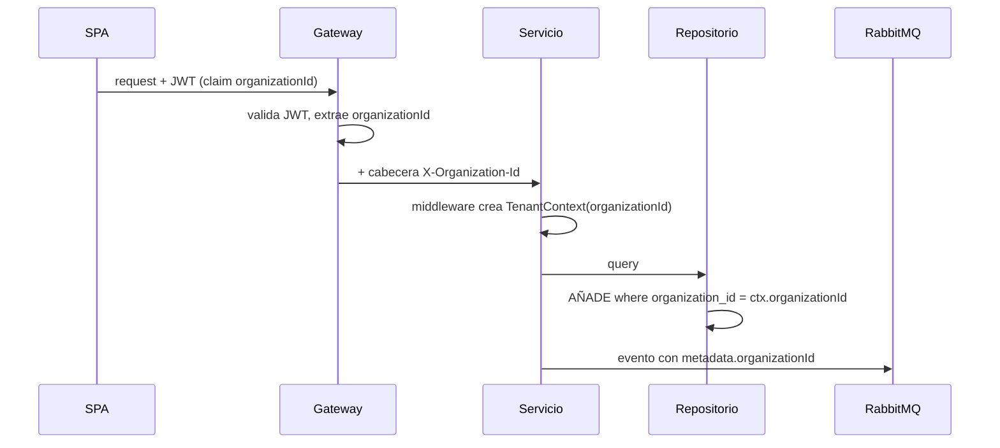
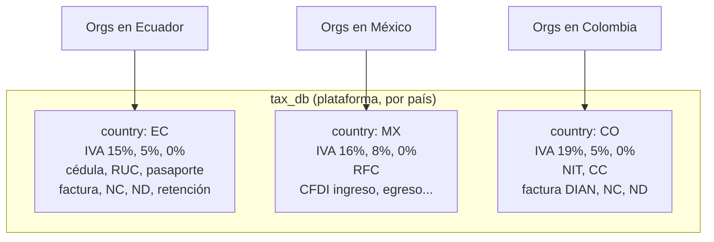
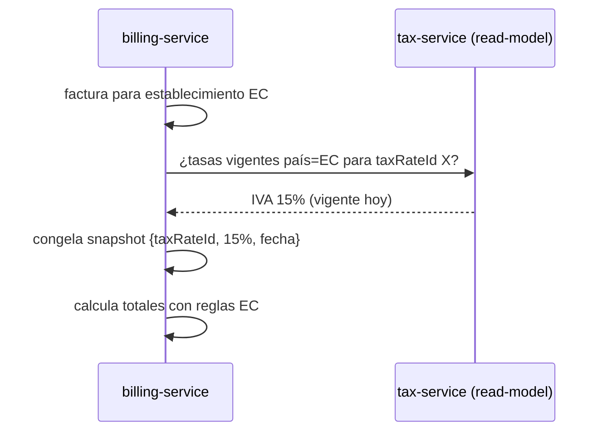

# Multiorganizacional + Multipaís

[← Volver al índice](../README.md) · [← Comunicación](./comunicacion.md)

Dos ejes ortogonales que conviene no confundir:

- **Multiorganizacional (tenant):** muchas empresas usan la misma plataforma; los datos de una **nunca** se ven entre sí. Discriminador: `organizationId`.
- **Multipaís (fiscal):** las reglas de impuestos, identificación y comprobantes dependen del **país**, no de la empresa. Discriminador: `countryCode`.

> Una organización **pertenece a un país** (o a varios, si opera en más de uno → ver más abajo). El país determina qué tablas fiscales aplican. Las tablas fiscales son **compartidas** entre todas las organizaciones del mismo país.

## Eje 1 — Multitenancy

### Estrategia elegida: base compartida por servicio + `organizationId`

Cada tabla de negocio lleva una columna `organization_id`. El aislamiento se garantiza en la **capa de repositorio**: ningún query sale sin filtrar por el tenant del contexto.

```mermaid
graph TB
    subgraph "billing_db (compartida)"
        T[invoices<br/>organization_id ★<br/>customer_id<br/>billing_point_id<br/>...]
    end
    O1[Org A] -->|organization_id = A| T
    O2[Org B] -->|organization_id = B| T
    O3[Org C] -->|organization_id = C| T
```

#### Comparativa de estrategias

| Estrategia | Aislamiento | Costo/Operación | Cuándo |
|------------|-------------|-----------------|--------|
| **Row-level (`organization_id`)** ✅ | Lógico (en repos) | Bajo, una sola base por servicio | Muchas organizaciones pequeñas/medianas. **Nuestra elección** |
| Schema-per-tenant | Medio | Migraciones ×N esquemas | Pocas organizaciones grandes con aislamiento exigente |
| Database-per-tenant | Fuerte | Alto, infra ×N | Requisitos regulatorios estrictos / enterprise |

Elegimos row-level por costo operativo y porque encaja con un SaaS de muchas pymes. Si una organización enterprise exige aislamiento físico, se puede migrar **ese** tenant a base dedicada sin cambiar el modelo.

### Propagación del contexto de tenant

El `organizationId` viaja en **toda** la cadena:

Mecanismos clave:

- **JWT** lleva el `organizationId` activo como claim (firmado, no manipulable).
- **Middleware de tenant** en cada servicio lee la cabecera y crea un contexto por request (AsyncLocalStorage / contexto de Hono).
- **Repositorio base** (en infraestructura) inyecta automáticamente `where organization_id = ctx` en cada operación; los repos concretos no pueden olvidarlo.
- **Eventos**: el `organizationId` va en los metadatos del mensaje y se restablece en el consumidor.

### Usuarios en varias organizaciones

Un usuario puede pertenecer a más de una organización (ej. un contador). Modelo en [auth-service](../servicios/auth-service.md):

- `users` (global, sin tenant — la persona)
- `organization_memberships` (`userId`, `organizationId`, estado)
- `user_roles` (`userId`, `organizationId`, `roleId`) → los roles son **por organización**

Al iniciar sesión, si el usuario tiene varias organizaciones, el front pide elegir una; el `organizationId` elegido se incrusta en el JWT (o se cambia con un endpoint "switch organization" que reemite el token).

## Eje 2 — Multipaís (configuración fiscal)

### Las tablas fiscales son datos de plataforma, no de la organización

Todas las organizaciones de Ecuador comparten la misma tabla de IVA ecuatoriano; las de México, la del IVA mexicano. Por eso el catálogo vive en [tax-service](../servicios/tax-service.md) **particionado por `countryCode`**, no por `organizationId`.

### Qué varía por país

| Concepto | Ejemplos por país |
|----------|-------------------|
| **Tasas de IVA** | EC: 15/5/0 · MX: 16/8/0 · CO: 19/5/0 |
| **Impuestos adicionales** | EC: ICE, IRBPNR · CO: INC · MX: IEPS |
| **Tipos de identificación** | EC: cédula, RUC, pasaporte · MX: RFC · CO: NIT, CC |
| **Tipos de comprobante** | EC: factura, NC, ND, retención, guía remisión · MX: CFDI (I/E/T/N/P) |
| **Autoridad y formato** | EC: SRI/XML · MX: SAT/CFDI · CO: DIAN/UBL · PE: SUNAT · CL: SII |
| **Reglas de redondeo y validación de ID** | dígito verificador de RUC vs RFC vs NIT |

### Cómo se conecta el país con la facturación

1. La **organización** declara su(s) país(es) de operación → [organization-service](../servicios/organization-service.md).
2. Cada **establecimiento** está físicamente en un país (`countryCode`).
3. Cada **producto** tiene asignada una tasa de impuesto **del catálogo del país** → [product-service](../servicios/product-service.md).
4. Al **emitir una factura**, billing-service:
   - toma el `countryCode` del establecimiento,
   - resuelve las tasas vigentes desde tax-service (read-model local),
   - **congela un snapshot** de la tasa en cada línea (para que facturas viejas no cambien si el IVA sube después),
   - aplica las reglas de redondeo y el formato del comprobante de ese país.

### ¿Y si una organización opera en varios países?

Soportado: la organización habilita N países; cada establecimiento define el suyo. La factura siempre usa el país de **su** establecimiento. Así una misma empresa puede facturar en Ecuador y en Colombia con sus reglas respectivas, sin mezclar catálogos.

## Reglas que nunca se rompen

1. Toda tabla de negocio tiene `organization_id` y todo query lo filtra.
2. Las tablas fiscales se filtran por `country_code`, no por organización.
3. El `organizationId` viaja en JWT, en cabeceras REST y en metadatos de eventos.
4. Las tasas se **congelan** (snapshot) en el comprobante al emitir.
5. El front nunca decide el tenant: lo decide el token firmado.

## Siguiente

- Catálogos fiscales en detalle → [tax-service](../servicios/tax-service.md)
- Estructura de organizaciones/establecimientos → [organization-service](../servicios/organization-service.md)
