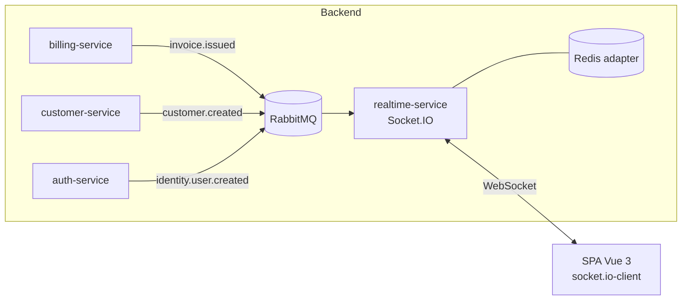
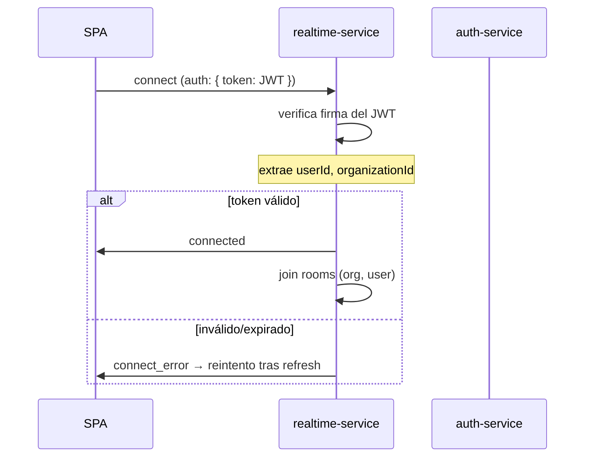
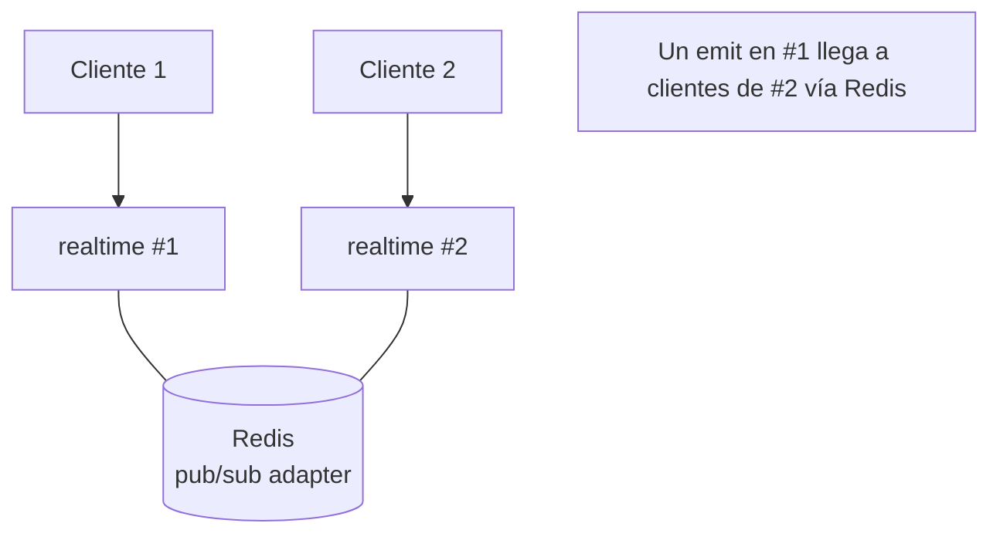

# Tiempo Real (Socket.IO)

[← Volver al índice](../README.md) · [← Validación](./validacion.md)

> ⚠️ **Corregido el 2026-09-14.** El servicio dedicado que describe este documento **nunca se construyó**. El principio se mantuvo, pero la pieza cambió de sitio: el **Socket.IO vive dentro del [api-gateway](../servicios/api-gateway.md)** (`/ws`) y las notificaciones persistentes en [notification-service](../servicios/notification-service.md). Lo que sigue vale como razonamiento de diseño; para el comportamiento real ver [tiempo real](../servicios/realtime-service.md).
>
> Diferencias concretas con lo diseñado aquí: no hay `realtime_db`; no hay adaptador de Redis, así que **el gateway corre en una sola réplica**; el canal `app` se consulta a notification-service antes de emitir. El **chat entre usuarios sí se está construyendo** como servicio propio (ver [chat-service](../servicios/chat-service.md)): el hub emitirá `chat.message.new` a la sala `user:<destinatario>`.

La comunicación en tiempo real se apoya en **Socket.IO**, desacoplado de la lógica de negocio: los servicios solo **publican eventos** a RabbitMQ; el hub los **consume y empuja** al cliente correcto.

## Arquitectura general

Flujo: *un servicio publica un evento → realtime-service lo consume → lo emite a la room adecuada → el cliente conectado recibe la actualización en vivo*.

## Autenticación del socket

El WebSocket **también** se autentica; no es un canal abierto.

- El cliente envía el **mismo JWT** de [auth-service](../servicios/auth-service.md) en el handshake (`auth.token`).
- Un middleware de Socket.IO verifica la firma **antes** de aceptar la conexión.
- De ahí se obtienen `userId` y `organizationId` para asignar las rooms.
- Si el token expira, el cliente refresca (ver [front](../frontend/arquitectura-frontend.md)) y reconecta.

## Rooms: aislamiento por tenant también en tiempo real

El `organizationId` aísla los datos **también** en los sockets. Al conectar, el socket se une a:

| Room | Patrón | Para qué |
|------|--------|----------|
| Organización | `org:{organizationId}` | Eventos que afectan a toda la empresa (nueva factura, nuevo cliente) |
| Usuario | `user:{userId}` | Notificaciones personales |
| Establecimiento (opc.) | `establishment:{id}` | Eventos de una sucursal concreta |
| Conversación (chat) | `conversation:{id}` | Mensajería |

> Regla de oro: **nunca** se hace `io.emit` global. Siempre `io.to('org:{id}')`. Un evento de la Org A jamás llega a la Org B, igual que en REST.

## Namespaces

Se separan responsabilidades en namespaces de Socket.IO:

| Namespace | Uso |
|-----------|-----|
| `/notifications` | Notificaciones y eventos de negocio en vivo |
| `/chat` | Mensajería en tiempo real entre usuarios de la organización |
| `/presence` | Quién está en línea (opcional) |

## Casos de uso en este CRM

1. **Facturación en vivo**: al emitir una factura, los demás usuarios de la organización ven la lista actualizarse y reciben un toast. (`billing.invoice.issued` → room `org:{id}`).
2. **Autorización del SRI/DIAN**: cuando la autoridad fiscal autoriza el comprobante (proceso async), se notifica al emisor sin que recargue. (`billing.invoice.authorized` → `user:{id}`).
3. **Chat interno**: mensajería entre usuarios de la misma organización (el equipo ya tiene experiencia con chat por Socket.IO).
4. **Notificaciones**: tareas, alertas de stock (fase 2), menciones.

## Escalado horizontal con Redis

Socket.IO en varias instancias necesita compartir las rooms. Se usa el **Redis adapter**:

Sin el adapter, un `emit` en la instancia #1 no llegaría a un cliente conectado en la instancia #2. Con Redis pub/sub, las rooms son consistentes entre instancias. Indispensable en MicroK8s con varias réplicas del pod.

## Contrato de eventos hacia el cliente

Los nombres de eventos que recibe el front se versionan y documentan junto con `@crm/contracts`:

| Evento socket | Payload | Origen (evento RabbitMQ) |
|---------------|---------|--------------------------|
| `invoice:issued` | `{ invoiceId, number, customerName, total }` | `billing.invoice.issued` |
| `invoice:authorized` | `{ invoiceId, authorizationNumber }` | `billing.invoice.authorized` |
| `customer:created` | `{ customerId, name }` | `customer.customer.created` |
| `notification:new` | `{ id, type, title, body }` | varios |
| `chat:message` | `{ conversationId, message }` | (directo en `/chat`) |

El payload que sale al socket es un **subconjunto seguro** del evento interno (no se filtran datos sensibles).

## Validación también aquí

Los mensajes que el cliente **envía** por socket (ej. mandar un chat) se validan con Zod igual que en REST (ver [validación](./validacion.md)). El canal en tiempo real no es excusa para saltarse la validación.

## Siguiente

- El servicio que implementa todo esto → [realtime-service](../servicios/realtime-service.md)
- Cómo el front se conecta y maneja reconexión → [arquitectura frontend](../frontend/arquitectura-frontend.md)
