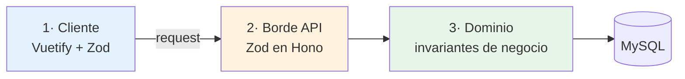
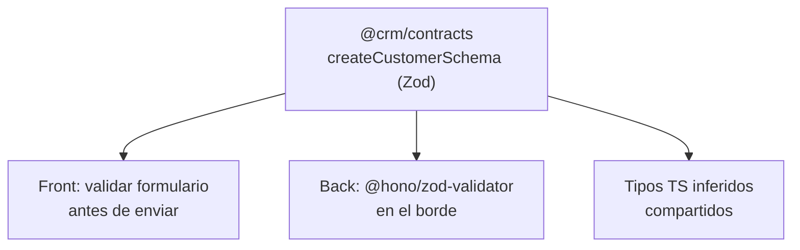

# Estrategia de Validación (front + back)

[← Volver al índice](../README.md) · [← Clean Architecture](./arquitectura-limpia.md)

Principio rector:

> **El front valida para dar buena UX. El back valida para garantizar integridad. Nunca se confía en el cliente: todo lo que valida el front se vuelve a validar en el back.**

## Tres anillos de validación



| Anillo | Dónde | Qué valida | Si falla |
|--------|-------|------------|----------|
| 1. Cliente | SPA Vue 3 | Formato, requeridos, longitudes, feedback inmediato | Mensaje en el campo, no se envía |
| 2. Borde API | Hono + `@hono/zod-validator` | **Todo** lo del cliente otra vez + tipos/coerción | `422` con detalles |
| 3. Dominio | Capa domain del servicio | Reglas de negocio (saldos, estados, unicidad real) | Error de dominio → `409/422` |

## Esquemas compartidos: una sola fuente de verdad

Los esquemas Zod viven en `@crm/contracts` (ver [Clean Architecture](./arquitectura-limpia.md#paquetes-compartidos-monorepo)) y se **importan** tanto en el back como en el front. Así una regla (ej. "el email es obligatorio y válido") se escribe **una vez**.



Ventaja: si cambia una regla, cambia en un solo lugar y front y back quedan sincronizados. Cero divergencia.

## Anillo 1 — Validación en el front

Dos niveles complementarios:

1. **Reglas de Vuetify** (`:rules`) para validación de campo en vivo: requerido, longitud, patrón. Da el feedback inmediato que el usuario espera.
2. **Zod** (el mismo schema de `@crm/contracts`) para validar el objeto completo antes del submit, normalmente vía `vee-validate` + `@vee-validate/zod` o validando manualmente en el store/composable.

Reglas:

- La validación de campo (Vuetify) cubre lo simple e inmediato.
- La validación estructural (Zod) cubre el payload completo antes de llamar a la API.
- El botón de envío se deshabilita si el formulario es inválido.
- **Nunca** se asume que pasar el front basta; el back puede rechazar igual y el front muestra ese error.

Detalle de implementación en el [front](../frontend/arquitectura-frontend.md#validación).

## Anillo 2 — Validación en el borde del back

Cada ruta Hono valida **antes** de tocar el caso de uso:

- Body, params y query se validan con `@hono/zod-validator` usando el schema de `@crm/contracts`.
- Coerción y normalización (trim, lowercase de emails, parse de números).
- Si falla, responde `422` con `{ code: 'VALIDATION_ERROR', details: [...] }` sin llegar al dominio.

Esto protege al servicio de cualquier cliente (no solo nuestro front: también otros servicios o integraciones).

## Anillo 3 — Validación de dominio (la importante)

Hay reglas que **Zod no puede ver** porque dependen del estado o requieren consultar datos:

| Regla | Por qué no es de Zod | Dónde vive |
|-------|----------------------|------------|
| "El RUC tiene dígito verificador válido para EC" | Algoritmo por país | Value Object `Ruc` en domain |
| "No se puede facturar a un cliente inactivo" | Depende del estado del cliente | Caso de uso / dominio |
| "El secuencial no puede repetirse" | Depende de la base | Dominio + restricción única en DB |
| "La tasa de IVA debe existir y estar vigente en el país" | Depende del catálogo fiscal | Dominio + read-model de [tax](../servicios/tax-service.md) |
| "No anular una factura ya autorizada por el SRI" | Invariante de máquina de estados | Entidad `Invoice` |

Estas reglas se aplican en la capa **domain/application** y son la última línea de defensa. Las validaciones de formato (anillos 1–2) nunca las reemplazan.

## Validaciones específicas por país

Como el sistema es multipaís, ciertas validaciones se **parametrizan por `countryCode`**:

- Dígito verificador de identificación: cédula/RUC (EC) vs RFC (MX) vs NIT (CO).
- Formato y longitud de identificación.
- Reglas de redondeo de impuestos.

Estas viven como **estrategias por país** en el dominio (o consultando reglas desde [tax-service](../servicios/tax-service.md)), no como `if (pais === 'EC')` esparcidos por el código.

## Cuerpo de error estándar

Todos los servicios responden errores con la misma forma, para que el front los maneje uniformemente:

```json
{
  "code": "VALIDATION_ERROR",
  "message": "El cliente no es válido",
  "details": [
    { "field": "identification", "message": "RUC inválido para Ecuador" }
  ],
  "requestId": "..."
}
```

El front mapea `details[].field` a los campos del formulario para mostrar el error en el lugar correcto, aunque venga del back.

## Resumen de responsabilidades

- **Vuetify rules** → feedback inmediato por campo.
- **Zod (compartido)** → forma y tipo del payload, en front y en borde del back.
- **Dominio** → reglas de negocio, estado e invariantes; lo único que garantiza integridad.
- **DB** → restricciones de respaldo (únicos, not null) como red de seguridad final.

## Siguiente

- Implementación en el cliente → [arquitectura frontend](../frontend/arquitectura-frontend.md)
- Comunicación en tiempo real (otra frontera que también autentica) → [tiempo real](./tiempo-real.md)
