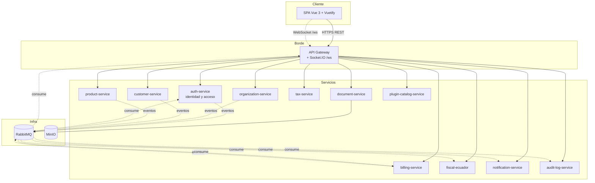
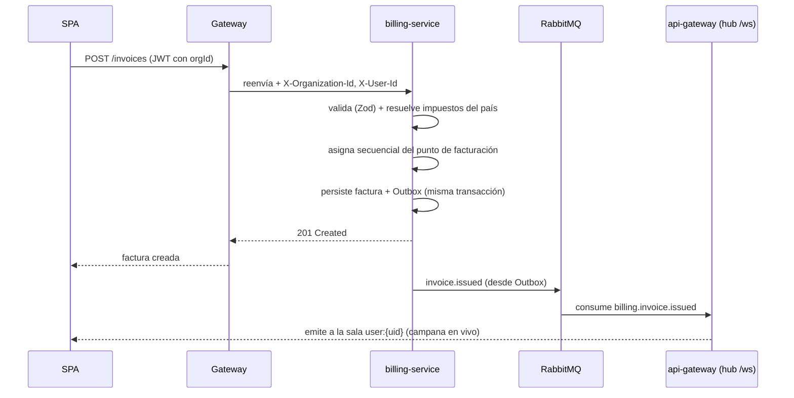

# Visión General de la Arquitectura

[← Volver al índice](../README.md)

> **Revisado el 2026-09-14.** El diagrama y el texto se corrigieron contra el código: no existe `realtime-service` (el socket está en el gateway) y se sumaron los servicios construidos después. Inventario completo en [microservicios](./microservicios.md).

## Contexto del sistema

El sistema es una plataforma SaaS **multiorganizacional** donde múltiples empresas (organizaciones) gestionan sus clientes, productos y, sobre todo, **emiten comprobantes electrónicos** según las reglas fiscales de su país.

## Principios de diseño

1. **Un servicio, una responsabilidad, una base de datos.** Cada microservicio es dueño de su modelo de datos y lo expone solo por su API. Ver [microservicios](./microservicios.md).
2. **Comunicación explícita.** Síncrona por REST a través del [gateway](../servicios/api-gateway.md) para consultas; asíncrona por [eventos en RabbitMQ](./comunicacion.md) para propagar cambios.
3. **Multitenancy por diseño.** El `organizationId` está presente en cada entidad de negocio y se propaga en cada request y cada evento. Ver [multiorganizacional](./multiorganizacional.md).
4. **Configuración fiscal por país, no por organización.** Las tablas de IVA, tipos de identificación y comprobantes son datos de plataforma versionados por país. Ver [tax-service](../servicios/tax-service.md).
5. **Clean Architecture en cada servicio.** El dominio no depende de Hono ni de Sequelize. Ver [arquitectura-limpia](./arquitectura-limpia.md).
6. **Validar en todas las fronteras.** Vuetify + Zod en el cliente para UX; Zod en el borde de cada API; invariantes de negocio en el dominio. Ver [validación](./validacion.md).
7. **No confiar nunca en el cliente.** Toda validación del front se repite en el back.

## Vista lógica por capas

| Capa | Componentes | Responsabilidad |
|------|-------------|-----------------|
| Presentación | SPA Vue 3 | UI, UX, validación inmediata, estado local |
| Borde | API Gateway (REST + Socket.IO `/ws`) | Autenticación de borde, routing, plugins por ruta, propagación de contexto, push en tiempo real |
| Aplicación | 6 microservicios | Lógica de negocio por dominio |
| Integración | RabbitMQ | Eventos de dominio, desacople temporal |
| Datos | MySQL ×N, Redis | Persistencia aislada por servicio + cache |

## Flujo representativo: emitir una factura

Resume cómo colaboran los servicios (detalle en [billing-service](../servicios/billing-service.md) y [comunicación](./comunicacion.md)):

## Decisiones clave registradas

| Decisión | Elección | Por qué |
|----------|----------|---------|
| Aislamiento de tenant | Base compartida por servicio + `organizationId` (row-level) | Muchas organizaciones pequeñas; menor costo operativo. Alternativas en [multiorganizacional](./multiorganizacional.md) |
| Config. fiscal | Catálogo de plataforma por país | Países comparten reglas; evita duplicar IVA por organización |
| auth + identity | Un solo servicio (identidad y acceso) | Auth no puede firmar el token sin los permisos; separarlos solo añade sincronización. Ver [auth-service](../servicios/auth-service.md) y [autorización](./autorizacion.md) |
| Numeración de comprobantes | La posee billing-service | Garantiza atomicidad y secuencias sin huecos |
| Tiempo real | Servicio dedicado que consume eventos | Desacopla el push de la lógica de negocio |

## Por dónde seguir

- ¿Cómo se parten los servicios? → [microservicios](./microservicios.md)
- ¿Cómo se hablan? → [comunicación](./comunicacion.md)
- ¿Cómo funciona el multitenant y el multipaís? → [multiorganizacional](./multiorganizacional.md)
