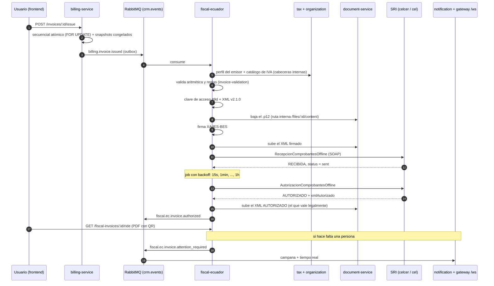
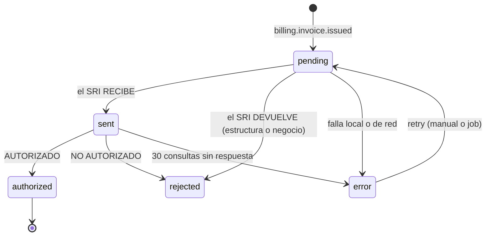

# Flujo end-to-end

[← Facturación electrónica](./README.md) · [Reglas del SRI](./reglas-sri.md) · [Operación](./operacion.md)

## El recorrido completo

## Paso a paso, con lo que puede salir mal

### 1. Billing emite

`POST /invoices/:id/issue` asigna el secuencial en la tabla `sequences` con `SELECT … FOR UPDATE` (único por organización + punto de emisión + tipo de documento), congela los snapshots del emisor y del cliente y publica `billing.invoice.issued` por el patrón outbox.

Lo importante para lo fiscal: **billing guarda siempre importes SIN impuestos**. Si el producto tiene precio con IVA incluido, se le quita el IVA al precio primero y el impuesto se calcula una sola vez sobre la base. Antes no era así y el IVA se cobraba dos veces (ver [N6](./historial-hallazgos.md)).

### 2. El evento `billing.invoice.issued`

Es **el contrato** entre los dos servicios. Campos que lo fiscal necesita de verdad:

| Campo | Para qué |
|---|---|
| `number`, `sequentialNumber` | serie `001-001-000000009` y los 9 dígitos de la clave de acceso |
| `documentTypeCode` (`01`/`04`) | qué comprobante construir. Si falta, factura |
| `issueDate` | **fecha legal** del comprobante. Sin ella se caería a la hora de proceso, que puede ser otro día |
| `issuerSnapshot` | RUC, razón social, dirección, códigos de establecimiento y punto de emisión |
| `customerSnapshot.identificationTypeCode` | el **código** (`04` RUC, `05` cédula, `06` pasaporte, `07` consumidor final). Los ids de catálogo de customer-service y tax-service **no coinciden**, por eso viaja el código y no el id |
| `lines[].productCode` | SKU que va en `codigoPrincipal` (máx. 25 caracteres; un UUID no cabe) |
| `lines[].taxes[]` | `kind` + `rateSnapshot` + id de tarifa, para traducir a los códigos del SRI |
| `paymentMethodCode` | Tabla 24; si falta sale de la organización o `01` |
| `userId` | a quién avisar en la campana |
| `relatedInvoiceId`, `relatedIssueDate`, `creditNoteReason` | solo notas de crédito |

### 3. Fiscal valida antes de firmar

`domain/invoice-validation.ts` vuelve a sumar todo con lo que de verdad va a ir en el XML: líneas, bases, impuestos, totales, RUC de 13 dígitos, secuencial de 9, moneda USD y el tope de consumidor final. El SRI rechaza cualquier descuadre, pero lo hace después de un viaje de red y con un mensaje genérico (`num_fila`); aquí se dice exactamente qué no cuadra.

### 4. Firma y envío

El `.p12` se baja de document-service por la **ruta interna** `GET /files/:id/content`. La pública redirige a una URL prefirmada de MinIO que no es alcanzable desde dentro del clúster. La contraseña está cifrada con AES-256-GCM y `CERTIFICATE_MASTER_KEY`.

Solo se firma con **certificado vigente**: si `valid_until` ya pasó, se marca `expired` y el comprobante pide atención en vez de firmarse con algo inválido. `POST /certificates` rechaza de entrada un `.p12` vencido o que aún no entra en vigor.

### 5. Autorización: un job, no una espera

La recepción y la autorización son dos llamadas distintas del SRI. Tras una recepción correcta el registro queda en `sent` con `next_check_at`, y un job consulta con **backoff exponencial**, ordenando por vencimiento y sin solapes entre pasadas.

| Constante | Valor | Qué es |
|---|---|---|
| `firstAuthorizationCheckMs` | 15 s | primera consulta tras RECIBIDA |
| `baseDelayMs` → `maxDelayMs` | 1 min → 1 h | backoff exponencial |
| `maxAuthorizationChecks` | 30 (~26 h) | consultas antes de pasar a `error` |
| `maxDeliveryAttempts` | 10 | intentos de envío ante fallos de red o del SRI |
| `stalePendingMs` | 10 min | un `pending` más viejo es un proceso que murió a mitad de envío |

### 6. El XML que vale es el del SRI

El SRI devuelve `xmlAutorizado`: el comprobante **sellado con el número y la fecha de autorización**. Ese es el que tiene validez legal, no el que firmamos nosotros. Se sube a document-service como `comprobante-autorizado` y `GET /fiscal-invoices/:id/xml` sirve el autorizado cuando existe. Si la subida falla, se conserva dentro de `sri_response` para no perderlo.

### 7. El RIDE

`GET /fiscal-invoices/:id/ride` genera el PDF **al vuelo** desde `original_payload` más los datos de autorización, con el QR de verificación. Solo existe para comprobantes `authorized`: emitirlo antes sería entregar un documento sin validez.

## Máquina de estados fiscal

`authorized` y `rejected` son **estados finales**: si vuelve a llegar el mismo evento, no se reprocesa.

## Anulación y nota de crédito

Fiscal consume también `billing.invoice.voided`:

- Si el comprobante **aún no se envió**, simplemente no se envía.
- Si **ya estaba autorizado**, no hay vuelta atrás: publica `void_requires_action`. Legalmente hay que emitir una **nota de crédito** (o anularlo en el portal del SRI en línea).

La nota de crédito se emite desde billing con `POST /invoices/:id/credit-note` (motivo obligatorio). Clona el comprobante original —mismas líneas e impuestos, reversión total— como tipo `04` y lo emite por el mismo camino. Reglas que se validan ahí: el original no puede estar en borrador, la NC debe salir del **mismo establecimiento** que el comprobante que modifica (el SRI lo exige; el punto de emisión sí puede ser otro), y el catálogo del país tiene que tener configurado el tipo `04`.

La clave de acceso del documento modificado la resuelve fiscal, que fue quien la generó; billing solo manda `relatedInvoiceId`.

## Eventos que publica fiscal

Todos como `fiscal.ec.invoice.<tipo>` por outbox: `pending`, `sent`, `authorized`, `rejected`, `error`, `void_requires_action`, `sequence_gap`.

Cada evento lleva `fiscalInvoiceId`, `billingInvoiceId` (también como `invoiceId`, para que la campana enlace a la factura), `organizationId`, `number`, `status`, `message`, `requiresAttention` y `userId`.

**`fiscal.ec.invoice.attention_required`** se publica *además*, y **solo cuando hace falta una persona**. Los errores que se reintentan solos no llenan la campana. Es el evento al que están suscritos notification-service y el hub de tiempo real del gateway (`/ws`). Sin `userId` el gateway descarta el evento y la campana no suena.

## Quién ve qué en el frontend

`FiscalStatusCard`, en el detalle de la factura: estado del SRI, clave de acceso, número de autorización, mensajes del SRI, botón de reintento, descarga del XML y —sin subir todavía— botón de RIDE.

El reintento exige el permiso `invoice:authorize` ("mandar al SRI para autorizar"), separado de `fiscal:manage`, que además deja subir y revocar el certificado de firma. `fiscal:manage` se sigue aceptando en el reintento para no quitarle acceso a nadie.
