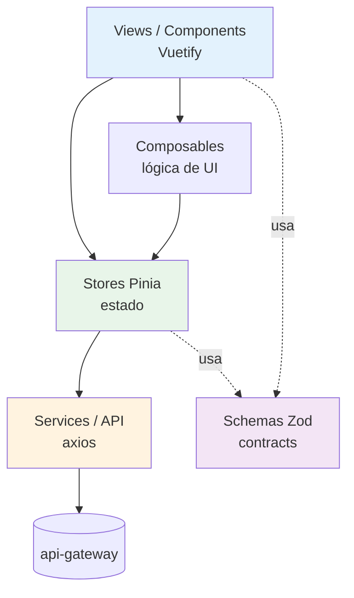
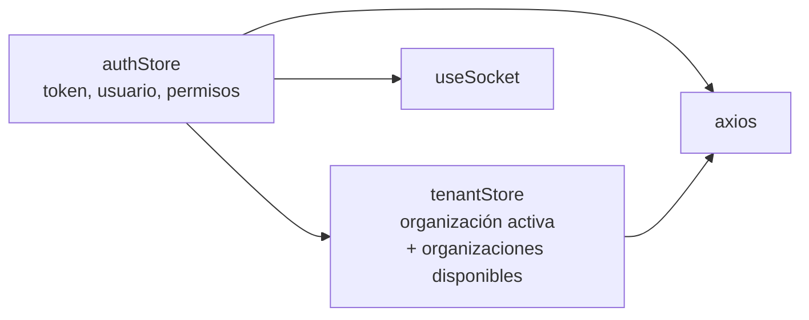
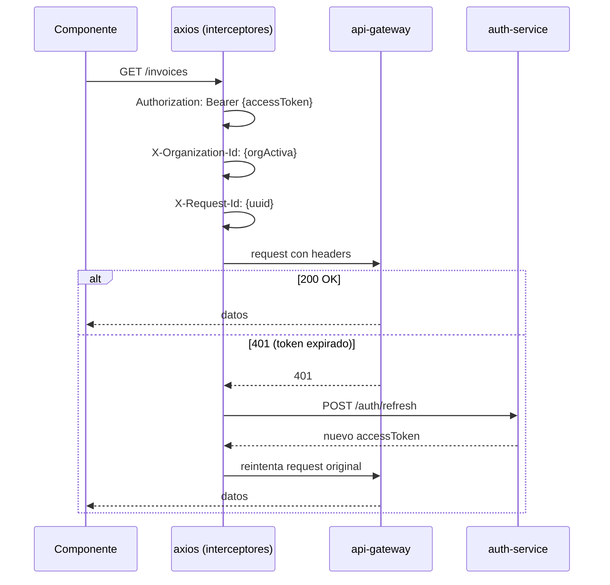
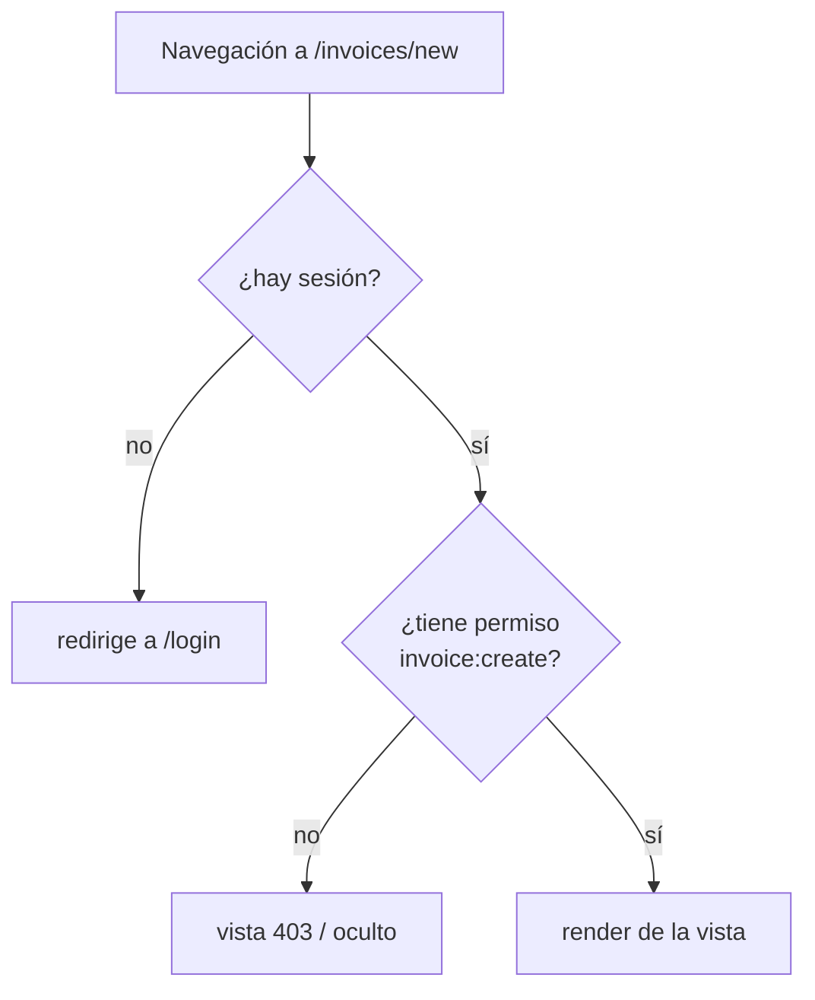
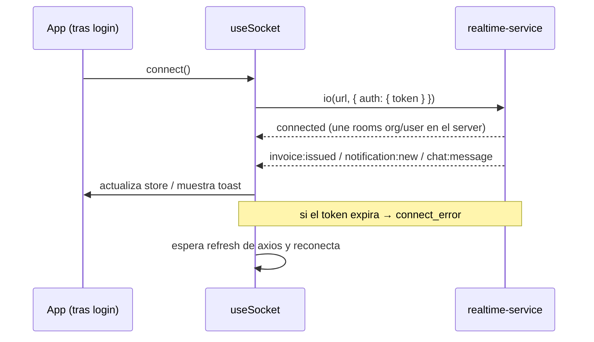
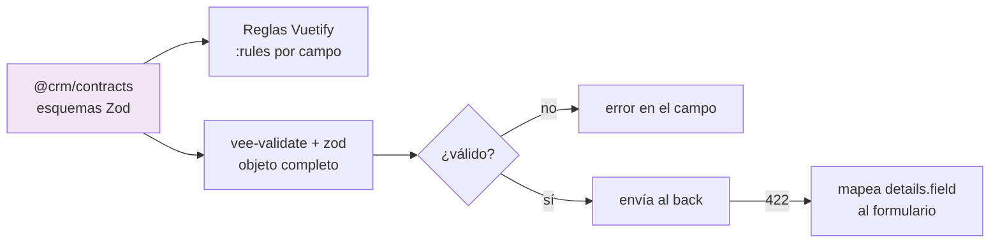

# Arquitectura Frontend (Vue 3)

[← Volver al índice](../README.md) · [← Tiempo real](../arquitectura/tiempo-real.md) · [← Validación](../arquitectura/validacion.md)

El front es una **SPA en Vue 3** (Composition API) con Vuetify 3, Pinia, Vue Router, Axios y socket.io-client. Consume el sistema **siempre a través del** [api-gateway](../servicios/api-gateway.md): nunca habla con los microservicios directamente. Toda petición lleva el **JWT** (quién soy) y la **organización activa** (en qué tenant trabajo).

> Principio rector: el front es un **cliente más**, no una fuente de verdad. Da buena UX (validación inmediata, tiempo real, navegación por permisos), pero el back vuelve a validar y autorizar todo. Ver [validación](../arquitectura/validacion.md).

> **Estado real al 2026-09-14.** Estructura: `api/`, `components/`, `composable/`, `config/`, `i18n/`, `layouts/`, `menus/`, `plugins/`, `router/`, `stores/`, `styles/`, `types/`, `utils/`, `views/`. Vistas por dominio: `customers`, `products`, `employees`, `roles`, `invoices`, `inventory`, `organization`, `plugins`, `settings`, `audit`, `onboarding`.
>
> - **Tres idiomas** (`es`, `en`, `fr`): todo texto visible va por i18n, incluidos los nombres y descripciones de los plugins y de los proveedores de notificación, que el backend manda como **claves**, no como texto.
> - **Estilos: clases utilitarias de Vuetify antes que CSS propio** (`text-primary`, `font-weight-medium`…). Escribir estilos a mano es la excepción.
> - **Socket**: se conecta a `/ws` del gateway (no a un servicio aparte). Refresca campana, catálogo, plugins y permisos.
> - **Pruebas end-to-end con Playwright** (`e2e/`), incluido `test:e2e:sri`, que emite una factura real contra el ambiente de pruebas del SRI por la interfaz.
> - ⚠️ Hay trabajo **sin commitear**: la pantalla de nota de crédito, el botón de RIDE y la división de `InvoiceFormView`. Ver [pendientes de facturación](../facturacion-electronica/pendientes-y-riesgos.md).

## Tres piezas propias del frontend que no están en ningún servicio

### 1. El menú declara permiso y plugin

`src/menus/navigation.ts` es una lista de ítems donde cada uno declara su **clave i18n** (nunca el texto traducido), su **permiso** (`customer:read`, `invoice:read`…) y, si aplica, el **plugin** que lo habilita (`crm.contacts`, `finance.electronic_invoicing`, `inventory.kardex`…). Los ítems del núcleo no declaran plugin.

Es el espejo en el cliente de lo que el [gateway](../servicios/api-gateway.md) impone en el servidor: el menú esconde lo que el backend va a rechazar con 403, en vez de enseñar puertas cerradas. La autoridad sigue siendo el backend.

Hay además un patrón de navegación deliberado: **Ajustes es un solo ítem** que abre una vista de pestañas (Perfil, Organización, Establecimientos, Certificado) en lugar de cuatro entradas sueltas.

### 2. Registro de regímenes fiscales por país

`src/config/fiscalRegimes.ts`. La facturación electrónica cambia por país: quién autoriza, cómo se numeran los documentos, si existen establecimientos y puntos de emisión, si hace falta certificado de firma.

En vez de repartir `if (país === 'EC')` por las vistas, **cada régimen se declara en un sitio** y la vista lee el del país de la organización; hay un régimen genérico de respaldo. Dar de alta un país nuevo debería ser añadir su entrada y traducir sus claves, sin tocar `InvoiceFormView`.

Es la mitad cliente de la [estrategia multipaís](../arquitectura/estrategia-multipais.md), cuya mitad servidor son los servicios `fiscal-<país>`.

### 3. Tours guiados (driver.js)

`src/composable/useAppTour.ts`. **Tres tours encadenados** en el orden en que los encuentra un usuario nuevo:

| Tour | Dónde | Qué explica |
|---|---|---|
| `welcome` | `/profile` | da la bienvenida y los datos personales que hay que dar |
| `organization` | `/organization/settings` | la ficha de la organización, campo a campo |
| `app` | multi-pantalla | el recorrido por los módulos, al terminar el alta |

El `app` es **multi-pantalla**: cada paso vive en la ruta que describe, así que Siguiente/Anterior navegan con vue-router y el resaltado se reanuda cuando la vista nueva monta su `PageHeader`. Los dos del alta ocurren dentro de una sola vista y los lanza la propia vista.

Otros composables: `useLocale` (idioma), `useThemeToggle` (claro/oscuro), `useFileUrl`, `useBareShell`, `usePluginsRealtime` (refresca los módulos cuando llega `plugins.changed` por el socket).

## Stack y responsabilidades

| Pieza | Tecnología | Rol |
|-------|------------|-----|
| UI | Vue 3 + Vuetify 3 | Componentes, formularios, feedback visual |
| Estado | Pinia | Sesión, organización activa, datos de dominio cacheados |
| Ruteo | Vue Router | Navegación + guards de auth y permisos |
| HTTP | Axios | Cliente único con interceptores (JWT, tenant, refresh) |
| Tiempo real | socket.io-client | Notificaciones y chat en vivo |
| Validación | Vuetify rules + Zod (`@crm/contracts`) | Anillo 1 de validación (ver abajo) |

## Estructura de carpetas (feature-based)

Se organiza por **funcionalidad** (no por tipo de archivo), de modo que cada dominio del CRM viva junto:

```
src/
  app/                 # arranque, router, plugins (vuetify, pinia)
  core/
    http/              # cliente axios + interceptores
    socket/            # cliente socket.io + composable useSocket
    auth/              # guards, manejo de sesión y refresh
    tenant/            # organización activa, selector
  shared/
    components/        # UI reutilizable (tablas, dialogs, inputs)
    composables/       # useXxx genéricos
  features/
    customers/         # views, components, store, api, schemas
    products/
    invoicing/
    organizations/
    users-roles/
  contracts/           # re-export de @crm/contracts (Zod + tipos)
```

Cada carpeta de `features/` replica una mini-estructura por capas (ver siguiente sección). Esto mantiene el front **alineado** con la separación de servicios del back.

## Capas del front (analogía con Clean Architecture)

El front también respeta una **regla de dependencia**: las vistas dependen de stores y servicios, no al revés. Ver el paralelo en [Clean Architecture](../arquitectura/arquitectura-limpia.md).



| Capa | Qué contiene | Qué NO hace |
|------|--------------|-------------|
| Views/Components | Render, Vuetify, eventos de usuario | Llamar a axios directo |
| Composables | Lógica reutilizable de UI (paginación, formularios) | Guardar estado global |
| Stores (Pinia) | Estado de sesión y de dominio, acciones | Renderizar |
| Services/API | Llamadas HTTP, mapeo de DTOs | Tener estado |

## Estado con Pinia: sesión y tenant

Dos stores transversales sostienen todo lo demás:



- **`authStore`**: guarda el access token (en memoria), el usuario y la **lista de permisos** que vienen en el JWT (emitido por [auth-service](../servicios/auth-service.md), que resuelve los permisos desde sus tablas RBAC). Expone `hasPermission('invoice:create')`.
- **`tenantStore`**: guarda la **organización activa** y las organizaciones a las que el usuario pertenece (un usuario puede estar en varias, ver [multiorganizacional](../arquitectura/multiorganizacional.md#un-usuario-en-varias-organizaciones)). Cambiar de organización dispara la recarga de los datos scoped.

> El refresh token se maneja como cookie httpOnly (no accesible por JS) o vía endpoint dedicado; el access token vive en memoria, no en `localStorage`, para reducir superficie de XSS.

## Axios: interceptores (JWT + tenant + refresh)

Hay **un solo** cliente axios. Sus interceptores inyectan el contexto y manejan el ciclo del token, igual que el [gateway](../servicios/api-gateway.md) espera recibirlo:



Responsabilidades del interceptor:

- **Request**: añade `Authorization: Bearer <token>`, `X-Organization-Id` (de `tenantStore`) y `X-Request-Id` (uuid para trazabilidad de punta a punta).
- **Response 401**: intenta **un** refresh; si tiene éxito, reintenta la petición original; si falla, limpia sesión y manda a login. Las peticiones concurrentes durante el refresh se **encolan** para no disparar múltiples refresh.
- **Response 422**: error de validación → se propaga a la capa de formulario para mapear `details[].field` (ver [Validación](#validación)).
- **Response 403**: sin permiso → toast y/o redirección.

## Multitenancy en la UI

La organización activa es **explícita** en la interfaz:

- Un **selector de organización** (organization switcher) en la barra superior lista las organizaciones del usuario.
- Al cambiarla, `tenantStore` actualiza el `organizationId`, se **invalidan los datos cacheados** del tenant anterior y se recargan los del nuevo.
- El `socket` se reconecta/re-suscribe para recibir eventos de la nueva organización (las rooms son por `org:{id}`, ver [tiempo real](../arquitectura/tiempo-real.md#rooms-aislamiento-por-tenant-también-en-tiempo-real)).
- El usuario **nunca** ve datos de una organización a la que no pertenece: el back filtra por `organizationId` en cada request; el front solo refleja eso.

## Rutas y guards (auth + permisos)

Vue Router protege la navegación en dos niveles, espejo de la doble autorización del [gateway](../servicios/api-gateway.md#dos-niveles-de-autorización):



- **Guard de autenticación**: rutas marcadas `requiresAuth` exigen sesión válida; si no, a `/login`.
- **Guard de permisos**: la ruta declara el permiso requerido (ej. `meta.permission = 'invoice:create'`) y el guard consulta `authStore.hasPermission(...)`.
- El guard es **UX, no seguridad**: aunque alguien fuerce la ruta, el back rechaza igual. La verdad de la autorización vive en el servidor.

## Permisos en la UI

Más allá de las rutas, la UI **se adapta** a los permisos del usuario:

- Botones y acciones se ocultan/deshabilitan con un helper (`v-if="can('invoice:void')"`) basado en `authStore`.
- Los menús se construyen filtrando por permiso.
- Es presentación: ocultar un botón no protege el endpoint; solo evita que el usuario intente algo que el back rechazaría.

## Socket.IO en el cliente

La conexión en tiempo real se encapsula en un composable `useSocket` que vive junto a `core/socket`:



- Se conecta **después** del login, enviando el **mismo JWT** en el handshake (`auth.token`). El server valida y asigna las rooms; el cliente **no** pide unirse a rooms manualmente (lo hace el back según el token, ver [tiempo real](../arquitectura/tiempo-real.md#autenticación-del-socket)).
- Escucha los eventos del [contrato hacia el cliente](../arquitectura/tiempo-real.md#contrato-de-eventos-hacia-el-cliente) (`invoice:issued`, `invoice:authorized`, `notification:new`, `chat:message`) y actualiza los stores o muestra toasts.
- **Reconexión**: ante `connect_error` por token expirado, espera a que axios refresque el token y reconecta con el nuevo. Maneja también backoff y reintentos de socket.io.
- Al hacer **logout** o cambiar de organización, desconecta y vuelve a conectar para no mezclar contextos.

## Validación

El front es el **anillo 1** de la [estrategia de validación](../arquitectura/validacion.md). Valida para dar UX inmediata, reutilizando los **mismos esquemas Zod** del back.



Dos niveles complementarios en el cliente:

1. **Reglas de Vuetify** (`:rules`): validación de campo en vivo (requerido, longitud, patrón). Feedback inmediato mientras el usuario escribe.
2. **Zod vía `vee-validate` + `@vee-validate/zod`**: valida el **objeto completo** antes del submit, usando el schema importado desde [`@crm/contracts`](../arquitectura/arquitectura-limpia.md#paquetes-compartidos-monorepo). Una sola fuente de verdad para front y back.

Reglas de oro:

- El botón de envío se **deshabilita** si el formulario es inválido.
- **Nunca** se asume que pasar el front basta: el back puede rechazar igual.
- Cuando el back responde `422`, el front **mapea** `details[].field` al campo correspondiente para mostrar el error en el lugar correcto (ver [cuerpo de error estándar](../arquitectura/validacion.md#cuerpo-de-error-estándar)).
- Las validaciones que dependen de estado o catálogos (RUC válido por país, cliente activo, tasa vigente) son **del dominio en el back**; el front solo refleja su resultado.

## Manejo de errores y estados

- **Errores de red / 5xx**: toast genérico + opción de reintento; nunca se pierde el `X-Request-Id` para soporte.
- **403 / 401**: redirección o aviso según corresponda (sin sesión → login; sin permiso → aviso).
- **Estados de carga**: skeletons/spinners por vista; las acciones optimistas se confirman o revierten con el evento de socket o la respuesta REST.

## Siguiente

- Cómo se autentican y autorizan las peticiones del lado servidor → [api-gateway](../servicios/api-gateway.md)
- El servicio que empuja los eventos en vivo → [realtime-service](../servicios/realtime-service.md)
- Cómo se asocian las entidades que el front consume → [relaciones globales](../modelo-datos/relaciones-globales.md)
