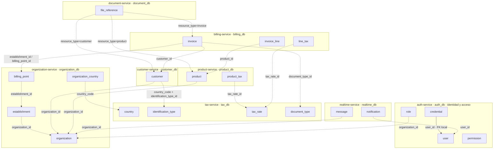
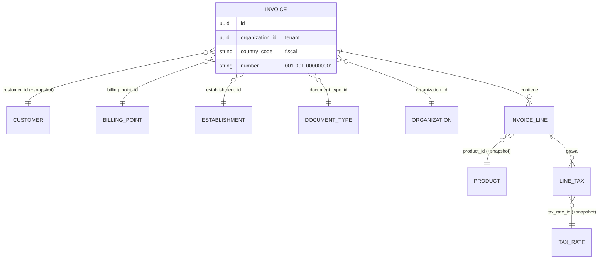
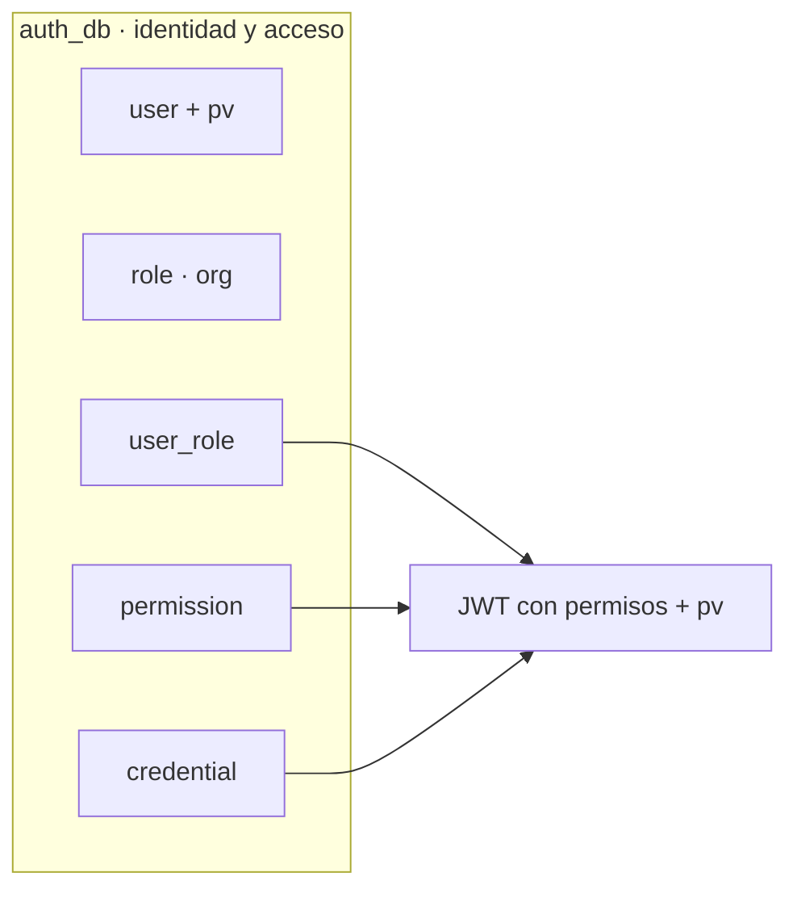

# Relaciones Globales (entre servicios)

[← Volver al índice](../README.md) · [← Microservicios](../arquitectura/microservicios.md) · [← Comunicación](../arquitectura/comunicacion.md)

Este documento es el **panorama completo**: cómo se asocian las entidades que viven en bases de datos distintas. Es la vista que falta cuando se lee cada servicio por separado.

> Recordatorio clave: **cada servicio tiene su propia base** y nadie hace JOIN contra la base de otro. Las asociaciones se expresan por **ID de referencia** (ej. `customer_id`, `organization_id`) y se mantienen consistentes con **eventos**, **read-models** y **snapshots**. Ver [microservicios](../arquitectura/microservicios.md) y [comunicación](../arquitectura/comunicacion.md).

> ⚠️ **Revisado el 2026-09-14.** Sigue siendo la mejor vista de conjunto, pero le faltan servicios y tiene una base que no existe:
>
> - **`realtime_db` no existe.** Las notificaciones viven en `notification_db` ([notification-service](../servicios/notification-service.md)) y el socket en el gateway.
> - **Falta el eje fiscal**: `fiscal_ec_db.fiscal_invoices` referencia a `billing.invoices` por `billing_invoice_id`, y `certificates` referencia archivos de `document_db`. La relación se mantiene **por eventos**, no por FK: ver [flujo end-to-end](../facturacion-electronica/flujo-end-to-end.md).
> - **Faltan** `plugin_catalog_db` (qué módulos tiene cada organización: lo consulta el gateway en cada ruta), `audit_db`, `assistant_db` e `inventory_db` (que además mantiene un **read-model** de productos alimentado por eventos).
> - `organizations.settings` (JSON) guarda el perfil fiscal del emisor que consume fiscal-ecuador.

## Los dos ejes que cruzan todo

Antes de las entidades, dos columnas aparecen una y otra vez (ver [multiorganizacional](../arquitectura/multiorganizacional.md)):

| Eje | Columna | Qué representa | Dónde aplica |
|-----|---------|----------------|--------------|
| Tenant | `organization_id` | A qué empresa pertenece el dato | **Todas** las tablas de negocio |
| Fiscal | `country_code` | Qué reglas fiscales aplican | Catálogos de [tax](../servicios/tax-service.md) y datos derivados |

`organization_id` **aísla** (datos de una empresa nunca se mezclan con otra). `country_code` **parametriza** (qué IVA, qué identificación, qué comprobantes). Son ortogonales: una organización puede operar en varios países.

## Mapa global de referencias

Cada servicio expone sus entidades dueñas; las flechas punteadas son **referencias por ID** que cruzan fronteras de base de datos (no son foreign keys reales de SQL):

## Tabla de IDs de referencia

Quién apunta a quién, y cómo se mantiene al día:

| Servicio origen (dueño) | Entidad / campo | Referenciado por | Cómo se sincroniza |
|-------------------------|-----------------|------------------|--------------------|
| organization | `organization.id` | **Todos** (como `organization_id`) | Va en el JWT y en cada evento; no se duplica |
| organization | `establishment.id`, `billing_point.id` | billing (`invoice`, `sequence`) | Evento `organization.billing_point.created` → billing inicializa `SEQUENCE` |
| auth | `user.id` | realtime (`notification.user_id`) | Evento `identity.user.*`; dentro de auth es **FK local** |
| auth | `permission` (catálogo) | — (se resuelve **local** al firmar el JWT) | Interno a auth; el JWT ya lleva los permisos resueltos |
| tax | `country.code` | organization (`organization_country`), customer, product, billing | Catálogo de plataforma; se consulta / cachea por `country_code` |
| tax | `identification_type.id` | customer, organization (emisor) | Read-model / validación por país |
| tax | `tax_rate.id` | product (`product_tax`), billing (`line_tax` snapshot) | Evento `tax.tax_rate.upserted`; billing congela `rate_snapshot` |
| tax | `document_type.id` | billing (`invoice.document_type_id`) | Catálogo por país |
| customer | `customer.id` | billing (`invoice.customer_id` + `customer_snapshot`) | Evento `customer.customer.updated` actualiza snapshot en **borradores** |
| product | `product.id` | billing (`invoice_line.product_id` + `product_snapshot`) | Evento `product.product.updated` actualiza líneas en **borradores** |

## La factura: donde convergen todos los hilos

`invoice` es la entidad que **integra** al sistema entero. Una sola factura toca seis servicios:

Lecturas de este diagrama:

- El **número** `001-001-000000001` se arma con `establishment.code` + `billing_point.code` (de [organization](../servicios/organization-service.md)) + secuencial (que **administra** [billing](../servicios/billing-service.md)). Detalle en [billing-service](../servicios/billing-service.md#el-secuencial-por-qué-vive-aquí).
- Los `(+snapshot)` indican que billing **congela** una copia del dato al emitir: la factura es un documento legal inmutable y no depende de datos vivos de otros servicios. Ver [snapshots](../servicios/billing-service.md#snapshots-por-qué-se-congelan-datos).
- `country_code` decide qué `tax_rate` y qué `document_type` son válidos (los del país del establecimiento).

## Identidad y autorización: un solo servicio

Autenticación (credenciales) y autorización (roles/permisos) viven en **un único servicio**, [auth-service](../servicios/auth-service.md), sobre la misma base `auth_db`. Ya **no** hay puente de eventos entre "auth" e "identity" (antes eran dos servicios): al firmar el JWT, auth resuelve los permisos leyendo sus propias tablas.

El JWT lleva `org_id`, `permissions[]` y `pv`, y es lo que viaja en cada request y socket. La fuente de verdad de roles/permisos es esta misma base; los servicios de negocio **no** consultan a auth por request (autorizan con los claims del token). Ver [autorización](../arquitectura/autorizacion.md), [comunicación](../arquitectura/comunicacion.md) y [api-gateway](../servicios/api-gateway.md).

## Cómo se mantiene la consistencia (sin JOINs ni 2PC)

Como no hay base compartida, la coherencia entre servicios se logra con tres mecanismos, ya descritos en [comunicación](../arquitectura/comunicacion.md):

| Mecanismo | Para qué | Ejemplo |
|-----------|----------|---------|
| **Eventos** (RabbitMQ + Outbox) | Propagar cambios de forma confiable | `customer.updated` llega a billing |
| **Read-models locales** | Leer datos de otro servicio sin llamarlo | billing cachea tasas vigentes de tax |
| **Snapshots** | Inmutabilidad legal: congelar el dato | la factura guarda el nombre del cliente al emitir |

Consecuencia de diseño: se acepta **consistencia eventual** entre servicios (un cambio tarda en propagarse), pero **consistencia fuerte dentro** de cada servicio (transacciones locales, como el secuencial atómico de billing). Es el trade-off natural de microservicios.

## Notas

- Este mapa cubre la **Fase 1**. En fases siguientes se suman `payment`, `inventory`, `pricing`, `document` y `audit` (ver [microservicios](../arquitectura/microservicios.md) y el [README](../README.md)); todos seguirán el mismo patrón: DB propia, referencias por ID, sincronización por eventos.
- El servicio de **auditoría** se suscribe a `#` (todos los eventos) y reconstruye el "quién hizo qué" sin acoplarse a nadie. Ver [comunicación](../arquitectura/comunicacion.md#auditoría).
- Para ver cada entidad en detalle, ir a la ficha de su servicio en [servicios/](../servicios/).
