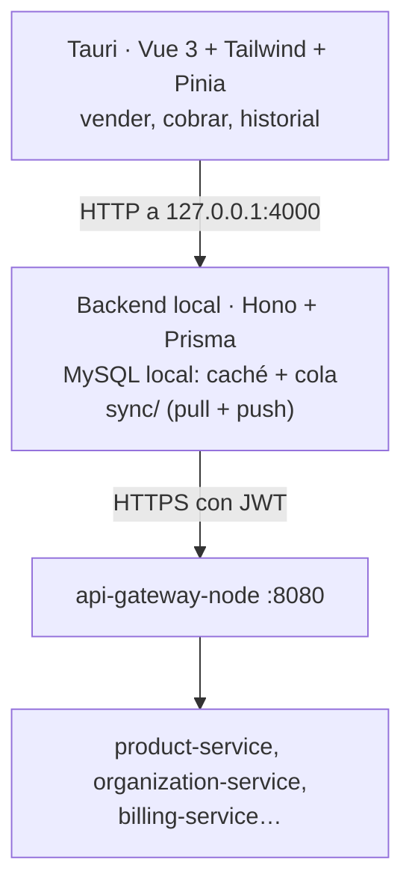

# POS — punto de venta

[← Volver al índice](../README.md) · [organization-service](../servicios/organization-service.md) · [auth-service](../servicios/auth-service.md) · [billing-service](../servicios/billing-service.md)

> **Estado (2026-09-14): código completo, nunca probado de punta a punta.** El propio `pos/CHANGELOG.md` lo dice: lo primero que debería hacer quien lo retome es un typecheck y una prueba real, no features nuevas.
>
> El POS vive en `pos/` dentro del repo de código y tiene su propia documentación operativa: **`rules.md`** (reglas fijas, contexto obligatorio para agentes), **`CHANGELOG.md`** (el porqué de cada decisión) y **`todo.md`**. Esto de aquí es el resumen de arquitectura; la fuente de verdad para trabajar en él son esos tres archivos.

## Qué es

Una **caja registradora**: aplicación de escritorio (Tauri) con su propio backend local. **No** es un panel de administración y **no** es la fuente de verdad de nada.

- Es una **caché local** del catálogo, que se sincroniza *desde* el CRM.
- Es una **cola de ventas**, que se sincroniza *hacia* el CRM cuando hay internet.
- **Tiene que funcionar sin internet**: si el CRM está caído, sigue vendiendo con el último catálogo y encola las ventas.

## Arquitectura



Dos reglas que sostienen el diseño:

1. **El backend del POS solo escucha en `127.0.0.1`.** Nunca se expone a la red.
2. **El frontend nunca le habla directo al CRM**, ni siquiera con internet. Siempre pasa por el backend local — por eso no hace falta lógica condicional "online/offline" en la interfaz.

Stack deliberadamente más simple que el del CRM: rutas + Zod, sin capas de dominio/aplicación separadas. Vue 3 con **Tailwind, no Vuetify** (descartado por peso).

## El emparejamiento (TOTP)

Es la parte más interesante y la que no hay que reimplementar distinto:

```mermaid
sequenceDiagram
    participant A as Admin (CRM)
    participant O as organization-service
    participant P as POS (sin configurar)
    participant AU as auth-service

    A->>O: crea un punto de emisión tipo POS
    O->>O: genera un secreto TOTP
    A->>A: "Ver código" → 6 dígitos rotando
    P->>O: POST /billing-points/pair (público, el código ES la autenticación)
    O->>O: valida contra TODOS los puntos POS sin emparejar de CUALQUIER organización
    O->>AU: POST /internal/device-accounts (X-Internal-Secret, nunca JWT de usuario)
    AU-->>O: usuario de servicio + tokens
    O-->>P: refreshToken
    Note over P: se guarda en pos_config; desde entonces solo /auth/refresh
```

Decisiones asociadas:

- **De un solo uso**: un punto emparejado no se puede volver a emparejar sin que un admin lo desvincule desde el CRM (`EmissionPoint.markPaired` / `unlinkAndRegenerate`).
- **`POST /billing-points/pair` es público a propósito**: es el único arranque posible para un equipo nuevo. Su defensa es el código TOTP y una ventana de tiempo corta. Ponerle autenticación haría que nada pudiera emparejarse nunca. Tiene rate limit en el gateway (5 por minuto).
- **`POST /internal/device-accounts` nunca se expone por el gateway**: solo servicio a servicio.
- Nada de `ADMIN_API_EMAIL` / `ADMIN_API_PASSWORD` fijos en `.env`: se descartó explícitamente.
- Las credenciales viven en la tabla local `pos_config`, no en el `.env`.
- MySQL local, no SQLite: más difícil de manipular si alguien accede al equipo, y permite migraciones con Prisma.

## Qué hace, como producto

No es solo una caché con una cola: tiene módulos propios que el CRM no tiene.

### Sesiones de caja (arqueo)

`cash_sessions`: apertura con **monto inicial**, cierre con **monto contado** (`closingAmount`) frente al **monto esperado** (`expectedAmount`) que calcula el sistema, notas y estado (`OPEN`/`CLOSED`). Toda venta cuelga de una sesión.

| Ruta | Qué hace |
|---|---|
| `GET /cash-sessions/current` | la sesión abierta del cajero |
| `POST /cash-sessions/open` | abrir con monto inicial |
| `POST /cash-sessions/:id/close` | cerrar con lo contado |

Es el clásico cuadre de caja: cuánto debería haber contra cuánto hay. **El CRM no tiene nada equivalente**, así que hoy el arqueo vive solo en el equipo.

### Ventas

`sales` + `sale_items`: subtotal, impuesto, descuento, total, **método de pago** (`PaymentMethod`), estado (`SaleStatus`) y los campos de sincronización (`synced`, `syncedAt`, `syncError`, `remoteId`, el uuid que asignará billing-service).

| Ruta | Qué hace |
|---|---|
| `POST /sales` · `GET /sales` · `GET /sales/:id` | vender y consultar |
| `POST /sales/:id/void` | anular |

### Login del cajero

El POS tiene su **propia tabla `users`** con rol (`CASHIER` por defecto) y dos clases de usuario:

- **Usuarios del CRM**: `username` es el **código de 7 caracteres** que genera auth-service, y `email` sirve para validar la contraseña contra el CRM. Ver [auth-service](../servicios/auth-service.md).
- **Usuarios locales**: sin correo, solo para ese equipo.

Teclear un código de 7 caracteres en una pantalla táctil es la razón de que ese código exista.

### Caché local y bitácora de sincronización

`categories`, `products`, `customers` (con `customer_contacts` y `customer_addresses`) replican el catálogo del CRM por `remoteId` (UUID). `sync_logs` guarda cada pasada con dirección, estado, mensaje y número de elementos — es lo que hace diagnosticable una sincronización que falló de madrugada.

`pos_config` (fila única) guarda la organización, el establecimiento, el punto de emisión y el `refreshToken`, que **se rota en cada refresh**. `pos_identity` (fila única) guarda el `deviceId` del equipo.

## Pantallas

Cuatro: `SetupView` (emparejamiento), `LoginView` (código + contraseña), `POSView` (vender) e `HistoryView` (historial y arqueo).

## Sincronización

`backend/src/sync/`: `pull.ts` (catálogo desde el CRM), `push.ts` (ventas hacia el CRM), `admin-client.ts`, `realtime.ts` (escucha `catalog.changed` por el socket del gateway y dispara un pull), `scheduler.ts` y `status.ts`. Los ids que llegan del CRM son UUID (`remoteId`), no autoincrement.

Expuesto como `GET /sync/status` y `POST /sync/run`, para ver y forzar la sincronización desde la propia caja.

## Desfases conocidos entre `rules.md` y el CRM de hoy

`pos/rules.md` se escribió antes de que existieran varios servicios. Al retomarlo, revisar:

| Dice `rules.md` | Realidad (2026-09-14) |
|---|---|
| "`push.ts` siempre va a fallar porque `billing-service` todavía no existe" | **billing-service existe y está desplegado**, con facturación electrónica encima. La subida de ventas se puede cablear de verdad |
| "Sin control de stock porque product-service no maneja inventario" | Existe [inventory-service](../servicios/inventory-service.md), construido aunque no desplegado |
| `POST /internal/service-accounts` | La ruta real en auth-service es **`/internal/device-accounts`** |
| El usuario de servicio del POS es "Administrador" | Sigue siendo así, y sigue siendo una decisión temporal: falta un catálogo de permisos propio para terminales |

## Lo que el CRM aporta a este flujo

- **organization-service**: puntos de emisión tipo POS, secreto TOTP, emparejar, desvincular, regenerar. Eventos `organization.billing_point.created` / `.paired` / `.unlinked`.
- **auth-service**: usuarios de servicio por dispositivo (`pos_devices`, `/internal/device-accounts`), evento `identity.pos_device.provisioned`.
- **api-gateway**: expone `/billing-points/pair` como público con rate limit.
