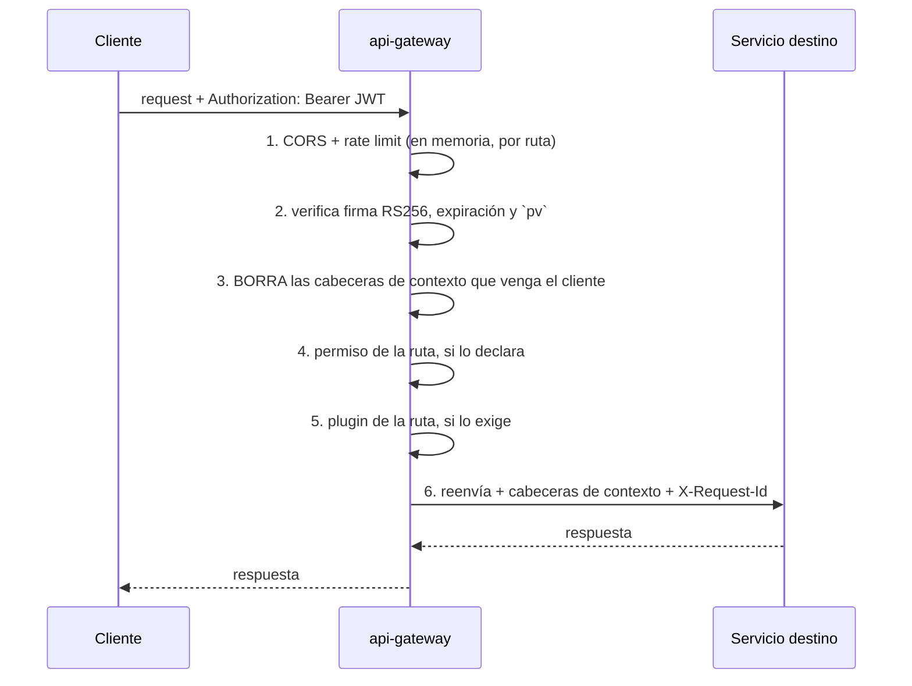

# api-gateway

[← Volver al índice](../README.md) · [auth-service](./auth-service.md) · [tiempo real](./realtime-service.md) · [plugin-catalog-service](./plugin-catalog-service.md)

> **Estado: construido y desplegado.** `api-gateway-node`, Hono, puerto 8080, expuesto por cloudflared como `api.noahsolution.com`. Documento actualizado el 2026-09-14 contra el código.

## Responsabilidad

**Punto único de entrada.** Sin datos de negocio. Valida el JWT, propaga el contexto a los servicios internos, decide si la organización tiene contratado el módulo que la ruta exige, enruta, y además **sostiene el WebSocket** (`/ws`) de todo el sistema.

```mermaid
graph TB
    SPA[SPA Vue 3] -->|HTTPS + JWT| GW[api-gateway :8080]
    POS[POS Tauri] -->|HTTPS + JWT| GW
    SPA -.Socket.IO /ws.-> GW
    GW --> AUTH[auth-service]
    GW --> ORG[organization-service]
    GW --> CUST[customer-service]
    GW --> PROD[product-service]
    GW --> TAX[tax-service]
    GW --> BILL[billing-service]
    GW --> FISC[fiscal-ecuador]
    GW --> DOC[document-service]
    GW --> NOTIF[notification-service]
    GW --> PLUG[plugin-catalog-service]
    GW --> AUD[audit-log-service]
    GW --> ASIS[assistant-service]
    GW --> INV[inventory-service]
```

**No hay prefijo `/api/v1`**: las rutas públicas son las mismas que las internas (`/invoices/*`, `/customers/*`…).

## Qué hace en cada petición



### Cabeceras de contexto

| Cabecera | Origen |
|---|---|
| `X-User-Id` | claim `sub` |
| `X-Organization-Id` | claim `org_id` |
| `X-Country-Code` | claim del token |
| `X-Permissions` | permisos del token |
| `X-Client-Ip` | **la IP que resuelve el gateway**; lo que mande el cliente se descarta |
| `X-Request-Id` | generado o propagado |

⚠️ **Todas estas cabeceras se borran de la petición entrante antes de inyectarlas** (`deriveSpoofHeaders`). Sin eso, cualquiera podía suplantar a otro usuario u organización mandándolas a mano. El caso real que lo destapó: el gateway reenviaba `X-Internal-Secret` desde fuera, y su valor de desarrollo está en el repo, así que **cualquier usuario podía leer el certificado de firma `.p12` de otra organización** (ver [historial de hallazgos](../facturacion-electronica/historial-hallazgos.md)).

## Tres decisiones que definen el gateway

### 1. Es un motor genérico, no "el gateway del CRM"

Esto es fácil de pasar por alto y condiciona todo lo demás: **el motor no sabe nada del CRM ni de "organización"**. Verifica un JWT, inyecta contexto y hace reverse proxy; todo lo específico de esta aplicación vive en **un archivo de configuración**. Reutilizarlo en otra aplicación es escribir otra config con el mismo motor.

Por eso el enrutamiento entero está en `src/config/gateway.config.ts`, una lista de reglas con método, ruta, servicio, `public`, `stripPrefix`, `permission`, `requiresPlugin` y `rateLimit`. Añadir un servicio es añadir filas, no código — y meter una regla de negocio del CRM dentro del motor rompe la propiedad que lo hace reutilizable.

### 2. El permiso viaja en el token, con una caché que lo desmiente

El JWT lleva los permisos y un `pv` (*permissions version*). El gateway mantiene una **caché de 10 s, fail-open**, del `pv` vigente de cada usuario: si el token trae un `pv` viejo (le cambiaron el rol, lo deshabilitaron), responde **`401 TOKEN_STALE`** y obliga a re-autenticar. Un rechazo se **reconfirma** saltándose la caché antes de darlo por bueno.

En paralelo, el hub emite `permissions.changed` por el socket para que el frontend refresque en el acto en vez de descubrirlo con un error.

### 3. Los plugins se comprueban aquí

Cada ruta puede declarar `requiresPlugin`, y el gateway consulta a [plugin-catalog-service](./plugin-catalog-service.md) con una caché de 60 s que **se invalida en cuanto llega un evento `plugin.*`** por RabbitMQ: activar o desactivar un módulo se nota al instante.

| Ruta | Plugin exigido |
|---|---|
| `/customers/*`, `/contacts/*`, `/addresses/*`, `/tags/*` | `crm.contacts` |
| `/products/*`, `/categories/*`, `/units/*`, `/tax-rates/*` | `infra.catalog_products` |
| `/establishments/*` | `org.establishments` |
| `/invoices/*`, `/fiscal-invoices/*` | `finance.electronic_invoicing` |
| `/certificates/*` | `finance.electronic_certificate` |
| `/warehouses/*` | `inventory.warehouses` |
| `/stock/*` | `inventory.kardex` |

## Rutas públicas (sin JWT)

`POST /auth/register`, `/auth/login`, `/auth/google`, `/auth/refresh`, `/auth/logout`, `/auth/accept-invite`, `/auth/password-reset`; `GET /trusted-ips/enabled`; `GET /plugins` y `/business-profiles`; y **`POST /billing-points/pair`**, el emparejamiento del [POS](../pos/punto-de-venta.md), con rate limit de 5 por minuto — es público a propósito: el código TOTP *es* la autenticación.

### `/cmr-documents/*`: el objeto que no es un servicio

Hay un destino más en el mapa de servicios, llamado `store`, que **no es un microservicio**: es **MinIO** (`STORE_SERVICE_URL`). El gateway lo publica en `/cmr-documents/*` **sin autenticación y sin `stripPrefix`**, porque las URL prefirmadas van en *path-style* —el bucket viaja en la ruta— y la firma se rompe si el URI no llega intacto.

Esto explica dos cosas que de otro modo parecen contradictorias:

- Una URL prefirmada funciona desde el navegador aunque el usuario no mande el token: **la firma es la autorización**, y caduca sola.
- Es también **el resto abierto del hallazgo N13**: las imágenes siguen siendo alcanzables sin sesión porque la interfaz las pinta con `` contra esta ruta. Los archivos fiscales se cerraron en document-service, que ya no entrega enlace para ellos; lo que falta es que el frontend deje de pedir URL directas. Ver [document-service](./document-service.md).

En cambio `/files/*` **ya no es público**: con solo el id cualquiera obtenía enlace a cualquier archivo. Hoy la interfaz pide `GET /files/:id/url` con su token y document-service acota por organización.

## El WebSocket

Socket.IO en `/ws`, sobre el mismo servidor HTTP y con el mismo JWT. Consume `crm.events` y reparte por salas (`catalog:<orgId>`, `user:<uid>`, `device:<sub>`). Ver [tiempo real](./realtime-service.md).

Ahí cuelga también el socket del [asistente de IA](./asistente-ia.md), para que un turno largo no choque con los tiempos de Cloudflare.

## Detalles de implementación

- **Rate limit en memoria del proceso** (`InMemoryRateLimitStore`), no Redis. Devuelve `X-RateLimit-Limit` y `X-RateLimit-Remaining`. Con más de una réplica del gateway el límite se multiplica: es otra razón por la que hoy corre en una sola.
- **IPs de confianza**: exentas del rate limit, no un control de acceso. Salen de auth-service (`/trusted-ips/enabled`) con caché refrescada cada 30 s y respaldo en `RATE_LIMIT_TRUSTED_IPS` si auth no responde. Ver [auth-service](./auth-service.md).
- Cabeceras hop-by-hop eliminadas al reenviar; query string preservado.
- Trazas OTel en `src/infrastructure/telemetry`.

## Lo que el gateway NO hace

- No tiene lógica de negocio ni base de datos.
- No es el único sitio donde se valida: cada servicio revalida permisos y reglas de dominio (ver [validación](../arquitectura/validacion.md)).
- No agrega respuestas de varios servicios: el frontend compone.
