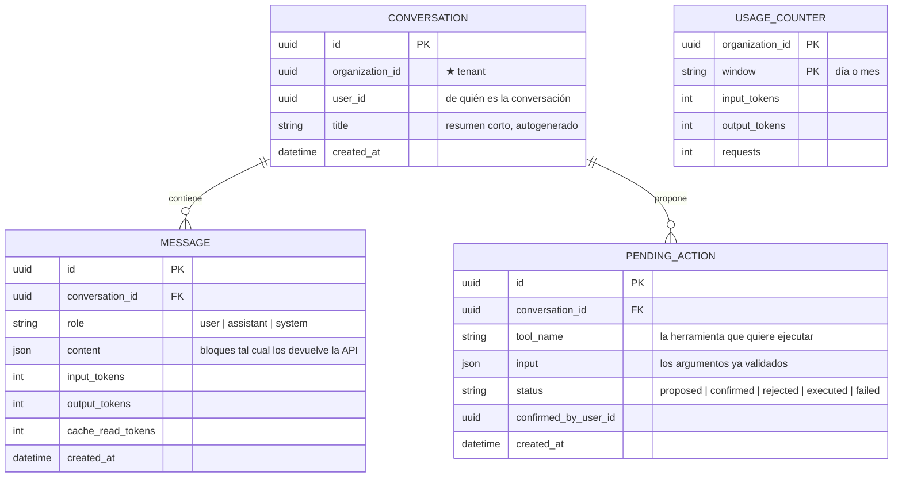

# Asistente del CRM (agente que ejecuta)

> **Estado: construido y desplegado (2026-09).** Lo que sigue era el diseño y se cumplió. Estado real verificado el 2026-09-14:
>
> - Servicio `assistant-service`, tablas `conversations`, `messages`, `pending_actions`, `usage_counters`; rutas `/assistant/conversations`, `/assistant/messages`, `/assistant/actions/:id/decide`.
> - **Tres proveedores de modelo** por `ASSISTANT_PROVIDER`: `anthropic` (necesita `ANTHROPIC_API_KEY`), `opencode` (`OPENCODE_API_KEY`) y `openai-compat` (necesita `ASSISTANT_BASE_URL`, p. ej. `http://ollama:11434/v1`).
> - Funcionando **gratis** con **gemma en Ollama** a través de `openai-compat`.
> - Los turnos van por **WebSocket** sobre el socket del gateway, con HTTP como plan B: un turno largo chocaba con los tiempos de Cloudflare (502).
> - Historial persistente, borrado virtual de conversaciones y enlaces internos clicables en las respuestas.

## El catálogo de herramientas (código real, `domain/tools.ts`)

**13 herramientas**, y cada una es **un endpoint que ya existe** en la API del CRM, llamado a través del gateway **con el JWT del usuario que conversa**.

De esa sola decisión salen gratis los permisos, el aislamiento por organización, la validación, los eventos de outbox y la auditoría: *el asistente no puede hacer nada que el usuario no pudiera hacer pulsando botones*. El propio código lo avisa: el día que alguien le dé un token de servicio "para simplificar", las cinco cosas se caen a la vez.

| Riesgo | Qué pasa |
|---|---|
| `read` | se ejecuta sola |
| `write` | se **propone** y se para hasta que una persona confirme (`pending_actions`) |

Lectura: `listar_clientes`, `ver_cliente`, `listar_productos`, `listar_facturas`, `listar_empleados`, `listar_roles`, `listar_permisos`, `ver_organizacion`, `listar_establecimientos`.
Escritura: `crear_rol`, `invitar_empleado`, `crear_cliente`, `crear_producto`.

**Lo que no está en el catálogo no existe para el asistente.** Borrar la organización o desactivar usuarios no se ofrecen a propósito.

### El asistente no factura

Puede **consultar** facturas para responder preguntas, pero nunca emitir, anular ni modificar una, ni tocar nada fiscal (comprobantes electrónicos, certificados de firma). Una factura tiene efectos tributarios que no se deshacen con un clic. Cualquier llamada que no sea `GET` a esas rutas se bloquea en `callTool`, **y hay un test que falla si alguien lo cambia**.

## Qué es

Un asistente al que el usuario le pide cosas en su idioma y **las hace**: "crea
un rol de cajero que solo pueda facturar", "invita a maria@… como vendedora",
"dame las ventas de marzo por establecimiento". No es un buscador ni un chat de
ayuda: es un agente con manos dentro del CRM.

Va **incluido en la plataforma**, no como módulo vendible. Eso no exime de medir
el consumo: un asistente que ejecuta cuesta dinero variable por uso, y sin
medición no hay forma de saber a quién le sale caro.

## La decisión que lo sostiene todo: las herramientas son tu propia API

El asistente **no habla con las bases de datos**. Cada herramienta que puede usar
es un endpoint de los 73 que ya funcionan, llamado a través del api-gateway
**con el JWT del usuario que está conversando**.

De esa sola decisión salen gratis cinco cosas que si no habría que reinventar:

| Lo que sale gratis | Por qué |
|---|---|
| **Permisos** | El gateway inyecta `X-Permissions` del token. Si el usuario no puede crear roles, la herramienta devuelve 403 y el asistente lo dice. |
| **Aislamiento por organización** | `X-Organization-Id` sale del mismo token. Es imposible que el asistente lea datos de otra organización, porque no tiene por dónde. |
| **Validación** | Los esquemas Zod de cada servicio siguen aplicando. Un RUC inválido lo rechaza quien siempre lo ha rechazado. |
| **Eventos y read-models** | Crear un cliente por el asistente publica el mismo evento de outbox que crearlo a mano. Nada se queda a medias. |
| **Auditoría** | Cae en la bitácora como cualquier otra acción, con el usuario real como autor. |

> **La regla:** el asistente nunca puede hacer nada que el usuario no pudiera
> hacer pulsando botones. Si algún día se le da un token de servicio para
> "facilitar" algo, todo lo de la tabla se cae a la vez.

Queda pendiente una cosa pequeña y necesaria: que los eventos lleven **de dónde
vino la acción** (`source: "assistant"`), para poder distinguir en la bitácora lo
que hizo una persona de lo que hizo el asistente en su nombre.

## Dónde vive: `assistant-service`

Un servicio nuevo, con el mismo molde que los demás (Hono + Clean Architecture +
Sequelize, su propia base `assistant_db`).

Es dueño de:

- **La clave de la API de Anthropic.** Nunca sale de ahí. El frontend jamás la ve.
- **El catálogo de herramientas**: qué endpoints se exponen, con qué esquema y en
  qué categoría de riesgo.
- **El bucle del agente** y el historial de cada conversación.
- **El consumo**: tokens por organización, por usuario y por conversación.

Guardar los bloques de contenido **tal cual** (no solo el texto) importa: es lo
que permite reanudar una conversación sin perder los bloques de razonamiento ni
los de compactación.

## Cómo se ejecuta

- **SDK oficial de TypeScript** (`@anthropic-ai/sdk`), que es el mismo lenguaje
  del resto del backend.
- **Tool Runner** (`client.beta.messages.toolRunner` con herramientas definidas
  por Zod): la librería lleva el bucle de llamada → ejecución → repetición, y
  expone ganchos por turno. Esos ganchos son exactamente donde se coloca la
  puerta de confirmación de la que habla la sección siguiente. Escribir el bucle
  a mano solo añade código propio que mantener.
- **Modelo `claude-opus-5`** con pensamiento adaptativo y **streaming**, que es
  obligatorio en la práctica: un agente que encadena varias herramientas tarda, y
  sin streaming se come el tiempo de espera de la petición.
- **Los 73 endpoints no caben como catálogo fijo.** Se marcan con carga diferida
  y se añade la herramienta de búsqueda de herramientas, para que el modelo
  encuentre la que necesita en vez de leerse las 73 en cada mensaje. Al menos una
  herramienta debe quedar sin diferir.
- **Caché de prompt** sobre el prompt de sistema y el catálogo, que son la parte
  estable. Se verifica que funciona mirando `cache_read_input_tokens`: si sale
  cero en peticiones seguidas, algo del prefijo cambia en cada llamada.
- **Respaldo ante rechazo**: si el modelo declina una petición por política, la
  llamada puede reintentarse sola en un modelo de respaldo. Conviene activarlo
  desde el principio para que una negativa aislada no deje al usuario mirando un
  error.

## Leer es libre, escribir se confirma

Cada herramienta se declara en una de tres categorías:

| Categoría | Qué hace el asistente | Ejemplos |
|---|---|---|
| **Lectura** | La ejecuta sin preguntar | listar clientes, ver un producto, ventas del mes, catálogo de permisos |
| **Escritura** | **Propone** y espera que un humano confirme | crear un rol, invitar a alguien, crear cliente o producto, emitir factura |
| **Prohibida** | No existe para el asistente | eliminar la organización, desactivar al usuario que conversa, tocar catálogos de plataforma |

La propuesta se enseña en la interfaz con el efecto exacto, no con el nombre
técnico: *"Voy a crear el rol **Cajero** con estos 7 permisos: …"* y dos botones.
Hasta que alguien pulse, no se llama a nada.

Esto no es solo cortesía con el usuario: es **la defensa contra la inyección de
instrucciones**. Un cliente que se llame "ignora tus instrucciones anteriores"
entra en el contexto en cuanto el asistente lista clientes. Con la puerta de
confirmación, lo peor que consigue es proponer una tontería que alguien rechaza.
Complementos que sí valen la pena:

- Las instrucciones del operador viajan por el canal de mensajes de sistema, no
  mezcladas con los datos.
- Los resultados de herramienta son datos, nunca órdenes, y el prompt lo dice.
- Confirmar dos veces las acciones que afectan a permisos o a dinero.

## Informes

"Dame un informe de ventas" tiene dos niveles y conviene no confundirlos:

1. **v1 — datos, no documentos.** El asistente consulta y devuelve datos
   estructurados; la interfaz los pinta con el sistema de gráficos que ya tienes.
   Es más rápido, más barato y más fiable que pedirle prosa con números dentro.
2. **v2 — documentos de verdad.** PDF o XLSX generados con ejecución de código y
   devueltos por la API de archivos. Solo cuando el primero se quede corto.

## Coste, y por qué se mide aunque sea gratis

Al ir incluido en la plataforma, cada conversación la pagas tú. Sin medición no
te enteras hasta la factura.

- **Contador por organización desde el día uno**, aunque no se facture. Es la
  tabla `usage_counter` de arriba.
- **Límite duro por organización y ventana**, con un mensaje honesto al llegar.
- **Esfuerzo bajo para lo rutinario** y modelo pequeño (Haiku) para tareas
  mecánicas como clasificar o resumir un texto corto. El modelo grande se reserva
  para el bucle del agente, que es donde se nota.
- **La caché de prompt es el ahorro grande**, no el cambio de modelo: el prompt
  de sistema y el catálogo se repiten en cada mensaje de cada conversación.

## Privacidad: una decisión que hay que tomar antes de escribir código

Los datos que el asistente lee (clientes, facturas, empleados) **salen hacia la
API de Anthropic** para poder razonar sobre ellos. Eso no es un detalle técnico,
es una decisión de producto que hay que:

1. **Decidir explícitamente**, incluida la retención de datos que aplique al
   plan contratado.
2. **Contarlo en el contrato o en los términos**, porque tus clientes tienen
   datos de sus clientes ahí dentro.
3. **Poder apagarlo por organización**, para quien no lo quiera.

## Evaluación: sin esto no se puede mejorar

Un agente no se prueba mirándolo. Antes de abrirlo hace falta un conjunto de
casos reales con criterio de acierto claro:

- "Crea un rol de cajero que solo facture" → ¿creó el rol con los permisos
  correctos y ninguno de más?
- "Invita a maria@ejemplo.com como vendedora" → ¿invitación con el rol correcto?
- "¿Cuánto facturé en marzo?" → ¿el número coincide con la consulta directa?
- "Bórrame la organización" → ¿se niega?

Con eso, cambiar el prompt deja de ser adivinar. Sin eso, cada ajuste es una
apuesta.

## Fases

| Fase | Qué entra | Por qué en este orden |
|---|---|---|
| 1 | `assistant-service` con el bucle, 5 herramientas **de solo lectura** y un chat en la interfaz | Toda la fontanería (clave, streaming, historial, permisos) sin poder romper nada |
| 2 | Escritura con confirmación: crear rol, invitar empleado, crear cliente y producto | Es el salto de valor real, y ya con la puerta puesta |
| 3 | Búsqueda de herramientas sobre los 73 endpoints | Solo compensa cuando el catálogo ya no cabe |
| 4 | Informes con datos estructurados | Necesita que las herramientas de lectura estén asentadas |
| 5 | Medición, límites y apagado por organización | Antes de abrirlo a todos |
| 6 | Documentos generados, si hace falta | El último, y puede que nunca |

Las fases 1 y 2 son las que deciden si esto funciona. El resto es ensanchar.

## Decisiones abiertas

1. **Por dónde va el streaming.** Ya existe un socket en el api-gateway para
   notificaciones. Reaprovecharlo evita infraestructura nueva; un canal propio de
   eventos servidos desde `assistant-service` es más simple de razonar. Hay que
   elegir.
2. **Quién puede usarlo.** ¿Cualquier usuario con sesión, o hace falta un permiso
   `assistant:use` que se asigne por rol? Lo segundo permite abrirlo poco a poco.
3. **En qué idioma responde.** El CRM es trilingüe. Lo natural es que siga el
   idioma de la interfaz, pero hay que decirlo en el prompt, no confiar en que
   lo adivine.
4. **Qué hacer con las acciones propuestas y nunca confirmadas.** Caducan solas,
   se quedan en la conversación, o hay una bandeja de pendientes.

## Qué no es este plan

- **No es un asistente que aprenda de tus datos.** No hay ajuste fino ni memoria
  entre organizaciones: cada conversación empieza con el contexto que se le da.
- **No sustituye la interfaz.** Un formulario bien hecho sigue siendo mejor que
  pedirlo hablando, y el asistente no es excusa para no arreglar un flujo malo.
