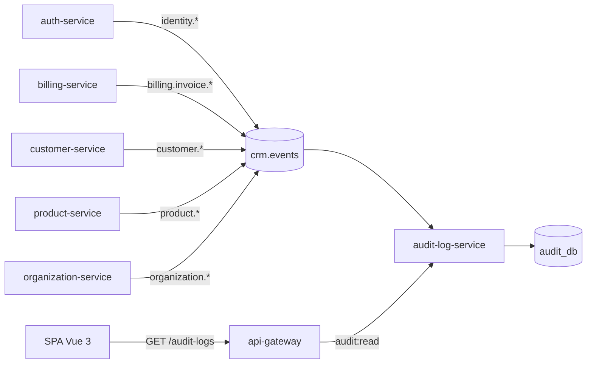
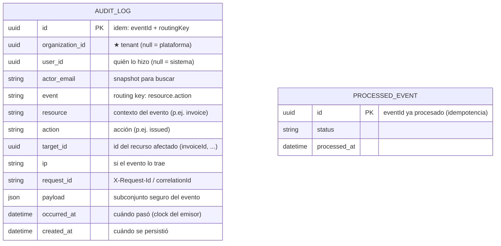
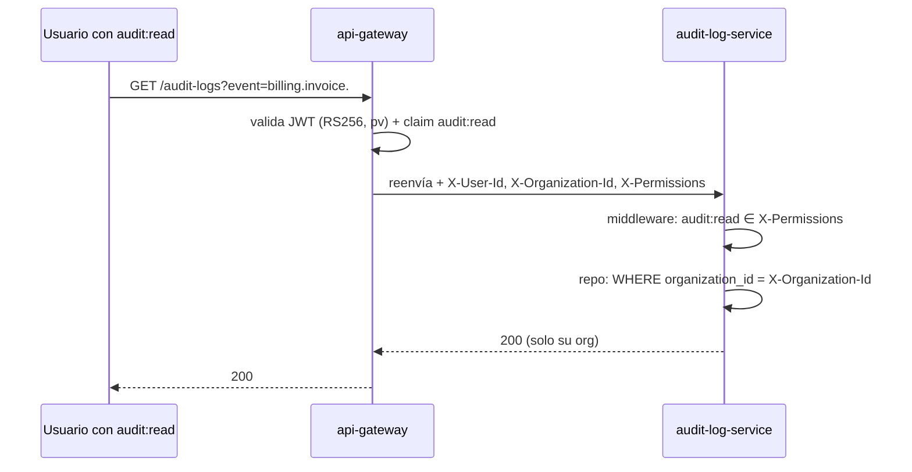

# audit-log-service

[← Volver al índice](../README.md) · [comunicación](../arquitectura/comunicacion.md) · [api-gateway](./api-gateway.md)

> **Estado: construido y desplegado.** Verificado el 2026-09-14: consume con el handler comodín (`#`) de `@facturero/outbox-relay`, tablas `audit_logs` y `processed_events`, rutas `/audit-logs`, `/audit-logs/:id` y `/audit-logs/summary` con permiso `audit:read`.
>
> ⚠️ **Su cobertura depende de que los demás publiquen.** El servicio no instrumenta a nadie: solo ve lo que se publica en `crm.events`. Un servicio que no emita un evento simplemente no aparece en la bitácora.
>
> El **actor** (`actorId`, `actorEmail`, IP, `requestId`) llega por el `ActorContext` de la librería, no por el payload del evento: en los eventos de identidad el `userId` del payload es el usuario **afectado**, no quien ejecuta. Ver [outbox-relay](./outbox-relay.md).

## Responsabilidad

Registra **cada acción que hace cada usuario** dentro del sistema, en una **bitácora central de auditoría**. Consume **todos** los eventos de negocio del exchange `crm.events` (binding `#`) y los persiste con el contexto de quién lo hizo, en qué organización, cuándo y con qué payload. Expone una API **de solo lectura** (no hay mutaciones de negocio) que requiere el permiso `audit:read`.

> La bitácora es de **cumplimiento** y **trazabilidad**: quién hizo qué, cuándo y desde dónde. No participa en el camino crítico de ninguna operación: llega todo por RabbitMQ, de forma asíncrona.

## Por qué un servicio aparte

- Los servicios de negocio **no** se acoplan al registro de auditoría: solo publican sus eventos de dominio (patrón ya establecido). audit-log-service escucha y persiste lo que le interesa.
- La **bitácora es transversal**: cruza `identity.*`, `billing.*`, `customer.*`, `organization.*`, etc. Vivir en un servicio dedicado evita inflar cada servicio con tablas de log y da un solo lugar para consultar "toda la historia".
- Cumplimiento fiscal (SRI/DIAN): tener un registro no repudiable, consultable por SQL/API, de las operaciones críticas.
- Si se cae, **no bloquea el negocio**: los eventos quedan encolados en RabbitMQ (o reintentados por el consumidor) y AL final se persiste lo que no se pudo. La consistencia es eventual.



## Entidades dueñas (`audit_db`)



### Claves del modelo

- **`id` estable y determinista**: derivado de `(eventId, routingKey)` con forma UUID v5 (re-procesar el mismo evento cae sobre la misma fila, nunca duplica).
- **`organization_id` es el tenant.** Toda consulta por API filtra obligatoriamente por la organización del contexto (`X-Organization-Id`). Los eventos de plataforma (`organization_id = null`) no se listan a organizaciones.
- **`user_id`** = `sub`/`X-User-Id` que el emisor puso en el evento. `null` cuando la acción la hizo el sistema (no un usuario).
- **`event`** guarda la routing key completa (`billing.invoice.issued`): es lo que se muestra, filtra y agrupa.
- **`ip` / `request_id`** son **opcionales**: se guardan solo si el evento los trae (no todos los emisores los propagan hoy).
- **`payload`** es el payload del evento (JSON). Es el "detalle". Por volumen se puede normalizar/comprimir más adelante (ver [Retención](#retención-y-volumen)).

## Qué consume y qué registra

El diseño del sistema ya define un consumidor de auditoría que bindea `#` (todos los eventos) — ver [comunicación](../arquitectura/comunicacion.md#auditoría). Tabla no exhaustiva de eventos esperados (catálogo completo en `crm.events`):

| Evento (routing key) | Quién | Qué registra |
|----------------------|-------|---------------|
| `identity.user.created` | auth | Alta de usuario |
| `identity.user.role_assigned` | auth | Cambio de rol (con su `pv++`) |
| `identity.user.disabled` / `.enabled` | auth | Baja/alta de acceso |
| `identity.user.invited` | auth | Invitación |
| `identity.role.updated` | auth | Cambio de permisos de un rol |
| `organization.org.updated` | organization | Actualización del perfil fiscal |
| `organization.establishment.created` | organization | Alta de establecimiento |
| `organization.billing_point.created` | organization | Alta de punto de emisión |
| `customer.customer.created` / `.updated` / `.deleted` | customer | CRUD de clientes |
| `product.product.updated` | product | Cambios de producto |
| `tax.tax_rate.upserted` | tax | Altas/bajas de tasas |
| `billing.invoice.issued` | billing | Emisión de factura |
| `billing.invoice.authorized` | billing | Autorización fiscal (SRI/DIAN) |
| `billing.invoice.voided` | billing | Anulación de factura |

> **Cobertura "cada acción de cada usuario".** La base hoy es: **todo evento de dominio con contexto de usuario**. Para expandir a *toda operación REST* (incluso GETs y acciones que hoy no emiten evento), cada servicio publicaría además un evento `audit.*` por acción relevante (ver [Evolución](#evolución)). El consumidor del audit-log no distingue: persiste lo que llegue al exchange.

Los eventos llevan metadatos obligatorios: `eventId`, `organizationId`, `occurredAt`, `version`, `correlationId`. El consumidor los extrae y **descarta** el evento si falta `eventId` (no auditable) o si `organizationId` es inválido.

## Consumo e idempotencia

- **Queue:** `audit-log-service.events`, bindeada con `#` (patrón catch-all) a `crm.events`.
- **Relay:** la librería `@facturero/outbox-relay` (`InboxConsumer`) gestiona reconexión con backoff, reintentos inmediatos → cola de retry (TTL+DLX) → estado `failed`.
- **Idempotencia:** tabla `processed_events`. El id de la fila de AUDIT_LOG se deriva del `eventId`, así un reintento **no duplica** la bitácora.
- **Fallos:** si el handler falla N veces, la librería marca `failed` en `processed_events` y `onFailure` puede alertar (p.ej. evento `audit.failed`). El evento original ya no se pierde silenciosamente: queda inspeccionable por SQL.

## API REST (solo lectura)

Todas las rutas son `GET` y requieren el permiso **`audit:read`** (ver [Autorización](#autorización)). El servicio **no valida JWT**: confía en los headers que inyecta el gateway (`X-User-Id`, `X-Organization-Id`, `X-Permissions`, `X-Request-Id`). El aislamiento por tenant se aplica **siempre** en el repositorio (el `WHERE organization_id = :org` nunca se omite).

| Método | Ruta | Descripción |
|--------|------|-------------|
| GET | `/audit-logs` | Lista paginada de eventos de la org. Filtros: `event`, `userId`, `targetId`, `from`/`to`, `search`. |
| GET | `/audit-logs/:id` | Detalle de un evento concreto (página/da el payload completo). |
| GET | `/audit-logs/summary` | Agrupaciones útiles por día: nº de acciones por evento y por usuario (para una vista de dashboard). |
| GET | `/health` | Liveness/readiness. |

Parámetros de listado:

| Parámetro | Tipo | Descripción |
|-----------|------|-------------|
| `event` | string | Filtra por routing key exacta (`billing.invoice.issued`) o prefijo (`billing.`). |
| `userId` | uuid | Acciones de un usuario concreto. |
| `targetId` | uuid | Acciones sobre un recurso concreto (factura, cliente…). |
| `from` / `to` | ISO-8601 | Ventana de tiempo por `occurred_at`. |
| `search` | string | Busca en payload (JSON) o actor. |
| `limit` / `offset` | int | Paginación (default 50, máx 500). |

**Respuesta de ejemplo** (`GET /audit-logs`):

```json
{
  "items": [
    {
      "id": "b52a…-d5e7",
      "event": "billing.invoice.issued",
      "resource": "invoice",
      "action": "issued",
      "userId": "5a7c…-9f21",
      "targetId": "9d31…-c8aa",
      "occurredAt": "2026-09-07T14:02:11Z",
      "requestId": "req-…",
      "ip": null,
      "summary": "Factura 001-001-000000123 emitida"
    }
  ],
  "total": 128_412,
  "limit": 50,
  "offset": 0
}
```

> Solo lectura por diseño: **no hay** endpoints de crear/editar/borrar logs. Si un evento se registró mal, la política es retenerlo y, si hace falta, marcar una corrección aparte (nunca `DELETE`).

## Autorización

### Permiso nuevo

Se añade `audit:read` al catálogo de permisos de plataforma (auth-service, migración seed del catálogo RBAC, misma forma que `report:read` / `analytics:read`).

| Permiso | Acción que habilita |
|---------|---------------------|
| `audit:read` | Consultar la bitácora del **propio scope**: ver eventos, detalle y resumen de la organización activa. |

### Roles

- **Administrador**: recibe `audit:read` en su rol (todos los permisos) — lo hereda al clonar las plantillas.
- **Contador** y **Solo lectura**: ver decisión de asignación (conveniencia) — candidatos naturales a `*:read`.
- El acceso es **siempre de solo lectura**: no existe `audit:write` para usuarios; las escrituras solo entran por RabbitMQ.

### Cómo se hace cumplir

1. **Gateway (grueso):** el JWT ya viaja con `permissions[]`; a la ruta `/audit-logs/*` se le declara `permission: 'audit:read'` en `gateway.config.ts` (mismo patrón `{ method: 'ANY', path: '/audit-logs/*', service: 'audit-log-service', stripPrefix: '' }`). El gateway verifica que el claim contenga el permiso antes de enrutar.
2. **Servicio (fino):** el middleware de cada ruta lee `X-Permissions`, comprueba `audit:read` y **además** el repositorio filtra por `X-Organization-Id` (aislamiento de tenant, nunca por GET visible).

Flujo:



### Ruteo en el gateway

| Prefijo público | Servicio interno |
|-----------------|------------------|
| `/audit-logs/*` | audit-log-service (permiso `audit:read`) |

## Retención y volumen

La bitácora crece sin límite; hay que **dimensionarla desde el diseño**:

- **Particionaje por mes** (`audit_logs_YYYYMM`) o `PARTITION BY RANGE (TO_DAYS(occurred_at))` en MySQL: borrar/seleccionar ventanas viejas es barato.
- **Payload normalizado**: guardar solo un subconjunto seguro del evento (no PII innecesaria; los datos completos siguen en el servicio dueño). Si crece mucho, GZIP/compresión del JSON o mover el payload a una tabla hija `audit_log_payloads`.
- **Política de retención** (configurable por organización o global): p.ej. 3 años exigencia fiscal EC/CO. Al caducar, archive/delete por partición.
- **Índices**:
  - `(organization_id, occurred_at DESC)` — la consulta principal (bitácora por org, reciente arriba).
  - `(organization_id, event, occurred_at DESC)` — filtro por evento.
  - `(organization_id, user_id, occurred_at DESC)` — filtro por usuario.

## Dependencias

- **RabbitMQ**: consume `crm.events` (binding `#`). Vía librería `@facturero/outbox-relay`.
- **MySQL**: `audit_db` propia (modelo `AUDIT_LOG` + `processed_events`).
- **api-gateway**: único ingreso; inyecta contexto y exige `audit:read`.

## Evolución

1. **Acciones granulares (provider de auditoría por servicio):** cuando se quiera auditar *cada* request (no solo eventos de dominio), cada servicio publica un evento `audit.<recurso>.<accion>` (p.ej. `audit.customer.read`) con `userId/organizationId/ip/requestId`, idempotente por `eventId`. El audit-log los consume igual que los de dominio. *Diseño listo, implementación fase 2.*
2. **Inmutabilidad reforzada:** hash encadenado (Merkle) de filas para detección de alteración `^` backfill tolerante.
3. **Exportación a S3/MinIO** de particiones frías y reportes de cumplimiento.
4. **Frontend:** vista "Bitácora" de solo lectura (lista + filtros) visible solo con `audit:read`.

## Notas

- El consumo es **eventual**: un evento puede tardar segundos en aparecer hasta que relay/consumer lo procesen. No es un log de "tiempo de llegada exacto" sino de *ocurrencia* (`occurred_at`).
- La bitácora NO es la fuente de verdad de los datos — solo el registro de las acciones. Para el estado actual se consulta al servicio dueño.
- `eventId` es obligatorio: sin él no se puede garantizar idempotencia y el evento se descarta.