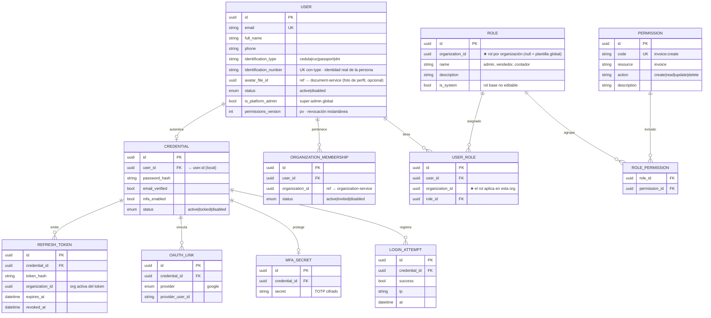
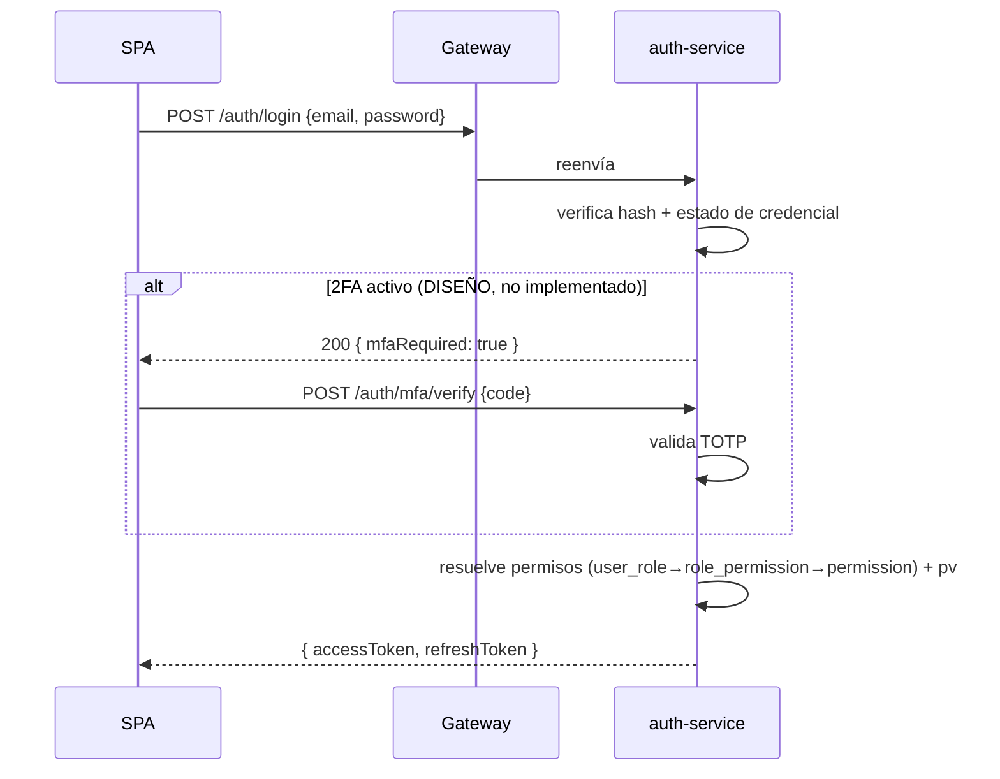
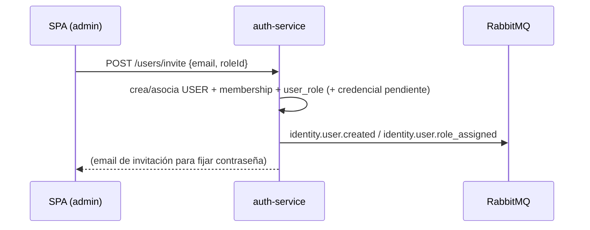

# auth-service (identidad y acceso)

[← Volver al índice](../README.md) · [api-gateway](./api-gateway.md) · [organization-service](./organization-service.md) · [autorización](../arquitectura/autorizacion.md) · [multipaís](../arquitectura/estrategia-multipais.md)

> **Servicio único de identidad.** auth-service es el **único** dueño del dominio de identidad: **autenticación** (¿eres quien dices ser?) **y autorización** (¿qué puedes hacer?). Antes esto estaba dividido en dos servicios (auth + identity); se unificó porque auth **no puede firmar un token correcto sin los datos de roles/permisos**, así que compartían ciclo de vida y la separación solo aportaba un puente de sincronización por eventos (read-model + `pv`) sin beneficio real. Un solo servicio lee sus **propias** tablas al emitir el token: sin read-model, sin consistencia eventual interna. Ver la justificación en [autorización](../arquitectura/autorizacion.md).
>
> *Nota:* el despliegue conserva el nombre `auth-service` (y `auth_db`) por continuidad con el código ya existente. Sus **eventos de dominio** usan el namespace `identity.*` porque nombran el contexto de negocio (identidad), no el nombre del despliegue.

## Responsabilidad

- **Autenticación**: credenciales, login email/contraseña, **Google Sign-In** (ID Token), emisión y rotación de **JWT**. ⚠️ **El 2FA está diseñado pero NO implementado** (verificado el 2026-09-14: no hay tabla, ni caso de uso, ni ruta de TOTP en el código).
- **Autorización (RBAC)**: **usuarios**, **roles** (por organización), **permisos** (catálogo `recurso:acción`), **asignaciones** y **membresía** de usuarios a organizaciones.
- **Fuente de verdad** de la identidad de negocio. Al emitir el JWT, resuelve los permisos efectivos leyendo sus propias tablas.

## Entidades dueñas (`auth_db`)

Credenciales (autenticación) + identidad/RBAC (autorización) viven en la **misma base**, así que `credential.user_id` ahora es una **FK real local** (no una referencia entre servicios).



### Claves del modelo RBAC

- **El usuario es global** (la persona). No lleva `organization_id`: puede estar en varias organizaciones vía `organization_membership`.
- **Los roles son por organización.** El "admin" de la Org A ≠ el de la Org B. Hay **plantillas** globales (`organization_id = null`) que se clonan al crear una organización.
- **`user_role` lleva `organization_id`**: un usuario puede ser "admin" en una org y "vendedor" en otra.
- **Los permisos son catálogo de plataforma** (`invoice:create`, `customer:read`…): los definen los desarrolladores, iguales para todas las organizaciones.
- **`permissions_version` (`pv`)** es un contador por usuario para la revocación instantánea (ver [autorización §7](../arquitectura/autorizacion.md#7-revocación-las-dos-capas)).

### Identidad de la persona (cédula / identificador)

El `email` identifica el **login**, no a la persona. El `User` (que es la persona) lleva además un identificador real:

- `identification_type` (`cedula` | `ruc` | `passport` | `dni`, parametrizado por país) + `identification_number`.
- **Único global** sobre `(identification_type, identification_number)`: una persona = un usuario = una cédula. Refuerza que el usuario es global (un contador en varias empresas es **un** usuario con varias memberships, no varios usuarios).
- Se valida con un value object por tipo (cédula EC = 10 dígitos + verificador; RUC = 13; pasaporte libre), igual que `Email`.
- **Multipaís:** el país de la *persona* no es el de la *organización* (un ecuatoriano en una empresa mexicana); por eso `type` + `number` son genéricos en el `User`, no se derivan del país de la org.

> **No confundir** con la identificación del **cliente** del CRM (RUC/cédula del contribuyente), que vive en [customer-service](./customer-service.md) con su estrategia por país. Esta es la cédula del **empleado/persona que inicia sesión**.

### Onboarding y ciclo de vida (Opción A)

El **fundador**, al **registrarse** (`/auth/register` o `/auth/google`), obtiene de una vez —dentro de auth y en una sola transacción— su `User`, una **organización mínima** (solo el `id`), su **membership** y el rol **Administrador** (clonando las plantillas). Es decir: apenas se registra, **ya tiene `org_id` + permisos de admin**. No hay saga de creación entre servicios ni compensación.

Lo que falta después son los **datos fiscales** de la organización (razón social, RUC, país, establecimientos), que son de [organization-service](./organization-service.md): el usuario los completa con `PUT /organizations/me`. Ese es el "onboarding fiscal", un paso independiente y reintentable.

- **Fundador:** `register` (auth: user + org mínima + admin) → `PUT /organizations/me` (organization-service: perfil fiscal + establecimiento 001 + punto 001).
- **Invitado:** `InviteUser` lo crea **ya atado** a la org existente (membership + rol en una operación); no crea organización.
- **Sin organización:** solo el `is_platform_admin` (soporte). Un usuario normal siempre nace con org. No se pone constraint `NOT NULL` de membership (rompería al platform admin).

> **Lo único que auth guarda de la organización** es un read-model mínimo (`organizations`: `id` + `country_code`). auth crea esa fila (solo el `id`) al registrar al fundador, y el `country_code` arranca en `null`. Cuando organization-service completa el perfil y emite `organization.org.updated`, auth lo **consume** para fijar el `country_code` (y con él, el del próximo token). **No** es la fuente de verdad: el RUC, la razón social, la dirección, los establecimientos y los puntos de emisión viven en [organization-service](./organization-service.md).

## Permisos: convención

Formato `recurso:acción`. Catálogo base:

| Recurso | Acciones | Ejemplos |
|---------|----------|----------|
| `customer` | create, read, update, delete | `customer:create` |
| `product` | create, read, update, delete | `product:update` |
| `invoice` | create, read, void, authorize | `invoice:void` |
| `organization` | read, update | `organization:update` |
| `establishment` | create, read, update | `establishment:create` |
| `user` | invite, read, update, assign_role | `user:assign_role` |
| `tax_config` | read | `tax_config:read` |
| `report` | read | `report:read` |
| `analytics` | read | `analytics:read` (consolidado según scope) |

El [gateway](./api-gateway.md) verifica el permiso grueso (ruta→permiso) y cada servicio el fino (por recurso). Estos permisos **viajan en el JWT** (ver abajo).

## Roles base (plantillas que se clonan por organización)

| Rol | Permisos típicos |
|-----|------------------|
| **Administrador** | Todos dentro de su organización |
| **Vendedor** | `customer:*`, `product:read`, `invoice:create`, `invoice:read` |
| **Contador** | `invoice:read`, `report:read`, `tax_config:read` |
| **Solo lectura** | `*:read` |

## JWT: contenido y emisión

El access token (corto, ~15 min, RS256) se arma **leyendo las propias tablas** (`user_role → role_permission → permission`), sin read-model ni llamadas externas:

```json
{
  "iss": "auth-service",
  "aud": "crm-api",
  "sub": "userId",
  "email": "user@org.com",
  "org_id": "org activa",
  "country_code": "EC",
  "permissions": ["invoice:create", "customer:read"],
  "pv": 3,
  "exp": 1893456900
}
```

- **Access token**: corto, firmado; lo valida el [gateway](./api-gateway.md) y el [realtime-service](./realtime-service.md).
- **Refresh token**: largo, almacenado (hash) en `refresh_token`, **rota** en cada uso.
- **`pv`**: si se revocan permisos o se deshabilita al usuario, se **incrementa** `permissions_version` en la fila del usuario; los access tokens viejos quedan obsoletos (el PEP los rechaza al comparar `pv`). Ver [autorización](../arquitectura/autorizacion.md#7-revocación-las-dos-capas).

> **Sin read-model, sin puente de eventos interno.** Como los roles/permisos viven en esta misma base, el token se construye con una consulta local. Esto elimina la proyección `access_projection` y la sincronización `auth ↔ identity` del diseño anterior.

### Login estándar



### Invitar usuario a una organización



### Cambio de organización

Si el usuario pertenece a varias organizaciones (ver [multiorganizacional](../arquitectura/multiorganizacional.md#usuarios-en-varias-organizaciones)), `POST /auth/switch-organization` reemite el token con el nuevo `org_id` y los permisos de esa organización.

## API REST (resumen)

**Autenticación:**

| Método | Ruta | Descripción |
|--------|------|-------------|
| POST | `/auth/register` | Alta de credencial + usuario |
| POST | `/auth/login` | Login con email/contraseña |
| POST | `/auth/mfa/verify` | Verificar código TOTP |
| POST | `/auth/google` | Sign-In con ID Token de Google |
| POST | `/auth/refresh` | Rotar access token |
| POST | `/auth/logout` | Revocar refresh token |
| POST | `/auth/switch-organization` | Cambiar org activa del token |
| POST | `/auth/password/forgot` · `/reset` | Recuperación |
| GET | `/auth/me` | Perfil + permisos del token |

**Autorización / administración (RBAC):**

| Método | Ruta | Permiso |
|--------|------|---------|
| GET | `/users` | `user:read` |
| POST | `/users/invite` | `user:invite` |
| PATCH | `/users/:id` | `user:update` |
| POST | `/users/:id/disable` | `user:update` |
| POST | `/users/:id/roles` | `user:assign_role` |
| GET | `/roles` | `user:read` |
| POST | `/roles` | `user:assign_role` |
| PATCH | `/roles/:id/permissions` | `user:assign_role` |
| GET | `/permissions` | (catálogo) |

Todas las rutas de administración operan dentro del `org_id` del contexto (ver [multiorganizacional](../arquitectura/multiorganizacional.md)).

## Eventos

**Publica** (namespace `identity.*` por contexto de dominio):

| Evento | Cuándo | Consumido por |
|--------|--------|---------------|
| `identity.user.created` | Nuevo usuario/invitación | [realtime](./realtime-service.md) |
| `identity.user.role_assigned` | Asignación/cambio de rol | [gateway](./api-gateway.md) (refresca caché de `pv`) |
| `identity.role.updated` | Cambio de permisos de un rol | [gateway](./api-gateway.md) (caché de `pv`) |
| `identity.user.disabled` | Baja de usuario | [gateway](./api-gateway.md), [realtime](./realtime-service.md) |
| `auth.user.logged_in` | Login exitoso | audit, [realtime](./realtime-service.md) |
| `auth.password.changed` | Cambio de clave | audit |

**Consume:**

| Evento | Origen | Acción |
|--------|--------|--------|
| `organization.org.updated` | [organization](./organization-service.md) | Actualiza el `country_code` del read-model de la org (para el token). *(El seeding de roles + admin del fundador NO viene de aquí: ocurre en `register`.)* |

> Los eventos ahora salen **hacia afuera** (gateway, realtime, audit). Desaparece el consumo de `identity.*` que hacía el antiguo auth (ya no hay dos servicios que sincronizar).

## Dependencias

- **organization-service**: vía eventos — auth consume `organization.org.updated` para refrescar el `country_code` del read-model. (El seeding de roles + admin del fundador ocurre en el **registro**, no por evento.)
- **document-service**: el usuario tiene **foto de perfil** (`avatar_file_id`, opcional) que **referencia por ID** un archivo de document-service. auth solo guarda el `avatar_file_id`; el binario y sus variantes viven en document-service. Se fija en `complete-profile` y se devuelve en `GET /auth/me`. No hay dependencia síncrona: si el archivo no existe, el front simplemente muestra el avatar por defecto.
- **Redis**: caché de tokens revocados / rate limiting de login (opcional, para multi-instancia).
- **RabbitMQ**: publicación (Outbox) y consumo.
- ~~identity-service~~: **eliminado** — sus responsabilidades viven aquí.

## Validaciones (ver [validación](../arquitectura/validacion.md))

- **Borde (Zod)**: email válido, fuerza de contraseña, formato TOTP, `roleId` existe, formato de permisos.
- **Dominio**: no login si credencial `locked/disabled`; validez/rotación del refresh token; un rol `is_system` no se edita; no quitar el último admin de una organización; el permiso debe existir en el catálogo.
- **Seguridad**: hash **Argon2**; rate limiting por IP+email; bloqueo tras N intentos; firma **RS256** con algoritmo fijado explícitamente.

## Evolución multipaís: scope de roles

Para acceso cross-país (ver [estrategia multipaís](../arquitectura/estrategia-multipais.md#analítica-y-roles-multipaís)), la asignación generaliza de `(usuario, rol, organization_id)` a **`(usuario, rol, scope_type, scope_id)`**:

| `scope_type` | `scope_id` apunta a | Qué ve | Rol típico |
|--------------|---------------------|--------|-----------|
| `tenant` | grupo | **todas** las entidades y países | Dirección / CFO / analista de grupo |
| `organization` | entidad legal | un país, una empresa | Contador local, gerente de país |
| `establishment` | local | una sucursal | Cajero, vendedor de sucursal |

El **modelo actual** es scope de **organización** (`user_role.organization_id`), consistente con el aislamiento por `organization_id` del resto del sistema. El scope **tenant/grupo** (consolidación cross-país) es una **evolución futura** que acompaña a la capa de grupo opcional de [organization-service](./organization-service.md); introducir `scope_type` + `scope_id` lo generaliza sin romper lo actual.

## Lo que se añadió después del diseño (verificado 2026-09-14)

El servicio creció con cuatro cosas que no estaban en este documento. Tablas reales hoy: `users`, `credentials`, `oauth_accounts`, `refresh_tokens`, `device_refresh_tokens`, `password_reset_tokens`, `roles`, `permissions`, `role_permissions`, `user_roles`, `user_establishments`, `organizations`, `organization_memberships`, `trusted_ips`, `pos_devices`, más outbox e idempotencia.

### 1. Terminales POS (usuarios de servicio)

`POST /internal/device-accounts` — **solo servicio a servicio**, con `X-Internal-Secret`, nunca expuesta por el gateway. La llama organization-service cuando un punto de emisión se empareja con un POS: crea o reutiliza un usuario de servicio para ese equipo y devuelve tokens. De ahí `pos_devices`, `device_refresh_tokens` y el evento `identity.pos_device.provisioned`.

El `sub` del token de un POS es el **id del equipo**, no una persona; el hub de tiempo real lo usa para la sala `device:<sub>`. Ver [POS](../pos/punto-de-venta.md).

⚠️ Hoy el rol del usuario de servicio de un POS es **Administrador** (todos los permisos). Es una decisión temporal explícita: falta un catálogo de permisos propio para terminales.

### 2. IPs de confianza (exención de rate limit, NO control de acceso)

`trusted_ips` y `/trusted-ips/*`. **No restringen desde dónde se puede entrar**: son la lista de IPs **exentas del límite de peticiones** del gateway. Leerlo al revés lleva a creer que hay un control de acceso por red que no existe.

`GET /trusted-ips/enabled` es **público** porque lo consulta el propio gateway. Este mantiene una caché en memoria que refresca cada 30 s (`TRUSTED_IPS_REFRESH_MS`) y, si auth-service no responde, cae a la lista fija de `RATE_LIMIT_TRUSTED_IPS`. La comparación admite entradas por rango, no solo IPs exactas.

La IP la resuelve el gateway y la manda en `X-Client-Ip`, descartando lo que mande el cliente.

### 3. Acceso por establecimiento

`user_establishments` y `PUT /users/:id/establishments`: a un usuario se le puede limitar a ciertos establecimientos de la organización, no solo por rol. Evento `identity.user.establishments_updated`.

### 4. Google Sign-In y reseteo de contraseña

`POST /auth/google` (público) con `oauth_accounts`, y el ciclo de reseteo (`password_reset_tokens`) con los eventos `identity.user.password_reset_requested` / `_completed`, que notification-service convierte en correo.

`FRONTEND_URL` tiene que apuntar al CRM público: los enlaces de invitación y de reseteo se arman con esa base.

### 5. El código de usuario (login de cajero)

`users.username` es un **código de 7 caracteres** (letras y números en mayúsculas) único en toda la tabla, generado en la entidad de dominio al crear el usuario. No es un alias bonito: es **el nombre de usuario con el que un cajero entra al POS**, donde teclear un correo largo en una pantalla táctil no tiene sentido.

Recorrido completo: auth lo genera → la API de empleados lo expone → el frontend lo muestra en la lista y el detalle del empleado (para que el administrador se lo diga al cajero) → el [POS](../pos/punto-de-venta.md) lo guarda en su tabla local `users` y valida la contraseña contra el CRM usando el correo asociado.

La migración `20260802140000-add-username-to-users.js` hizo el backfill de los usuarios existentes con códigos únicos.

### Contexto de acceso para otros servicios

`GET /internal/users/:userId/access-context` — lo consume el gateway para su caché de `pv` (ver [api-gateway](./api-gateway.md)).

### Permisos que conviene conocer

- `invoice:authorize` — reenviar un comprobante al SRI. Existía en el catálogo sin que nada lo exigiera; desde 2026-09 lo usa `POST /fiscal-invoices/:id/retry`.
- `fiscal:manage` — además, subir y revocar el certificado de firma de la empresa.
- `fiscal:read`, `audit:read`.

## Notas de diseño

- **RBAC** (roles → permisos) cubre el 95% de un CRM. Si se necesita granularidad por recurso individual (ABAC/ReBAC), ver el camino de evolución en [autorización §10](../arquitectura/autorizacion.md#10-cuándo-migrar-a-un-motor-de-autorización-dedicado).
- El `is_platform_admin` permite super-administración de la plataforma (soporte), fuera del scope de cualquier organización.
- Google por **ID Token flow** (ya implementado en tu `auth-api` con Bun/Hono).
- 2FA por TOTP, extensible a OTP por email: **sigue siendo diseño, no hay nada construido**. Lo único con TOTP hoy es el emparejamiento de terminales POS, que vive en organization-service y no es un segundo factor de un usuario humano.
