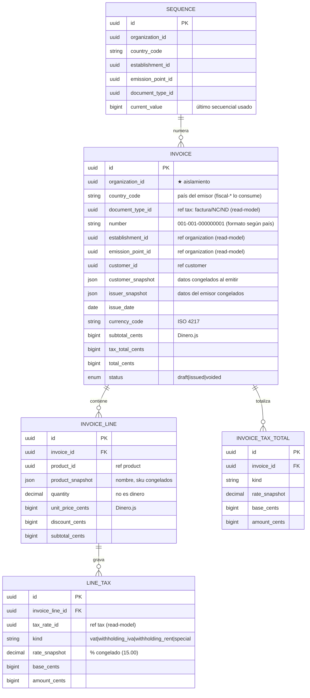
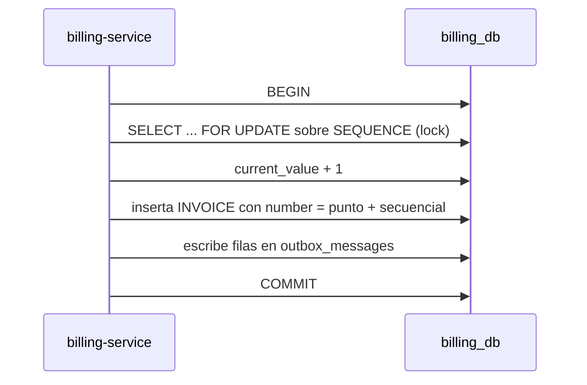
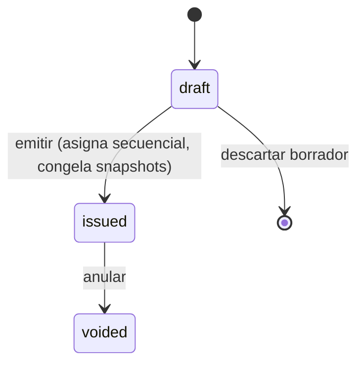

# billing-service

[← Volver al índice](../README.md) · [product-service](./product-service.md) · [tax-service](./tax-service.md) · [customer-service](./customer-service.md) · [organization-service](./organization-service.md)

> **Decisión de arquitectura (2026-07):**
> billing-service es **puro flujo comercial**, sin conexión a autoridades fiscales. Emite facturas con secuencial atómico, cálculos exactos con Dinero.js, snapshots inmutables y ciclo de vida `draft → issued → voided`.
> Las autoridades fiscales (SRI, DIAN, SUNAT, SAT) viven en **servicios separados por país** (`fiscal-ecuador`, `fiscal-peru`…) que **consumen los eventos de billing** y publican eventos fiscales de vuelta. Ver [estrategia multipaís](../arquitectura/estrategia-multipais.md) para el detalle.
>
> **Estado actual (2026-09-14).** Construido y desplegado: ciclo `draft → issued → voided`, Dinero.js, secuencial atómico, snapshots y **notas de crédito** (`POST /invoices/:id/credit-note`, tipo SRI `04`).
> La Fase 2 fiscal **ya existe**: [fiscal-ecuador](./fiscal-ecuador.md) consume los eventos de billing y se encarga del SRI. Billing sigue sin conocerlo. Ver [facturación electrónica](../facturacion-electronica/README.md).
>
> ⚠️ Cambio de 2026-09-13: las líneas guardan **siempre importes sin impuestos**. Si el producto tiene el precio con IVA incluido, se le quita el IVA primero y el impuesto se calcula una sola vez sobre la base; antes se cobraba dos veces.

## Responsabilidad

**Emite comprobantes comerciales** (facturas, notas de crédito/débito): asigna el secuencial, calcula impuestos con **Dinero.js + centavos (BIGINT)**, congela snapshots inmutables al emitir y gestiona el ciclo de vida interno de la factura. Es el servicio comercial de facturación — funciona **con o sin** integración fiscal.

Aislado por `organization_id`. Multi-moneda desde el diseño (guarda `currency_code` ISO 4217 en cada factura y línea).

**Lo que NO hace billing:**
- No firma XML (XAdES-BES / CFDI).
- No conoce endpoints del SRI, DIAN, SUNAT, SAT.
- No genera claves de acceso / CUFE / UUID fiscales.
- No maneja certificados .p12.
- No consulta el estado de autorización fiscal.

Todo eso vive en los servicios `fiscal-<país>`. Billing solo publica eventos que ellos consumen.

## Convención de dinero

Igual que el resto del sistema: **montos en centavos (`*_cents BIGINT`) + `currency_code` (ISO 4217)** + **Dinero.js v2** para toda la aritmética. Las tasas de impuesto viajan como decimal string (`"15.00"`) para preservar precisión. Ver [product-service](./product-service.md) para el detalle de la convención global.

## Entidades dueñas (`billing_db`)



Read-models locales (alimentados por eventos): `establishments`, `emission_points`, `customers`, `products`, `tax_rates`, `document_types`. Además Outbox + `processed_events`.

## El secuencial: por qué vive aquí y por qué es atómico

El número comercial (en EC, `001-001-000000001`) combina:
- código del **establecimiento** (viene de organization)
- código del **punto de emisión** (viene de organization)
- **secuencial** ← lo administra billing en `SEQUENCE`

El secuencial es la parte crítica: debe ser **atómico y sin huecos**. Se incrementa en la **misma transacción** que se crea la factura, con `SELECT ... FOR UPDATE` (lock pesimista):



El alcance del lock varía por país (**Fase 1: solo EC** = `(establishment, emission_point, document_type)`). El diseño lo soporta ampliar cuando llegue PE/CO/MX.

**Por qué no delegarlo a otro servicio:** un secuencial fiscal con huecos o duplicados es un problema contable serio. Manejarlo con llamadas remotas introduce ventanas de fallo inaceptables. Lock local + transacción es la única vía correcta.

## Cálculo de impuestos con Dinero.js

Cuando el usuario emite una factura, billing:

1. Lee cada línea con el producto snapshot (que ya trae `taxes[]` con `tax_rate_id` + `kind`).
2. Por cada línea, calcula la **base imponible** según `product.price_includes_tax`:
   - Si `false` (B2B): `base = quantity * unit_price - discount`
   - Si `true` (retail): `base = (quantity * unit_price - discount) / (1 + rate)`, redondeado
3. Aplica cada tasa: `amount = base * rate` con `Money.percentage(rate_snapshot)` de Dinero.js.
4. **Congela el `rate_snapshot`** en `LINE_TAX` (el % vigente al momento).
5. Agrupa por `kind` en `INVOICE_TAX_TOTAL` (todos los IVA sumados, todas las retenciones, etc.).
6. Calcula `subtotal_cents`, `tax_total_cents`, `total_cents`.

Todo con Dinero.js — cero `Number` en operaciones. `allocate()` para distribuir descuentos entre líneas sin perder centavos.

## Snapshots: por qué se congelan datos

Una factura emitida es un **documento legal inmutable**. Aunque el cliente cambie de nombre o el producto suba de precio mañana, la factura conserva los datos del momento en que se emitió.

| Snapshot | Origen | Se actualiza en... |
|----------|--------|--------------------|
| `customer_snapshot` | [customer](./customer-service.md) via `customer.customer.updated` | solo borradores (`draft`) |
| `issuer_snapshot` | [organization](./organization-service.md) via `organization.org.updated` | solo borradores |
| `product_snapshot` (línea) | [product](./product-service.md) via `product.product.updated` | solo borradores |
| `rate_snapshot` (impuesto) | [tax](./tax-service.md) via `tax.tax_rate.upserted` | solo borradores |

Emitida (`issued`) → **inmutable**. Nunca se cambia. Si hay un error, se emite una nota de crédito para corregir.

## Máquina de estados (Fase 1 — sin autoridad fiscal)



- `draft` — editable, sin número. Se descarta libremente.
- `issued` — numerado, snapshots congelados. Aparece en reportes de ventas. **Comercialmente ejecutada**, aunque no tenga aún validación fiscal.
- `voided` — anulada por el usuario. En Ecuador, fiscalmente esto requiere una nota de crédito, pero eso es responsabilidad del servicio `fiscal-ecuador`, no de billing.

## Cómo se conecta con los servicios fiscales (Fase 2)

Billing **publica eventos** cuando emite. Los servicios `fiscal-<país>` los consumen y hacen lo suyo:

```
billing-service                       fiscal-ecuador (futuro)
──────────────────                    ───────────────────────
POST /invoices/:id/issue
├─ lock SEQUENCE                      (escucha billing.invoice.issued)
├─ next number                        │
├─ Dinero.js calcula totales          │
├─ status = 'issued'                  │
├─ congela snapshots                  │
└─ emit ► billing.invoice.issued ────►│
                                      ├─ arma XML SRI
                                      ├─ firma XAdES-BES
                                      ├─ genera clave de acceso 49d
                                      ├─ envía al SRI
                                      ├─ recibe autorización
                                      └─ emit ► fiscal.ec.invoice.authorized
                                                     │
                                                     ▼
                                              (audit, notificación, etc.)
```

**Billing NO consume los eventos `fiscal.*`.** El estado fiscal (autorizado / rechazado) es de responsabilidad del servicio fiscal, no del comercial. Si algún consumidor (audit, notificaciones) quiere saber el estado fiscal, escucha `fiscal.*.invoice.authorized` directamente.

Esta separación permite que:
- Billing funcione **hoy sin ningún servicio fiscal** (solo emite comercialmente).
- Ecuador se sume mañana sin tocar billing.
- Perú se sume después con `fiscal-peru`, también sin tocar billing.

## API REST (implementada)

| Método | Ruta | Permiso | Controller |
|--------|------|---------|------------|
| GET | `/invoices?status=&customerId=&from=&to=` | `invoice:read` | `listInvoicesController` |
| GET | `/invoices/:id` | `invoice:read` | `getInvoiceController` |
| POST | `/invoices` (draft) | `invoice:create` | `createInvoiceController` |
| PATCH | `/invoices/:id` (solo drafts) | `invoice:update` | `updateInvoiceController` |
| POST | `/invoices/:id/lines` (agregar línea) | `invoice:update` | `addLineController` |
| DELETE | `/invoices/:id/lines/:lineId` | `invoice:update` | `removeLineController` |
| POST | `/invoices/:id/issue` (asigna secuencial) | `invoice:issue` | `issueInvoiceController` |
| POST | `/invoices/:id/void` | `invoice:void` | `voidInvoiceController` |
| GET | `/invoices/:id/pdf` (RIDE comercial) | `invoice:read` | (futuro) |

## Eventos

**Publica:**

| Evento | Cuándo | Payload clave |
|--------|--------|---------------|
| `billing.invoice.created` | Nuevo borrador | `{ invoiceId, organizationId, totalCents }` |
| `billing.invoice.issued` | Emisión con secuencial | `{ invoiceId, number, customerSnapshot, totals }` |
| `billing.invoice.voided` | Anulación | `{ invoiceId, reason }` |

**Consume (read-models — planificado para Fase 2):**

| Evento | Origen | Acción |
|--------|--------|--------|
| `organization.establishment.created` | [organization](./organization-service.md) | Read-model |
| `organization.billing_point.created` | [organization](./organization-service.md) | Read-model + inicializa `SEQUENCE` |
| `organization.org.updated` | [organization](./organization-service.md) | Refresca snapshot en borradores |
| `customer.customer.created/updated/disabled` | [customer](./customer-service.md) | Read-model |
| `product.product.created/updated/disabled` | [product](./product-service.md) | Read-model |
| `tax.tax_rate.upserted` | [tax](./tax-service.md) | Read-model de tasas |
| `tax.document_type.upserted` | [tax](./tax-service.md) | Read-model de tipos de comprobante |

> **Nota de implementación:** Los read-models se pueblan inicialmente bajo demanda (API calls internas) y se migrarán a eventos en Fase 2.

## Dependencias

- **[organization](./organization-service.md)** — establecimientos, puntos de emisión (para el número).
- **[customer](./customer-service.md)** — receptores.
- **[product](./product-service.md)** — líneas de factura.
- **[tax](./tax-service.md)** — tasas y tipos de comprobante (via read-model).
- **[document-service](./document-service.md)** — almacena el PDF comercial (RIDE).

## Implementación de referencia

El código fuente del billing-service está en `backend/billing-service/`. Ver:
- `backend/billing-service/IMPLEMENTATION.md`, **en el repo de código** (no en esta bóveda) — decisiones de diseño del código
- `backend/billing-service/openapi.yaml` — contrato REST (en el repo de código)
- `backend/billing-service/asyncapi.yaml` — contrato de eventos (en el repo de código)

## Validaciones

- **Borde (Zod):** líneas con `quantity > 0`, `unit_price` string decimal válido, `customerId`/`productId` presentes, `currencyCode` ISO 4217.
- **Dominio:**
  - El cliente debe existir y estar **activo**.
  - Los productos de línea deben existir y estar **activos**.
  - El punto de emisión debe estar **activo**.
  - Cada `tax_rate_id` debe ser válido para el país del establecimiento.
  - El secuencial es único por scope (constraint DB + lock).
  - Solo se anulan facturas `issued` (no `draft`).
  - Los totales calculados con Dinero.js deben cuadrar antes de persistir.

## Notas

- **Multi-moneda desde el diseño:** cada factura lleva su `currency_code`. La consolidación en moneda de reporte es un cálculo posterior.
- **RIDE vs Factura fiscal:** el PDF que genera billing es un **comprobante comercial**. El RIDE fiscal (con QR SRI) lo genera `fiscal-ecuador`.
- **Consumidor Final:** se selecciona como cualquier cliente; está marcado con `isSystem` en customer-service.
- **Fase 2 (fiscal-ecuador y otros):** ver [fiscal-ecuador](./fiscal-ecuador.md) y [estrategia multipaís](../arquitectura/estrategia-multipais.md).
