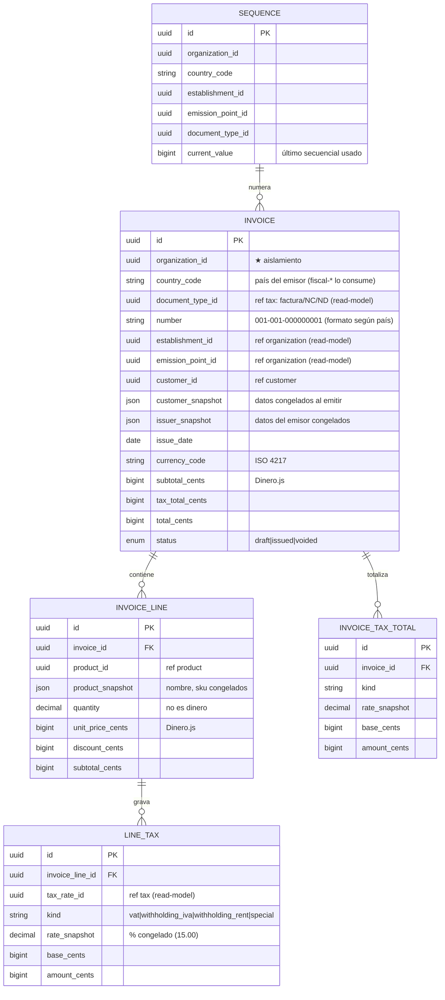
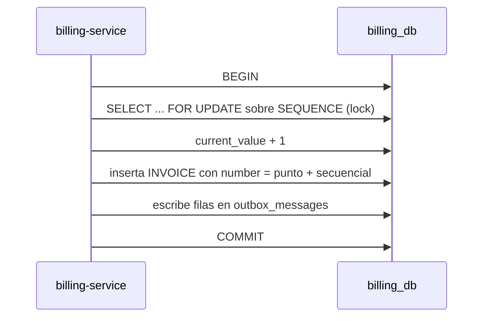
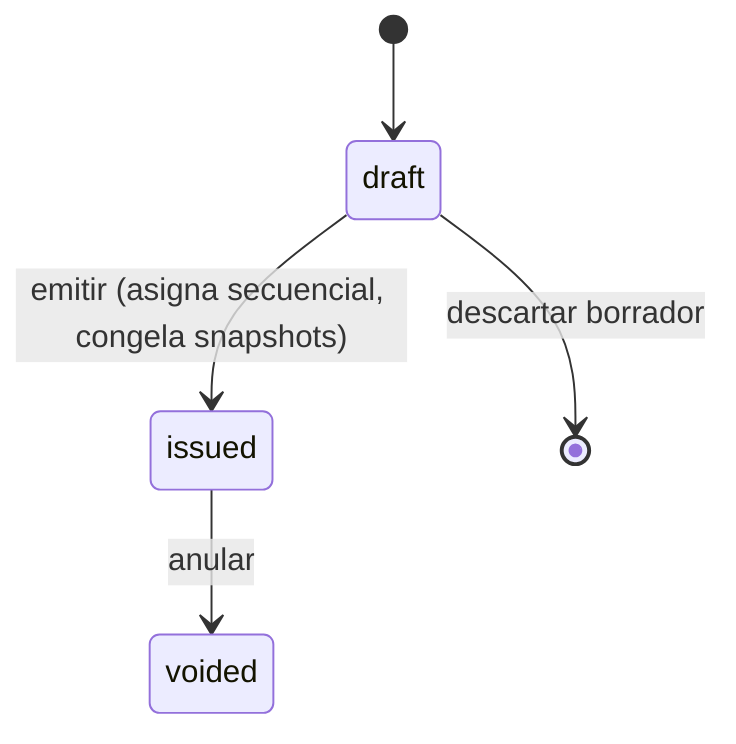

# billing-service

[← Volver al índice](../README.md) · [product-service](./product-service.md) · [tax-service](./tax-service.md) · [customer-service](./customer-service.md) · [organization-service](./organization-service.md)

> **Decisión de arquitectura (2026-07):**
> billing-service es **puro flujo comercial**, sin conexión a autoridades fiscales. Emite facturas con secuencial atómico, cálculos exactos con Dinero.js, snapshots inmutables y ciclo de vida `draft → issued → voided`.
> Las autoridades fiscales (SRI, DIAN, SUNAT, SAT) viven en **servicios separados por país** (`fiscal-ecuador`, `fiscal-peru`…) que **consumen los eventos de billing** y publican eventos fiscales de vuelta. Ver [estrategia multipaís](../arquitectura/estrategia-multipais.md) para el detalle.
>
> **Estado actual (2026-09-16).** Construido y desplegado: ciclo `draft → issued → voided`, Dinero.js, secuencial atómico, snapshots y **notas de crédito** (`POST /invoices/:id/credit-note`, tipo SRI `04`).
> La Fase 2 fiscal **ya existe**: [fiscal-ecuador](./fiscal-ecuador.md) consume los eventos de billing y se encarga del SRI. Billing sigue sin conocerlo. Ver [facturación electrónica](../facturacion-electronica/README.md).
>
> ⚠️ Cambio de 2026-09-13: las líneas guardan **siempre importes sin impuestos**. Si el producto tiene el precio con IVA incluido, se le quita el IVA primero y el impuesto se calcula una sola vez sobre la base; antes se cobraba dos veces.

## Responsabilidad

**Emite comprobantes comerciales** (facturas, notas de crédito/débito): asigna el secuencial, calcula impuestos con **Dinero.js + centavos (BIGINT)**, congela snapshots inmutables al emitir y gestiona el ciclo de vida interno de la factura. Es el servicio comercial de facturación — funciona **con o sin** integración fiscal.

Aislado por `organization_id`. Multi-moneda desde el diseño (guarda `currency_code` ISO 4217 en cada factura y línea).

**Lo que NO hace billing:**
- No firma XML (XAdES-BES / CFDI).
- No conoce endpoints del SRI, DIAN, SUNAT, SAT.
- No genera claves de acceso / CUFE / UUID fiscales.
- No maneja certificados .p12.
- No consulta el estado de autorización fiscal.

Todo eso vive en los servicios `fiscal-<país>`. Billing solo publica eventos que ellos consumen.

## Convención de dinero

Igual que el resto del sistema: **montos en centavos (`*_cents BIGINT`) + `currency_code` (ISO 4217)** + **Dinero.js v2** para toda la aritmética. Las tasas de impuesto viajan como decimal string (`"15.00"`) para preservar precisión. Ver [product-service](./product-service.md) para el detalle de la convención global.

## Entidades dueñas (`billing_db`)


```mermaid
erDiagram
    INVOICE ||--o{ INVOICE_LINE : contiene
    INVOICE ||--o{ INVOICE_TAX_TOTAL : totaliza
    INVOICE_LINE ||--o{ LINE_TAX : grava
    SEQUENCE ||--o{ INVOICE : numera

    INVOICE {
        uuid id PK
        uuid organization_id "★ aislamiento"
        string country_code "país del emisor (fiscal-* lo consume)"
        uuid document_type_id "ref tax: factura/NC/ND (read-model)"
        string number "001-001-000000001 (formato según país)"
        uuid establishment_id "ref organization (read-model)"
        uuid emission_point_id "ref organization (read-model)"
        uuid customer_id "ref customer"
        json customer_snapshot "datos congelados al emitir"
        json issuer_snapshot "datos del emisor congelados"
        date issue_date
        string currency_code "ISO 4217"
        bigint subtotal_cents "Dinero.js"
        bigint tax_total_cents
        bigint total_cents
        enum status "draft|issued|voided"
    }
    INVOICE_LINE {
        uuid id PK
        uuid invoice_id FK
        uuid product_id "ref product"
        json product_snapshot "nombre, sku congelados"
        decimal quantity "no es dinero"
        bigint unit_price_cents "Dinero.js"
        bigint discount_cents
        bigint subtotal_cents
    }
    LINE_TAX {
        uuid id PK
        uuid invoice_line_id FK
        uuid tax_rate_id "ref tax (read-model)"
        string kind "vat|withholding_iva|withholding_rent|special"
        decimal rate_snapshot "% congelado (15.00)"
        bigint base_cents
        bigint amount_cents
    }
    INVOICE_TAX_TOTAL {
        uuid id PK
        uuid invoice_id FK
        string kind
        decimal rate_snapshot
        bigint base_cents
        bigint amount_cents
    }
    SEQUENCE {
        uuid id PK
        uuid organization_id
        string country_code
        uuid establishment_id
        uuid emission_point_id
        uuid document_type_id
        bigint current_value "último secuencial usado"
    }
```

**Tablas reales (2026-09-16):** `invoices`, `invoice_lines`, `line_taxes`, `invoice_tax_totals`, `sequences`, `outbox_messages`, `processed_events`. Una nota de crédito es una fila más de `invoices` con `related_invoice_id` y `credit_note_reason`.

⚠️ **No hay read-models locales.** El diseño preveía copias de establecimientos, clientes, productos, tasas y tipos de comprobante alimentadas por eventos; lo construido las **consulta por HTTP** en el momento de usarlas, con un adaptador por catálogo en `infrastructure/http/`: `organization-catalog`, `customer-catalog`, `product-catalog`, `tax-rate-catalog`, `document-type-catalog` (y `document-storage` para subir archivos). Esas llamadas se hacen **antes de abrir la transacción**, para no tener bloqueada la fila del secuencial mientras se espera a otro servicio.

## El secuencial: por qué vive aquí y por qué es atómico

El número comercial (en EC, `001-001-000000001`) combina:
- código del **establecimiento** (viene de organization)
- código del **punto de emisión** (viene de organization)
- **secuencial** ← lo administra billing en `SEQUENCE`

El secuencial es la parte crítica: debe ser **atómico y sin huecos**. Se incrementa en la **misma transacción** que se crea la factura, con `SELECT ... FOR UPDATE` (lock pesimista):


```mermaid
sequenceDiagram
    participant B as billing-service
    participant DB as billing_db
    B->>DB: BEGIN
    B->>DB: SELECT ... FOR UPDATE sobre SEQUENCE (lock)
    B->>DB: current_value + 1
    B->>DB: inserta INVOICE con number = punto + secuencial
    B->>DB: escribe filas en outbox_messages
    B->>DB: COMMIT
```

El alcance del lock varía por país (**Fase 1: solo EC** = `(establishment, emission_point, document_type)`). El diseño lo soporta ampliar cuando llegue PE/CO/MX.

**Por qué no delegarlo a otro servicio:** un secuencial fiscal con huecos o duplicados es un problema contable serio. Manejarlo con llamadas remotas introduce ventanas de fallo inaceptables. Lock local + transacción es la única vía correcta.

## Cálculo de impuestos con Dinero.js

Cuando el usuario emite una factura, billing:

1. Lee cada línea con el producto snapshot (que ya trae `taxes[]` con `tax_rate_id` + `kind`).
2. Por cada línea, calcula la **base imponible** según `product.price_includes_tax`:
   - Si `false` (B2B): `base = quantity * unit_price - discount`
   - Si `true` (retail): `base = (quantity * unit_price - discount) / (1 + rate)`, redondeado
3. Aplica cada tasa: `amount = base * rate` con `Money.percentage(rate_snapshot)` de Dinero.js.
4. **Congela el `rate_snapshot`** en `LINE_TAX` (el % vigente al momento).
5. Agrupa por `kind` en `INVOICE_TAX_TOTAL` (todos los IVA sumados, todas las retenciones, etc.).
6. Calcula `subtotal_cents`, `tax_total_cents`, `total_cents`.

Todo con Dinero.js — cero `Number` en operaciones. `allocate()` para distribuir descuentos entre líneas sin perder centavos.

## Snapshots: por qué se congelan datos

Una factura emitida es un **documento legal inmutable**. Aunque el cliente cambie de nombre o el producto suba de precio mañana, la factura conserva los datos del momento en que se emitió.

| Snapshot | Origen (consulta HTTP) | Cuándo se fija |
|----------|--------|--------------------|
| `customer_snapshot` | [customer](./customer-service.md) | al crear el borrador; al emitir se vuelve a pedir **solo** si falta o no trae `identificationTypeCode` (borradores antiguos) |
| `issuer_snapshot` | [organization](./organization-service.md) | al emitir |
| `product_snapshot` (línea) | [product](./product-service.md) | al añadir la línea |
| `rate_snapshot` (impuesto) | [tax](./tax-service.md) | al añadir la línea |

El diseño preveía refrescar los snapshots de los borradores al llegar `customer.customer.updated`, `product.product.updated`, etc. **No está construido**: billing no escucha esos eventos, así que un borrador conserva los datos del momento en que se le añadió cada cosa.

Emitida (`issued`) → **inmutable**. Nunca se cambia. Si hay un error, se emite una nota de crédito para corregir.

## Máquina de estados (Fase 1 — sin autoridad fiscal)


```mermaid
stateDiagram-v2
    [*] --> draft
    draft --> issued: emitir (asigna secuencial, congela snapshots)
    draft --> [*]: descartar borrador
    issued --> voided: anular
```

- `draft` — editable, sin número. Se descarta libremente.
- `issued` — numerado, snapshots congelados. Aparece en reportes de ventas. **Comercialmente ejecutada**, aunque no tenga aún validación fiscal.
- `voided` — anulada por el usuario. En Ecuador, fiscalmente esto requiere una nota de crédito, pero eso es responsabilidad del servicio `fiscal-ecuador`, no de billing.

## Cómo se conecta con los servicios fiscales (Fase 2)

Billing **publica eventos** cuando emite. Los servicios `fiscal-<país>` los consumen y hacen lo suyo:

```
billing-service                       fiscal-ecuador (futuro)
──────────────────                    ───────────────────────
POST /invoices/:id/issue
├─ lock SEQUENCE                      (escucha billing.invoice.issued)
├─ next number                        │
├─ Dinero.js calcula totales          │
├─ status = 'issued'                  │
├─ congela snapshots                  │
└─ emit ► billing.invoice.issued ────►│
                                      ├─ arma XML SRI
                                      ├─ firma XAdES-BES
                                      ├─ genera clave de acceso 49d
                                      ├─ envía al SRI
                                      ├─ recibe autorización
                                      └─ emit ► fiscal.ec.invoice.authorized
                                                     │
                                                     ▼
                                              (audit, notificación, etc.)
```

**Billing NO consume los eventos `fiscal.*`** (su único consumidor escucha su propio `billing.invoice.issued`, ver [Eventos](#eventos)). El estado fiscal (autorizado / rechazado) es de responsabilidad del servicio fiscal, no del comercial. Si algún consumidor (audit, notificaciones) quiere saber el estado fiscal, escucha `fiscal.*.invoice.authorized` directamente.

Esta separación permite que:
- Billing funcione **hoy sin ningún servicio fiscal** (solo emite comercialmente).
- Ecuador se sume mañana sin tocar billing.
- Perú se sume después con `fiscal-peru`, también sin tocar billing.

## API REST (implementada)

Verificado contra `src/interface/http/routes.ts` el 2026-09-16. Todas exigen organización en el contexto.

| Método | Ruta | Permiso | Controller |
|--------|------|---------|------------|
| GET | `/invoices?status=&customerId=&from=&to=` | `invoice:read` | `listInvoicesController` |
| GET | `/invoices/:id` | `invoice:read` | `getInvoiceController` |
| POST | `/invoices` (draft) | `invoice:create` | `createInvoiceController` |
| PATCH | `/invoices/:id` (solo drafts) | `invoice:update` | `updateInvoiceController` |
| POST | `/invoices/:id/lines` (agregar línea) | `invoice:update` | `addLineController` |
| DELETE | `/invoices/:id/lines/:lineId` | `invoice:update` | `removeLineController` |
| POST | `/invoices/:id/issue` (asigna secuencial) | `invoice:issue` | `issueInvoiceController` |
| POST | `/invoices/:id/void` | `invoice:void` | `voidInvoiceController` |
| POST | `/invoices/:id/credit-note` (NC tipo `04` sobre una factura emitida) | `invoice:issue` | `issueCreditNoteController` |
| POST | `/invoices/from-pos` ⚠️ sin commitear | `invoice:create` **y** `invoice:issue` | `ingestPosSaleController` |

No hay `GET /invoices/:id/pdf`: el PDF comercial se genera por evento y se guarda en document-service (ver abajo), y el RIDE fiscal lo sirve [fiscal-ecuador](./fiscal-ecuador.md).

## Ingesta de ventas del POS (`POST /invoices/from-pos`)

> ⚠️ **Estado al 2026-09-16: escrito y con tests, pero sin commitear** (migración `20260916000000-pos-sale-ingest.cjs`, caso de uso `ingest-pos-sale.ts`). Nunca se ha probado de punta a punta con un POS real. El otro lado está en [POS](../pos/punto-de-venta.md#subida-de-ventas-al-crm-pushts).

Convierte una venta de caja, que ya ocurrió y ya se cobró, en una **factura emitida** en una sola transacción: crea la factura, añade las líneas con los impuestos del catálogo y la emite con el secuencial del punto de emisión del terminal. Emitir es lo que dispara el descuento de stock en [inventory-service](./inventory-service.md) y el envío al SRI en [fiscal-ecuador](./fiscal-ecuador.md); por eso no se deja en borrador.

Cuerpo: `terminalId`, `posSaleId` (texto: es el id autoincremental de la base local del POS), `establishmentId`, `emissionPointId`, `customerId` opcional, `currencyCode` opcional (USD por defecto), `posTotalCents` opcional y `lines[]` (`productId`, `quantity`, `unitPrice` como string decimal, `discountCents`, `description`).

- **Idempotente por `(organization_id, pos_terminal_id, pos_sale_id)`**, con índice único `uniq_invoices_pos_sale`. Si la venta ya estaba, devuelve la misma factura con **200** en vez de **201**. El POS puede perder la respuesta y reintentar sin duplicar.
- **Sin `customerId` se factura a CONSUMIDOR FINAL**: el cliente de sistema (`isSystem`) con identificación `9999999999999` que customer-service crea al dar de alta la organización. Si la organización no lo tiene, la venta falla.
- **Los totales del terminal no mandan.** Se recalculan desde el catálogo y la diferencia se guarda en `pos_totals_diff_cents`. Cero es lo normal; otro valor indica que un precio o IVA cambió en el CRM después de que el terminal se llevara su copia. No se rechaza la venta, porque el terminal quedaría reintentando para siempre algo que ya se cobró.
- Siempre es factura (`01`), nunca otro comprobante.

## Eventos

**Publica** (verificado 2026-09-16):

| Evento | Cuándo |
|--------|--------|
| `billing.invoice.created` | Nuevo borrador |
| `billing.invoice.updated` | Edición de un borrador |
| `billing.invoice.line_added` / `line_removed` | Cambio de líneas en un borrador |
| `billing.invoice.issued` | Emisión con secuencial. **También se publica al emitir una nota de crédito**: es el mismo evento con el tipo de comprobante `04` |
| `billing.invoice.voided` | Anulación |

El payload de `billing.invoice.issued` lleva número, secuencial, `countryCode`, `customerSnapshot`, `issuerSnapshot`, totales en centavos y las líneas con sus impuestos: lo suficiente para que fiscal-ecuador, inventory-service y notification-service no tengan que consultar nada.

**Consume:** solo **su propio `billing.invoice.issued`** (cola `billing-service.invoice-documents`). Busca en `application/documents/registry.ts` los generadores del país de la factura y sube cada archivo a [document-service](./document-service.md) con categoría `comprobante`. Hoy solo hay generadores para **EC**: un PDF y un XML **comerciales genéricos** (`factura-<número>.pdf/.xml`), que **no son** el XML firmado ni el RIDE del SRI. Para otro país no genera nada.

No consume eventos de otros servicios: los datos de organización, cliente, producto, tasas y tipos de comprobante los pide por HTTP (ver la sección *Entidades dueñas*).

## Dependencias

- **[organization](./organization-service.md)** — establecimientos, puntos de emisión (para el número).
- **[customer](./customer-service.md)** — receptores.
- **[product](./product-service.md)** — líneas de factura.
- **[tax](./tax-service.md)** — tasas y tipos de comprobante (via read-model).
- **[document-service](./document-service.md)** — almacena el PDF y el XML comerciales que genera el consumidor de `invoice.issued`.

Todas por HTTP y en el momento de usarlas, no por read-model.

## Implementación de referencia

El código fuente del billing-service está en `backend/billing-service/`. Ver:
- `backend/billing-service/IMPLEMENTATION.md`, **en el repo de código** (no en esta bóveda) — decisiones de diseño del código
- `backend/billing-service/openapi.yaml` — contrato REST (en el repo de código)
- `backend/billing-service/asyncapi.yaml` — contrato de eventos (en el repo de código)

## Validaciones

- **Borde (Zod):** líneas con `quantity > 0`, `unit_price` string decimal válido, `customerId`/`productId` presentes, `currencyCode` ISO 4217.
- **Dominio:**
  - El cliente debe existir y estar **activo**.
  - Los productos de línea deben existir y estar **activos**.
  - El punto de emisión debe estar **activo**.
  - Cada `tax_rate_id` debe ser válido para el país del establecimiento.
  - El secuencial es único por scope (constraint DB + lock).
  - Solo se anulan facturas `issued` (no `draft`).
  - Los totales calculados con Dinero.js deben cuadrar antes de persistir.

## Notas

- **Multi-moneda desde el diseño:** cada factura lleva su `currency_code`. La consolidación en moneda de reporte es un cálculo posterior.
- **RIDE vs Factura fiscal:** el PDF que genera billing es un **comprobante comercial**. El RIDE fiscal (con QR SRI) lo genera `fiscal-ecuador`.
- **Consumidor Final:** se selecciona como cualquier cliente; está marcado con `isSystem` en customer-service.
- **Fase 2 (fiscal-ecuador y otros):** ver [fiscal-ecuador](./fiscal-ecuador.md) y [estrategia multipaís](../arquitectura/estrategia-multipais.md).
