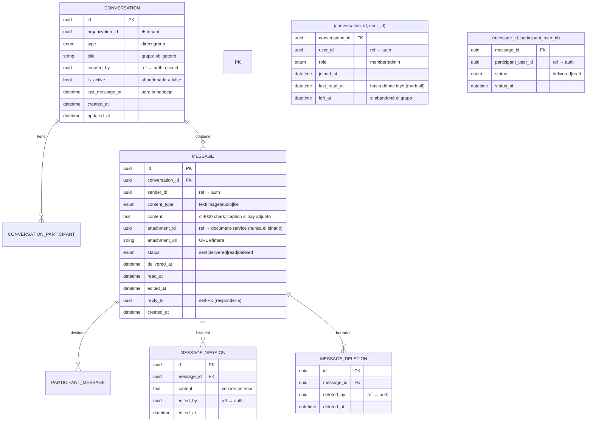

# chat-service

[← Volver al índice](../README.md) · [document-service](./document-service.md) · [notification-service](./notification-service.md) · [tiempo real](../arquitectura/tiempo-real.md)

> **Estado: en construcción.** Verificado contra el código el 2026-09-15. Persistencia (`chat_db`) y el aislamiento por organización listos; implementados los casos de uso de conversaciones (`create`/`list`/`get`) y mensajes (`send`/`list`). Sin desplegar aún: faltan las capas HTTP/WS, el relay de outbox y la emisión del hub del gateway para el tiempo real.

## Responsabilidad

Mensajería **interna entre usuarios de la misma organización**: chats **1-a-1 (direct)** y **grupales**, con estados de mensaje (`sent` / `delivered` / `read`), **borrado** ("para mí" y "para todos") y **adjuntos** (que se delegan en [document-service](./document-service.md)). Particionado por `organization_id`.

- El servicio **persiste y publica eventos** de dominio; el **tiempo real** lo hace el hub del [api-gateway](./api-gateway.md), que consume esos eventos y los empuja por Socket.IO.
- Los adjuntos nunca llegan al chat-service: solo se guarda la **referencia** (`attachment_id`).

## Entidades dueñas (`chat_db`)

Read/write-model local: `outbox_messages` + `processed_events` (patrón Outbox, igual que el resto del stack).

> `participant_messages` solo guarda `delivered|read`: **no existe un estado `sent` por destinatario**. Un mensaje nuevo nace como `message.status = sent` y la fila del destinatario se crea **al confirmar** por socket (ack del cliente). `message.status` es el agregado optimizado derivado de todos los destinatarios.

## Reglas de acceso (multi-tenancy)

- El **gateway inyecta** `X-User-Id` (claim `sub`) y `X-Organization-Id` (claim `org_id`) en cada request.
- Conversación de **otra organización → 404** (no se revela que existe).
- Usuario autenticado pero **no participante activo** (`left_at is null`) → **403**.
- Al **crear conversación** y **agregar participantes** se valida **estrictamente** la membresía vía el endpoint interno de [auth-service](./auth-service.md) `GET /internal/users/:userId/access-context?orgId=<org>` con `X-Internal-Secret` → `NOT_ORGANIZATION_MEMBER` (403). El actor y cada participante deben ser miembros **activos** de la org.
- Las **lecturas del actor** (bandeja, detalle, historial) no revalidan membresía: la query ya aísla por actor + org.

## API REST (vía gateway, prefijo `/chat/*`)

| Método | Ruta | Nota |
|--------|------|------|
| POST | `/conversations` | crear direct/grupo. Direct **idempotente**: reusa el par → `200 {existed:true}`; nuevo → `201 {existed:false}`. Grupo exige título; creador = `admin` |
| GET | `/conversations?limit=` | bandeja: solo participantes activos, `last_message_at desc` |
| GET | `/conversations/:id` | detalle + participantes activos |
| GET | `/conversations/:id/messages?cursor=&limit=` | historial, `created_at desc`, cursor de scroll (excluye "para mí") |
| POST | `/conversations/:id/messages` | enviar mensaje (outbox `message.created`) |
| POST | `/messages/:id/status` | confirmar `delivered`/`read` del destinatario |
| PATCH | `/messages/:id` | editar (copia previa en `message_versions`) |
| DELETE | `/messages/:id?for=me\|everyone` | "para mí" (calado) / "para todos" (autor o admin) |
| POST/DELETE | `/conversations/:id/participants` | agregar participante / abandonar grupo |
| POST | `/conversations/:id/read` | mark-all read (actualiza `last_read_at`) |

**Estado de implementación:** ✅ `create-conversation`, `list-conversations`, `get-conversation`, `send-message`, `list-messages`. ⏳ el resto (status, edit, delete, participants, leave, mark-read) y toda la capa HTTP/WS.

Mensajes: validaciones de borde → 400 (`contentType` ∈ `text|image|audio|file`, `content` ≤ `4000`, adjunto requiere `attachmentId` uuid, `attachmentUrl` ≤ 500, `replyTo` de la misma conversación).

## Tiempo real

El **hub del gateway** (`src/realtime/hub.ts`, Socket.IO en `/ws`) es quien publica: el chat-service **solo escribe el outbox**, el relay lo publica en `crm.events` y el hub lo empuja a la sala `user:<destinatario>`:

| Evento RabbitMQ | Emit por socket | A quién |
|---|---|---|
| `message.created` | `chat.message.new` | cada destinatario activo en su sala `user:<uid>` (sin el autor) |
| `message.edited` | `chat.message.edited` | participantes de la conversación |
| `message.deleted` | `chat.message.deleted` | participantes de la conversación |

Los **acks** `delivered`/`read` viajan en sentido inverso (cliente → hub → `POST /messages/:id/status`) y **no** generan outbox. Los eventos de hora de lectura (`mark-all`) tampoco: van por socket/local.

> En construcción: la capa WS del chat-service y la suscripción del hub a estos eventos se cablean cuando se termine la fase de persistencia/HTTP (ver [tiempo real](../arquitectura/tiempo-real.md)).

## Adjuntos (delegación en document-service, contrato N13)

- El **frontend pre-sube** el archivo en document-service (flujo presigned) antes de enviar el mensaje:
  1. `POST /files/presigned` (JSON `resourceType|resourceId|category|originalName|mimeType|size`) → URL firmada; el gateway inyecta `X-Organization-Id` y el archivo queda **acotado a la org**.
  2. Sube el binario a la URL firmada y `PATCH /files/:id/confirm` con `{checksum}`.
  3. Envía el mensaje al chat-service con `attachment_id` (= id del file) y `attachment_url`.
- Convención del chat: `resource_type = "chat"`, `resource_id = <messageId>` (**el frontend genera el id del mensaje** para poder subir antes), `category = image | audio | file`.
- Para ver el adjunto el cliente usa `GET /files/:id/url` (sesión + org-scope). El binario por servicios internos es `GET /files/:id/content` con `X-Internal-Secret` (llamada **directa**, sin pasar por el gateway, que bloquea ese header).
- chat-service **no valida el archivo al guardar** (evita acoplamiento síncrono): la autorización la aplica document-service al resolver la URL.

## Eventos

**Publica** (outbox → `crm.events`):

| Evento | Cuándo | Consumido por |
|--------|--------|---------------|
| `conversation.created` | nueva conversación (direct o grupo) | hub (WS) |
| `conversation.updated` | agregar participantes / abandonar grupo | hub (WS) |
| `message.created` | nuevo mensaje | hub (WS) → `chat.message.new` |
| `message.edited` | edición con historial | hub (WS) |
| `message.deleted` | borrado "para todos" | hub (WS) |

> `delivered` / `read` **no** se publican por outbox: van por el ack del socket → `POST /messages/:id/status`.

**Consume:** ninguno por ahora (el consumidor de eventos esta preparado en `processed_events`; el primer consumidor real se define cuando el asistente o notificaciones necesiten conversaciones).

## Dependencias

- **auth-service**: validación estricta de membresía (`/internal/users/:userId/access-context`, `X-Internal-Secret`) al crear conversaciones / agregar participantes.
- **document-service**: adjuntos por referencia (el binario vive en MinIO; ver [document-service](./document-service.md)).
- **RabbitMQ** (`crm.events`) vía patrón Outbox + relay; el **hub del gateway** consume para el tiempo real.
- **Gateway** (`/chat/*`): inyecta `X-User-Id` / `X-Organization-Id`, mensajes de acks por socket.

## Validaciones (ver [validación](../arquitectura/validacion.md))

- **Borde (en los casos de uso)**: uuids (UUID v4), `type` ∈ {direct, group}, `contentType` ∈ {text, image, audio, file} (default `text`), `content` no vacío para texto y **≤ 4000**, adjunto (`contentType≠text`) requiere `attachmentId`, `attachmentUrl` ≤ 500, `replyTo` de la misma conversación, `limit` acotado 1..100, `cursor` fecha válida.
- **Dominio**:
  - Direct = exactamente 1 participante y sin repetir al actor; grupo = título obligatorio.
  - `Message.create` rechaza texto vacío y adjunto sin id (invariante de dominio).
  - `message.status` solo transiciona `sent → delivered → read → deleted` (`canTransition`).
  - **Membresía estricta** (create/add-participants): actor + cada participante miembros activos de la org → 403; 404 para conversaciones cross-org (ver acceso).

## Aspectos clave

- **Estados fieles a WhatsApp**: `sent` (guardado, destinatario offline), `delivered` (ack del cliente por socket), `read` (individual por destinatario; el `message.status` agregado es una **proyección optimizada** de `participant_messages`, no la fuente de verdad).
- **Borrado**: "para mí" inserta en `message_deletions` (se filtra al listar por actor); "para todos" marca `status=deleted`, **conserva el `content` en BD** (auditoría) y el DTO expone `content: null` **y adjuntos `null`** (no se filtra el archivo de un mensaje eliminado).
- **Edición**: cada edición copia la versión previa en `message_versions` (auditoría); el texto visible es el último + `edited_at`.
- Límite de `content` en **4000 caracteres** (textos y captions) deliberado: `TEXT` aguanta más pero evita abusos y filas grandes en la bandeja.
- No maneja dinero ni binarios: solo texto/estados y referencias a archivos.
- Una sola réplica, sin Redis (mismo criterio que el gateway) — escalar el WS a varias réplicas exige resolver el adaptador antes.

## Notas

- El build avanza por **casos de uso** sobre persistencia y dominio ya verificados (`typecheck` + tests de value-objects). Los trozos pendientes se ordenan: resto de B3 → relay de outbox → capa HTTP → WS (B4) → `main.ts` (B5).
- El chat quedó fuera del diseño original de tiempo real (ver [realtime-service](./realtime-service.md)); hoy se construye como el propio este servicio y el hub se suscribe a sus eventos.