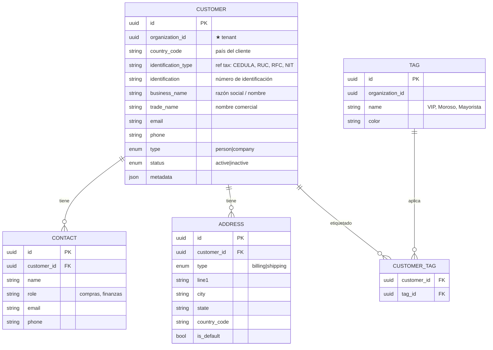
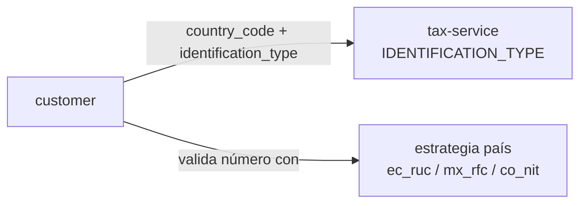
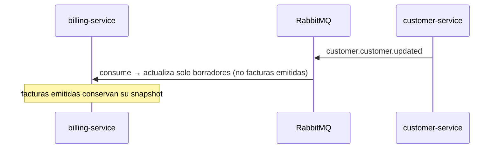

# customer-service

[← Volver al índice](../README.md) · [tax-service](./tax-service.md) · [product-service](./product-service.md)

> **Estado: construido y desplegado.** Verificado contra el código el 2026-09-14. Tablas reales: `customers`, `contacts`, `addresses`, `tags`, `customer_tags`, `identification_types`.

## Responsabilidad

Dueño de los **clientes** de cada organización (el núcleo "CRM"): datos del cliente, **contactos**, **direcciones** y **segmentos/etiquetas**. Todo particionado por `organizationId`.

## Entidades dueñas (`customer_db`)

## Relación con país e identificación

El cliente tiene `country_code` + `identification_type` + `identification`. El **tipo de identificación** referencia el catálogo de [tax-service](./tax-service.md) (cédula/RUC en EC, RFC en MX, NIT en CO), y el número se **valida con la estrategia del país** correspondiente (dígito verificador).

> Un cliente puede tener un país distinto al de la organización (ej. una empresa ecuatoriana factura a un cliente colombiano), aunque la **factura** usa siempre el país del establecimiento emisor (ver [billing](./billing-service.md)).

## Relación con facturación

[billing-service](./billing-service.md) referencia al cliente por `customerId` y, al emitir, **congela un snapshot** de sus datos fiscales (nombre, identificación, dirección) en la factura. Razón: si el cliente luego cambia de nombre, las facturas viejas deben conservar los datos del momento de la emisión.

## API REST (resumen)

| Método | Ruta | Permiso |
|--------|------|---------|
| GET | `/customers?search=&tag=&status=` | `customer:read` |
| GET | `/customers/:id` | `customer:read` |
| POST | `/customers` | `customer:create` |
| PATCH | `/customers/:id` | `customer:update` |
| DELETE | `/customers/:id` | `customer:delete` (baja lógica) |
| POST | `/customers/:id/contacts` | `customer:update` |
| POST | `/customers/:id/addresses` | `customer:update` |
| GET | `/tags` · POST `/tags` | `customer:read` / `customer:update` |

Todas filtran por `organizationId` del contexto.

## Eventos

**Publica:**

| Evento | Cuándo | Consumido por |
|--------|--------|---------------|
| `customer.customer.created` | Nuevo cliente | [realtime](./realtime-service.md) (refresca listas en vivo) |
| `customer.customer.updated` | Edición | [billing](./billing-service.md) (actualiza borradores) |
| `customer.customer.disabled` | Baja | [billing](./billing-service.md) (impide nuevas facturas) |

**Consume:**

| Evento | Origen | Acción |
|--------|--------|--------|
| `billing.invoice.issued` | [billing](./billing-service.md) | (opcional) actualizar "última compra" / estadísticas del cliente |

## Dependencias

- **tax-service**: para tipos de identificación y validación por país (vía read-model).
- Lo consumen [billing](./billing-service.md) y [realtime](./realtime-service.md).

## Validaciones (ver [validación](../arquitectura/validacion.md))

- **Borde (Zod)**: email/teléfono válidos, `type` ∈ {person, company}, requeridos según tipo.
- **Dominio**:
  - `identification` válida según la estrategia del país (RUC/cédula/RFC/NIT).
  - Identificación **única** por organización (no duplicar el mismo cliente).
  - No facturar a un cliente `inactive` (se valida en billing, pero el estado lo posee aquí).

## Notas

- Las **etiquetas (TAG)** son la base de segmentación CRM (VIP, mayorista, moroso). En fase 3 evolucionan a segmentos dinámicos.
- `metadata` (JSON) permite campos personalizados por organización sin migraciones.
- Este servicio es el punto de partida del CRM "puro": en fase 3 se le suman **leads**, **oportunidades** y **actividades** (o se separan en `sales-crm-service`, ver [microservicios](../arquitectura/microservicios.md#servicios-que-recomiendo-añadir-por-fase)).

## Aviso para facturación electrónica (2026-09-14)

Los ids del catálogo de tipos de identificación de **customer-service y tax-service no coinciden**. Cuando fiscal-ecuador recibía el id y lo buscaba en el catálogo de tax-service no lo encontraba, así que adivinaba por número de dígitos: un **pasaporte de 10 dígitos salía declarado como cédula** en el comprobante enviado al SRI.

Por eso customer-service expone `identificationTypeCode` en el detalle del cliente, billing lo guarda en la foto del cliente al emitir, y fiscal usa **el código, nunca el id**. Al tocar este catálogo hay que mantener esa salida. Ver [historial de hallazgos](../facturacion-electronica/historial-hallazgos.md).
