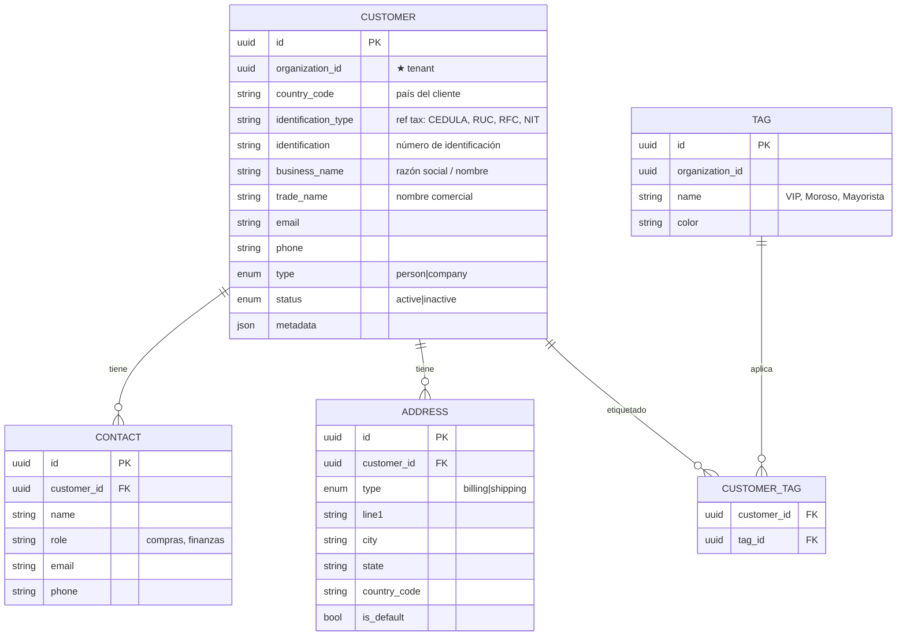
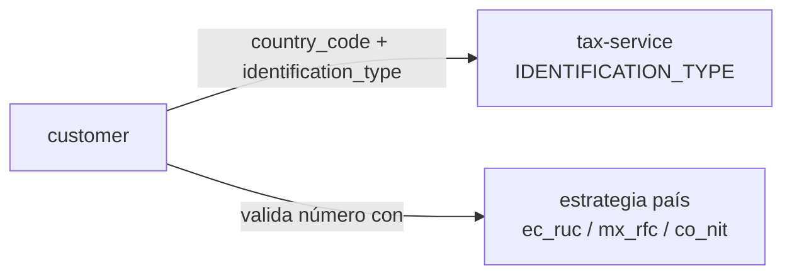
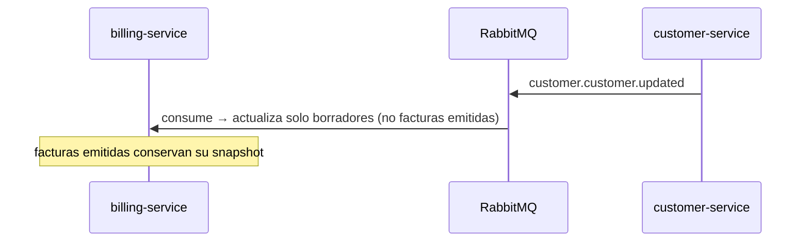

# customer-service

[← Volver al índice](../README.md) · [tax-service](./tax-service.md) · [product-service](./product-service.md)

> **Estado: construido y desplegado.** Verificado contra el código el 2026-09-16. Tablas reales: `customers`, `contacts`, `addresses`, `tags`, `customer_tags`, `identification_types`, `outbox_messages`, `processed_events`.

## Responsabilidad

Dueño de los **clientes** de cada organización (el núcleo "CRM"): datos del cliente, **contactos**, **direcciones** y **segmentos/etiquetas**. Todo particionado por `organizationId`.

## Entidades dueñas (`customer_db`)

```mermaid
erDiagram
    CUSTOMER ||--o{ CONTACT : tiene
    CUSTOMER ||--o{ ADDRESS : tiene
    CUSTOMER ||--o{ CUSTOMER_TAG : etiquetado
    TAG ||--o{ CUSTOMER_TAG : aplica

    CUSTOMER {
        uuid id PK
        uuid organization_id "★ tenant"
        string country_code "país del cliente"
        string identification_type "ref tax: CEDULA, RUC, RFC, NIT"
        string identification "número de identificación"
        string business_name "razón social / nombre"
        string trade_name "nombre comercial"
        string email
        string phone
        enum type "person|company"
        enum status "active|inactive"
        json metadata
    }
    CONTACT {
        uuid id PK
        uuid customer_id FK
        string name
        string role "compras, finanzas"
        string email
        string phone
    }
    ADDRESS {
        uuid id PK
        uuid customer_id FK
        enum type "billing|shipping"
        string line1
        string city
        string state
        string country_code
        bool is_default
    }
    TAG {
        uuid id PK
        uuid organization_id
        string name "VIP, Moroso, Mayorista"
        string color
    }
    CUSTOMER_TAG {
        uuid customer_id FK
        uuid tag_id FK
    }
```

## Relación con país e identificación

El cliente tiene `country_code` + `identification_type` + `identification`. El **tipo de identificación** referencia el catálogo de [tax-service](./tax-service.md) (cédula/RUC en EC, RFC en MX, NIT en CO), y el número se **valida con la estrategia del país** correspondiente (dígito verificador).

```mermaid
graph LR
    C[customer] -->|country_code + identification_type| TX[tax-service<br/>IDENTIFICATION_TYPE]
    C -->|valida número con| ST[estrategia país<br/>ec_ruc / mx_rfc / co_nit]
```

> Un cliente puede tener un país distinto al de la organización (ej. una empresa ecuatoriana factura a un cliente colombiano), aunque la **factura** usa siempre el país del establecimiento emisor (ver [billing](./billing-service.md)).

## Relación con facturación

[billing-service](./billing-service.md) referencia al cliente por `customerId` y, al emitir, **congela un snapshot** de sus datos fiscales (nombre, identificación, dirección) en la factura. Razón: si el cliente luego cambia de nombre, las facturas viejas deben conservar los datos del momento de la emisión.

```mermaid
sequenceDiagram
    participant B as billing-service
    participant MQ as RabbitMQ
    participant C as customer-service
    C->>MQ: customer.customer.updated
    MQ->>B: consume → actualiza solo borradores (no facturas emitidas)
    Note over B: facturas emitidas conservan su snapshot
```

> ⚠️ Este diagrama es el **diseño**: billing no consume `customer.customer.updated`. El snapshot se toma por HTTP al crear el borrador (y se repone al emitir si falta).

## API REST

Verificado contra `src/interface/http/routes.ts` el 2026-09-16.

| Método | Ruta | Permiso |
|--------|------|---------|
| GET | `/customers` | `customer:read` |
| GET | `/customers/:id` | `customer:read` (incluye `identificationTypeCode`) |
| POST | `/customers` | `customer:create` |
| PATCH | `/customers/:id` | `customer:update` |
| POST | `/customers/:id/disable` | `customer:update` (baja lógica) |
| GET · POST | `/customers/:id/contacts` | `customer:read` / `customer:update` |
| PATCH · DELETE | `/contacts/:id` | `customer:update` |
| GET · POST | `/customers/:id/addresses` | `customer:read` / `customer:update` |
| PATCH · DELETE | `/addresses/:id` | `customer:update` |
| GET · POST | `/tags` | `customer:read` / `customer:update` |
| POST | `/customers/:id/tags` | `customer:update` (asignar) |
| DELETE | `/customers/:id/tags/:tagId` | `customer:update` (quitar) |
| GET | `/identification-types` | `customer:read` |

No existe `DELETE /customers/:id` ni el permiso `customer:delete` en uso. Todas filtran por `organizationId` del contexto.

## Eventos

**Publica** (verificado 2026-09-16):

| Evento | Cuándo |
|--------|--------|
| `customer.customer.created` / `.updated` / `.disabled` | Alta, edición, baja |
| `customer.contact.added` / `.updated` / `.deleted` | Contactos |
| `customer.address.added` / `.updated` / `.deleted` | Direcciones |
| `customer.tag.created` | Nueva etiqueta |
| `customer.tag.assigned` / `.removed` | Etiquetar o quitar etiqueta a un cliente |

Hoy solo los recibe [audit-log-service](./audit-log-service.md). **billing no los consume**: pide el cliente por HTTP al crear o emitir la factura.

**Consume:**

| Evento | Origen | Acción |
|--------|--------|--------|
| `tax.identification_type.upserted` | [tax](./tax-service.md) | Upsert en la tabla local `identification_types` |
| `organization.org.updated` | [organization](./organization-service.md) | Crea el cliente de sistema **CONSUMIDOR FINAL** de la organización (`is_system`, identificación `9999999999999`) si todavía no existe |

## Dependencias

- **tax-service**: tipos de identificación, vía el read-model `identification_types`.
- **organization-service**: su evento dispara la creación de CONSUMIDOR FINAL.
- Lo consultan por HTTP [billing](./billing-service.md) (incluida la búsqueda de CONSUMIDOR FINAL para las ventas del POS) y el [POS](../pos/punto-de-venta.md) al sincronizar.

## Validaciones (ver [validación](../arquitectura/validacion.md))

- **Borde (Zod)**: email/teléfono válidos, `type` ∈ {person, company}, requeridos según tipo.
- **Dominio**:
  - `identification` válida según la estrategia del país (RUC/cédula/RFC/NIT).
  - Identificación **única** por organización (no duplicar el mismo cliente).
  - No facturar a un cliente `inactive` (se valida en billing, pero el estado lo posee aquí).

## Notas

- Las **etiquetas (TAG)** son la base de segmentación CRM (VIP, mayorista, moroso). En fase 3 evolucionan a segmentos dinámicos.
- `metadata` (JSON) permite campos personalizados por organización sin migraciones.
- Este servicio es el punto de partida del CRM "puro": en fase 3 se le suman **leads**, **oportunidades** y **actividades** (o se separan en `sales-crm-service`, ver [microservicios](../arquitectura/microservicios.md#servicios-que-recomiendo-añadir-por-fase)).

## Aviso para facturación electrónica (2026-09-14)

Los ids del catálogo de tipos de identificación de **customer-service y tax-service no coinciden**. Cuando fiscal-ecuador recibía el id y lo buscaba en el catálogo de tax-service no lo encontraba, así que adivinaba por número de dígitos: un **pasaporte de 10 dígitos salía declarado como cédula** en el comprobante enviado al SRI.

Por eso customer-service expone `identificationTypeCode` en el detalle del cliente, billing lo guarda en la foto del cliente al emitir, y fiscal usa **el código, nunca el id**. Al tocar este catálogo hay que mantener esa salida. Ver [historial de hallazgos](../facturacion-electronica/historial-hallazgos.md).
