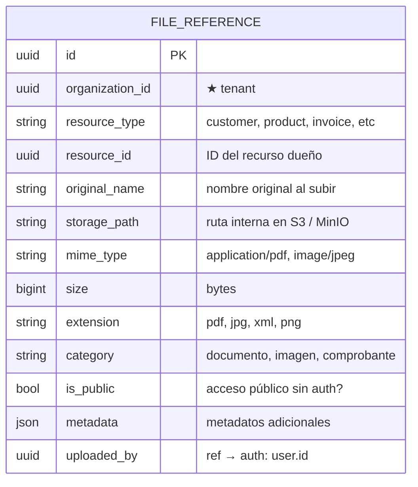
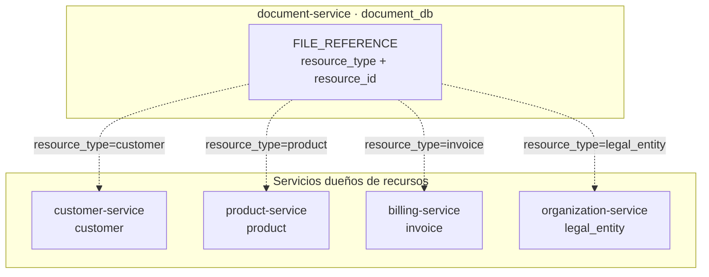
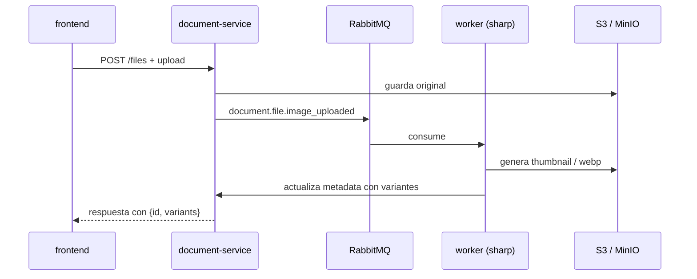

# document-service

[← Volver al índice](../README.md) · [customer-service](./customer-service.md) · [product-service](./product-service.md) · [billing-service](./billing-service.md)

> **Estado: construido y desplegado.** Verificado contra el código el 2026-09-14. Los cambios de seguridad de 2026-09-13 (acotado por organización, ruta interna, descarga pública restringida) están abajo.

## Responsabilidad

Dueño de todos los **archivos adjuntos** del sistema. Proporciona almacenamiento y acceso a archivos (imágenes, PDFs, XMLs, documentos genéricos) que cualquier entidad del CRM puede referenciar: clientes, productos, facturas, etc. La asociación es **polimórfica** (1 archivo → N tipos de recurso).

El servicio administra solo los **metadatos** del archivo; el almacenamiento físico se delega a **S3 / MinIO** (o disco local en desarrollo). Particionado por `organizationId`.

## Entidades dueñas (`document_db`)

> `FILE_REFERENCE` no tiene sub-entidades: cada fila es un archivo individual. Si se necesita **agrupar** archivos (ej. "carpeta de fotos del producto X"), se filtra por `resource_type + resource_id`.

## Asociación polimórfica

Cualquier entidad del sistema puede tener archivos adjuntos sin acoplar su esquema a document-service:

Cada servicio **dueño** del recurso decide qué archivos mostrar/adjuntar. La consistencia de la relación (no referenciar un recurso inexistente) se mantiene por **eventos de borrado**: cuando un recurso se elimina, publica un evento y document-service limpia sus archivos.

## Almacenamiento físico

| Entorno | Backend | Ruta de ejemplo |
|---------|---------|-----------------|
| Desarrollo | Disco local `./storage/organization/{orgId}/{resourceType}/{fileId}.{ext}` | `./storage/abc123/product/img_001.jpg` |
| Producción | S3 / MinIO | `s3://bucket/{orgId}/{resourceType}/{fileId}.{ext}` |

Los archivos se almacenan con **nombre único** (UUID) para evitar colisiones. El nombre original se conserva solo en metadatos.

### Generación de variantes (imágenes)

Para imágenes subidas (`mime_type` empieza con `image/`), el servicio puede generar **variantes** (miniaturas, tamaños predefinidos) de forma asíncrona:

## API REST

| Método | Ruta | Nota |
|--------|------|------|
| GET | `/files?resourceType=&resourceId=&category=` | listado |
| GET | `/files/:id` | metadatos |
| GET | `/files/:id/download` | **exige sesión**; devuelve una URL prefirmada de MinIO |
| GET | `/files/:id/url` | URL de visualización |
| POST | `/files` | subida |
| POST | `/files/presigned` · `/files/:id/confirm` | subida directa a MinIO en dos pasos |
| PATCH | `/files/:id` · DELETE `/files/:id` | metadatos / borrado |
| GET | **`/files/:id/content`** | **interna**, con `X-Internal-Secret`: devuelve el binario |
| POST | `/files/internal` | interna: subida servicio a servicio |

**Todas las rutas de usuario están acotadas a la organización del contexto**: ver, descargar, modificar y borrar solo alcanzan los archivos de la propia organización.

### Las dos lecciones de seguridad de 2026-09-13

1. **`/files/:id/download` redirige a una URL prefirmada del MinIO *público*.** Inalcanzable desde dentro del clúster: por eso fiscal-ecuador no podía bajar el certificado `.p12` y fallaba con `fetch failed`. De ahí nace **`/files/:id/content`**, la ruta interna protegida por el secreto compartido.
2. **La descarga era pública por id.** Con el identificador y sin sesión se obtenía el enlace firmado de cualquier archivo, certificados incluidos. Hoy responde **404 para archivos fiscales** (`fiscal_certificate`, `fiscal_invoice` o cualquier `application/x-pkcs12`) y el resto exige sesión y organización.
   ⚠️ **Sigue abierto**: las imágenes continúan siendo alcanzables sin sesión. El mecanismo concreto es que el gateway publica **MinIO** en `/cmr-documents/*` como ruta pública (la URL prefirmada es *path-style*, así que la firma **es** la autorización), y la interfaz las pinta con `` contra esa ruta. Cerrarlo obliga a cambiar cómo descarga el frontend, no solo a tocar este servicio. Ver [api-gateway](./api-gateway.md).

## Eventos

**Publica:**

| Evento | Cuándo | Consumido por |
|--------|--------|---------------|
| `document.file.attached` | Archivo subido y vinculado a un recurso | el hub de tiempo real del gateway y los servicios dueños |
| `document.file.removed` | Archivo eliminado | el hub del gateway y los servicios dueños |
| `document.file.metadata_updated` | Cambió la metadata de un archivo | servicios dueños |
| `document.file.upload_requested` | Se pidió una subida prefirmada | trazabilidad |

**Consume:**

| Evento | Origen | Acción |
|--------|--------|--------|
| `customer.customer.disabled` | [customer](./customer-service.md) | Elimina archivos del cliente (o los marca huérfanos) |
| `product.product.disabled` | [product](./product-service.md) | Elimina archivos del producto |
| `billing.invoice.voided` | [billing](./billing-service.md) | (opcional) conserva archivos legales; no eliminar |

## Dependencias

- **S3 / MinIO** (o sistema de archivos local): almacenamiento físico.
- **auth-service**: para `uploaded_by` y permisos de acceso por usuario/rol.
- Lo consumen todos los servicios que adjunten archivos (customer, product, billing, etc.).

## Validaciones (ver [validación](../arquitectura/validacion.md))

- **Borde (Zod)**:
  - Extensiones permitidas según `category` (imagen: jpg, png, webp; documento: pdf; comprobante: xml, pdf).
  - Tamaño máximo por archivo (p. ej. 10 MB en general, 50 MB para comprobantes).
  - `resource_type` debe ser un tipo conocido del sistema.
- **Dominio**:
  - El `resource_id` debe existir en el servicio dueño (validación opcional, vía evento de confirmación).
  - No exceder la cuota de almacenamiento por organización (fase 2).
  - Los archivos de facturas emitidas (`resource_type=invoice` + recurso `issued+`) no se pueden eliminar (inmutabilidad legal).

## Aspectos clave

### Inmutabilidad de archivos fiscales

Los PDF/XML de comprobantes **autorizados** no pueden eliminarse ni modificarse, solo marcarse como `archived`. El servicio distingue:

| Estado del archivo | Significado | ¿Editable? | ¿Eliminable? |
|--------------------|-------------|:----------:|:------------:|
| `active` | Archivo normal | Sí | Sí (por quien lo subió) |
| `archived` | Comprobante autorizado congelado | No | No |
| `orphan` | Recurso dueño eliminado, archivo sin referencia | No | Programado (TTL) |

### Cuotas y límites

- Cada organización tiene una **cuota** de almacenamiento (configurable en metadata del archivo).
- Los workers de variantes de imagen se ejecutan con baja prioridad para no saturar el servicio principal.

### Seguridad

- Los archivos se almacenan con nombre UUID, no con el nombre original (evita path traversal y colisiones).
- El acceso a `/download` verifica que el usuario tenga permiso sobre el `resource_type` y `resource_id` del archivo.
- Para acceso público (ej. logo de la organización), se usa `is_public=true` y se sirve vía CDN con cache largo.

## Notas

- Este servicio reemplaza el almacenamiento local de PDF/XML que [billing-service](./billing-service.md) podría hacer en fase 1. Desde fase 2, billing delega la persistencia y servir de archivos a document-service.
- La generación de variantes de imagen se implementa con **Sharp** (Node.js) o un worker externo.
- `metadata` (JSON) permite guardar información extra como: descripción del archivo, fecha del documento original, número de resolución asociada, etc.
- En una fase posterior, `document-service` puede evolucionar para manejar **versionado** de archivos (múltiples versiones del mismo adjunto).
