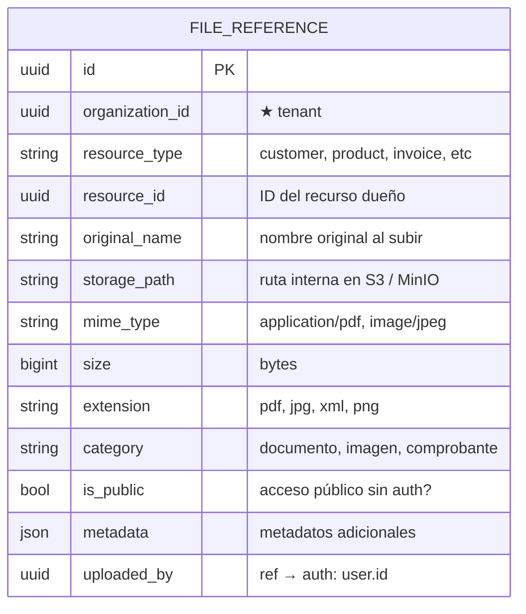
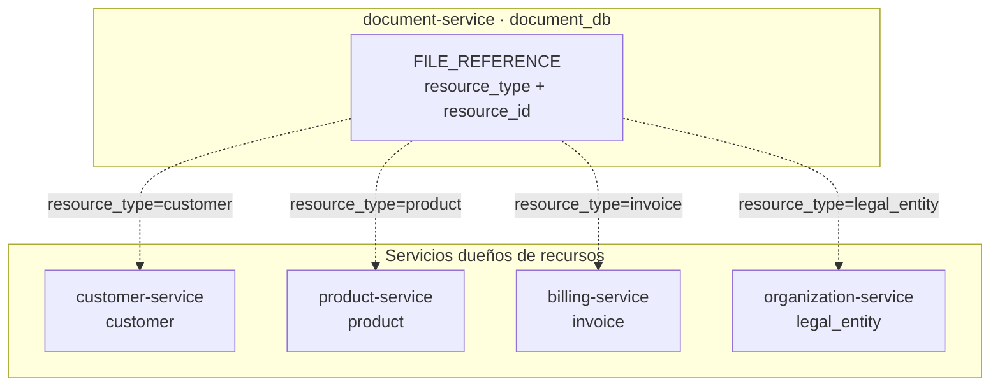

# document-service

[← Volver al índice](../README.md) · [customer-service](./customer-service.md) · [product-service](./product-service.md) · [billing-service](./billing-service.md)

> **Estado: construido y desplegado.** Verificado contra el código el 2026-09-16. Tablas reales: `file_references` y `outbox_messages`. Varias secciones de abajo (variantes de imagen, inmutabilidad fiscal, cuotas) son **diseño no construido** y están marcadas con ❌. Los cambios de seguridad de 2026-09-13 (acotado por organización, ruta interna, descarga pública restringida) están abajo.

## Responsabilidad

Dueño de todos los **archivos adjuntos** del sistema. Proporciona almacenamiento y acceso a archivos (imágenes, PDFs, XMLs, documentos genéricos) que cualquier entidad del CRM puede referenciar: clientes, productos, facturas, etc. La asociación es **polimórfica** (1 archivo → N tipos de recurso).

El servicio administra solo los **metadatos** del archivo; el almacenamiento físico se delega a **S3 / MinIO** (o disco local en desarrollo). Particionado por `organizationId`.

## Entidades dueñas (`document_db`)

```mermaid
erDiagram
    FILE_REFERENCE {
        uuid id PK
        uuid organization_id "★ tenant"
        string resource_type "customer, product, invoice, etc"
        uuid resource_id "ID del recurso dueño"
        string original_name "nombre original al subir"
        string storage_path "ruta interna en S3 / MinIO"
        string mime_type "application/pdf, image/jpeg"
        bigint size "bytes"
        string extension "pdf, jpg, xml, png"
        string category "documento, imagen, comprobante"
        bool is_public "acceso público sin auth?"
        json metadata "metadatos adicionales"
        uuid uploaded_by "ref → auth: user.id"
    }
```

> `FILE_REFERENCE` no tiene sub-entidades: cada fila es un archivo individual. Si se necesita **agrupar** archivos (ej. "carpeta de fotos del producto X"), se filtra por `resource_type + resource_id`.

## Asociación polimórfica

Cualquier entidad del sistema puede tener archivos adjuntos sin acoplar su esquema a document-service:

```mermaid
graph TB
    subgraph document[document-service · document_db]
        F[FILE_REFERENCE<br/>resource_type + resource_id]
    end
    subgraph otros[Servicios dueños de recursos]
        C[customer-service<br/>customer]
        P[product-service<br/>product]
        B[billing-service<br/>invoice]
        O[organization-service<br/>legal_entity]
    end
    F -. resource_type=customer .-> C
    F -. resource_type=product .-> P
    F -. resource_type=invoice .-> B
    F -. resource_type=legal_entity .-> O
```

Cada servicio **dueño** del recurso decide qué archivos mostrar/adjuntar. La consistencia de la relación (no referenciar un recurso inexistente) se mantiene por **eventos de borrado**: cuando un recurso se elimina, publica un evento y document-service limpia sus archivos.

## Almacenamiento físico

| Entorno | Backend | Ruta de ejemplo |
|---------|---------|-----------------|
| Desarrollo | Disco local `./storage/organization/{orgId}/{resourceType}/{fileId}.{ext}` | `./storage/abc123/product/img_001.jpg` |
| Producción | S3 / MinIO | `s3://bucket/{orgId}/{resourceType}/{fileId}.{ext}` |

Los archivos se almacenan con **nombre único** (UUID) para evitar colisiones. El nombre original se conserva solo en metadatos.

### Generación de variantes (imágenes) — ❌ no construida

El diseño preveía miniaturas y `webp` generadas por un worker con `sharp` a partir de un evento `document.file.image_uploaded`. **No existe** (verificado 2026-09-16): el evento no se publica, no hay worker, y aunque `sharp` está en `package.json` y hay un puerto `ImageProcessorPort` en `application/ports.ts`, nada lo implementa ni lo llama. Las imágenes se sirven tal como se subieron.

## API REST

Verificado contra `src/interface/http/routes.ts` el 2026-09-16.

| Método | Ruta | Nota |
|--------|------|------|
| GET | `/files?resourceType=&resourceId=&category=` | listado (`resourceType` y `resourceId` obligatorios) |
| GET | `/files/:id` | metadatos |
| GET | `/files/:id/download` | **exige sesión**; devuelve una URL prefirmada de MinIO |
| GET | `/files/:id/url` | URL de visualización |
| POST | `/files/presigned` | paso 1 de la subida: registra el archivo en `pending` y devuelve la URL prefirmada de subida |
| PATCH | `/files/:id/confirm` | paso 2: con el `checksum`, lo pasa a `confirmed` y publica `document.file.attached` |
| PATCH | `/files/:id` | metadatos (`description`, `category`, `expiresAt`) |
| DELETE | `/files/:id` | borrado |
| GET | **`/files/:id/content`** | **interna**, con `X-Internal-Secret`: devuelve el binario |
| POST | `/files/internal` | interna: subida servicio a servicio (la usan billing y fiscal-ecuador) |

No existe `POST /files`: **la única subida desde el cliente es la prefirmada en dos pasos**.

Las rutas de usuario exigen sesión, pero **no piden ningún permiso**: basta con pertenecer a la organización. La regla está en `domain/file-access.ts` (`canAccessFile`): se alcanza un archivo si es de la organización del usuario, si es su propio avatar (`resourceType: 'user'`) desde cualquier organización, o si es anterior a guardar la organización (`organization_id` NULL). Lo demás responde 404.

> ✅ **Corregido el 2026-09-16 (commit `f7b93a0`): los archivos fiscales y los comprobantes ya no se pueden borrar ni modificar desde rutas de usuario.** Antes, `DELETE /files/:id` solo comprobaba `canAccessFile`, así que cualquier usuario de la organización, sin ningún permiso, podía borrar el XML autorizado por el SRI o el `.p12`, incluido el objeto de MinIO. Los archivos anteriores a guardar la organización (`organization_id` NULL) los podía borrar **cualquier usuario con sesión**.
>
> Ahora `DELETE /files/:id` y `PATCH /files/:id` responden **409 `FILE_IMMUTABLE`** si `isImmutableFile` (en `domain/file-access.ts`) es verdadero. Protege los archivos privados (`fiscal_certificate`, `fiscal_invoice` y cualquier `application/x-pkcs12`) y los comprobantes comerciales de billing (`resourceType: invoice` + `category: comprobante`). También se bloquea el `PATCH`, porque cambiar la categoría habría bastado para sacar el archivo de la protección y luego borrarlo. Los demás adjuntos se borran como antes. El certificado se sigue revocando por `DELETE /certificates/:id` de fiscal-ecuador, que no toca document-service.
>
> Sigue sin haber **permiso** para borrar adjuntos normales: basta pertenecer a la organización.

### Las dos lecciones de seguridad de 2026-09-13

1. **`/files/:id/download` redirige a una URL prefirmada del MinIO *público*.** Inalcanzable desde dentro del clúster: por eso fiscal-ecuador no podía bajar el certificado `.p12` y fallaba con `fetch failed`. De ahí nace **`/files/:id/content`**, la ruta interna protegida por el secreto compartido.
2. **La descarga era pública por id.** Con el identificador y sin sesión se obtenía el enlace firmado de cualquier archivo, certificados incluidos. Hoy responde **404 para archivos fiscales** (`fiscal_certificate`, `fiscal_invoice` o cualquier `application/x-pkcs12`) y el resto exige sesión y organización.
   ⚠️ **Sigue abierto**: las imágenes continúan siendo alcanzables sin sesión. El mecanismo concreto es que el gateway publica **MinIO** en `/cmr-documents/*` como ruta pública (la URL prefirmada es *path-style*, así que la firma **es** la autorización), y la interfaz las pinta con `` contra esa ruta. Cerrarlo obliga a cambiar cómo descarga el frontend, no solo a tocar este servicio. Ver [api-gateway](./api-gateway.md).

## Eventos

**Publica:**

Verificado 2026-09-16:

| Evento | Cuándo | Lo consume |
|--------|--------|---------------|
| `document.file.upload_requested` | `POST /files/presigned` | audit |
| `document.file.attached` | Confirmación de una subida prefirmada, o subida interna | audit |
| `document.file.metadata_updated` | `PATCH /files/:id` | audit |
| `document.file.removed` | `DELETE /files/:id` | audit |

Ningún servicio de negocio ni el hub del gateway escucha hoy estos eventos.

**Consume:** nada. El diseño preveía limpiar archivos al llegar `customer.customer.disabled` o `product.product.disabled`; no está construido, así que los archivos de un recurso dado de baja se quedan.

## Dependencias

- **Almacenamiento físico**: `STORAGE_DRIVER=s3` (MinIO, lo que se usa en el clúster) o `local` (disco, valor por defecto), en `infrastructure/storage/`.
- **auth-service**: nada síncrono; `uploaded_by` sale de la cabecera `X-User-Id` del gateway.
- Lo usan por HTTP billing-service y fiscal-ecuador (`/files/internal`, `/files/:id/content`), y el frontend para avatares, imágenes de producto y el certificado.

## Validaciones (ver [validación](../arquitectura/validacion.md))

**Construido** (`interface/http/validators.ts`): `resourceType`, `resourceId`, `category`, `originalName` y `mimeType` como texto no vacío con longitud máxima; `size` entero positivo; `checksum` al confirmar.

**No construido** (diseño): lista de extensiones por categoría, tamaño máximo por archivo, lista cerrada de `resourceType`, comprobar que el recurso existe, cuotas por organización.

## Aspectos clave

### Inmutabilidad de archivos fiscales — ⚠️ parcial (2026-09-16)

**Lo construido:** los archivos fiscales y los comprobantes no se pueden borrar ni modificar desde las rutas de usuario (`isImmutableFile`, ver [API REST](#api-rest)). No hay estado `archived`: la protección se decide por `resourceType`, `category` y `mimeType`.

**Estados reales** (`FileStatus`): `pending` (prefirmada pedida), `confirmed` (subida confirmada), `deleted`, y además `rejected` y `quarantined`, que están declarados pero nada los asigna. **No existen** `active`, `archived` ni `orphan`.

El diseño original era este:

| Estado del archivo | Significado | ¿Editable? | ¿Eliminable? |
|--------------------|-------------|:----------:|:------------:|
| `active` | Archivo normal | Sí | Sí (por quien lo subió) |
| `archived` | Comprobante autorizado congelado | No | No |
| `orphan` | Recurso dueño eliminado, archivo sin referencia | No | Programado (TTL) |

### Cuotas y límites — ❌ no construidos

Ni cuota por organización ni límite de tamaño.

### Seguridad

- Los archivos se almacenan con nombre UUID, no con el nombre original (evita path traversal y colisiones).
- El acceso a `/download` y `/url` **no** mira permisos por `resource_type`: solo la regla de organización de `canAccessFile`, y 404 para los archivos fiscales (`get-file-download.ts`). `PATCH` y `DELETE` responden 409 para fiscales y comprobantes (`isImmutableFile`). `GET /files/:id` (metadatos) y el listado sí los muestran a la organización.
- No hay CDN: lo público se sirve por la ruta `/cmr-documents/*` del gateway con URL prefirmada.

## Notas

- Este servicio reemplaza el almacenamiento local de PDF/XML que [billing-service](./billing-service.md) podría hacer en fase 1. Desde fase 2, billing delega la persistencia y servir de archivos a document-service.
- La generación de variantes de imagen se implementa con **Sharp** (Node.js) o un worker externo.
- `metadata` (JSON) permite guardar información extra como: descripción del archivo, fecha del documento original, número de resolución asociada, etc.
- En una fase posterior, `document-service` puede evolucionar para manejar **versionado** de archivos (múltiples versiones del mismo adjunto).
