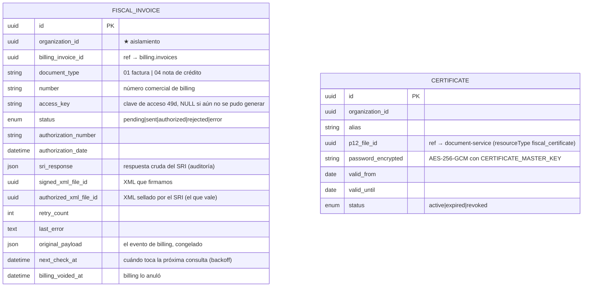

# fiscal-ecuador

[← Volver al índice](../README.md) · [Facturación electrónica (estado real)](../facturacion-electronica/README.md) · [billing-service](./billing-service.md) · [estrategia multipaís](../arquitectura/estrategia-multipais.md)

> **Estado: construido y desplegado (2026-09).** Este documento describe el servicio **tal como está implementado**, no como se diseñó. El flujo completo, las reglas del SRI y lo que falta están en [facturación electrónica](../facturacion-electronica/README.md).

## Responsabilidad

Integra el flujo comercial de facturación con el **SRI** de Ecuador. Consume las facturas emitidas por [billing-service](./billing-service.md), genera la **clave de acceso de 49 dígitos**, arma el **XML** del comprobante, lo firma con **XAdES-BES** usando el `.p12` de la organización, lo envía a los web services del SRI, consulta la autorización y expone el **XML autorizado** y el **RIDE** en PDF.

**Aislado del core:**
- Billing no conoce este servicio.
- Consume eventos de billing y publica los suyos.
- Si el SRI se cae, billing sigue emitiendo comercialmente; este servicio reintenta en segundo plano.

**Puerto 3010, Service ClusterIP**: solo lo llama el gateway.

## Qué sabe emitir

| Comprobante | Código | Estado |
|---|---|---|
| Factura | `01` | ✅ |
| Nota de crédito | `04` | ✅ (XML validado contra `notaCredito_V1.1.0.xsd`) |
| Nota de débito | `05` | ❌ |
| Guía de remisión | `06` | ❌ |
| Comprobante de retención | `07` | ❌ |

## Entidades (`fiscal_ec_db`)



Índices que importan:
- `(organization_id, document_type, number)` **único**: impide dos comprobantes con el mismo número.
- `(status, next_check_at)`: el job de autorización consulta por vencimiento.
- `access_key` **único** y **nullable**: antes se grababa una "clave" falsa de 49 caracteres aleatorios cuando faltaban datos del emisor.

Además: `outbox_messages` y `processed_events`, como el resto de servicios.

## API REST

| Método | Ruta | Permiso |
|--------|------|---------|
| GET | `/fiscal-invoices` | `fiscal:read` (listado paginado) |
| GET | `/fiscal-invoices/sequence-gaps` | `fiscal:read` |
| GET | `/fiscal-invoices/:billingInvoiceId` | `fiscal:read` (DTO, no la fila cruda) |
| GET | `/fiscal-invoices/:id/xml` | `fiscal:read` (el autorizado si existe) |
| GET | `/fiscal-invoices/:id/xml/download` | `fiscal:read` |
| GET | `/fiscal-invoices/:id/ride` | `fiscal:read` (PDF; solo autorizados) |
| POST | `/fiscal-invoices/:billingInvoiceId/retry` | `invoice:authorize` (o `fiscal:manage`) |
| GET | `/certificates` · `/certificates/:id` | `fiscal:manage` |
| POST | `/certificates` | `fiscal:manage` (rechaza `.p12` vencidos) |
| DELETE | `/certificates/:id` | `fiscal:manage` |

No verifica JWT: la identidad llega por cabeceras del gateway, que borra las internas que vengan de fuera.

## Eventos

**Consume:** `billing.invoice.issued`, `billing.invoice.voided`.

**Publica** (`fiscal.ec.invoice.<tipo>`): `pending`, `sent`, `authorized`, `rejected`, `error`, `void_requires_action`, `sequence_gap`, y además `attention_required` cuando hace falta una persona.

## Dependencias

| Servicio | Para qué | URL en el clúster |
|---|---|---|
| document-service | bajar el `.p12`, subir XML | `http://document-service:3003` |
| tax-service | catálogo de tarifas de IVA | `http://tax-service:3005` |
| organization-service | perfil fiscal del emisor | `http://organization-service:3002` |

Las tres se llaman con `X-Internal-Secret`; sin cabeceras responden 401/403.

## Estructura del código

Clean Architecture, ESM, Hono + Sequelize + Zod.

```
src/
  domain/         access-key, invoice-xml-builder, credit-note-xml-builder,
                  xml-signer, sri-tax-codes, invoice-validation, sequence-gaps,
                  ecuador-time, ride-pdf, ride-qr
  application/    fiscal-processor (máquina de estados, reintentos, backoff), ports
  infrastructure/ config, crypto, http (sri-client, document-storage,
                  fiscal-catalogs), messaging (consumer), persistence
  interface/http/ app, middlewares
```

144 tests: XML contra los XSD oficiales, firma contra un verificador independiente, cliente SOAP con respuestas reales de celcer, procesador, configuración y manifiestos de k8s.

## Notas

- Existe **solo si la organización factura electrónicamente en Ecuador**. El gateway lo protege además con el plugin `finance.electronic_invoicing` (y `finance.electronic_certificate` para los certificados).
- Los comprobantes de otros países se ignoran en silencio: el exchange es compartido.
- **Nota de crédito para anular**: una factura ya autorizada no se puede deshacer; se emite una NC desde billing.
