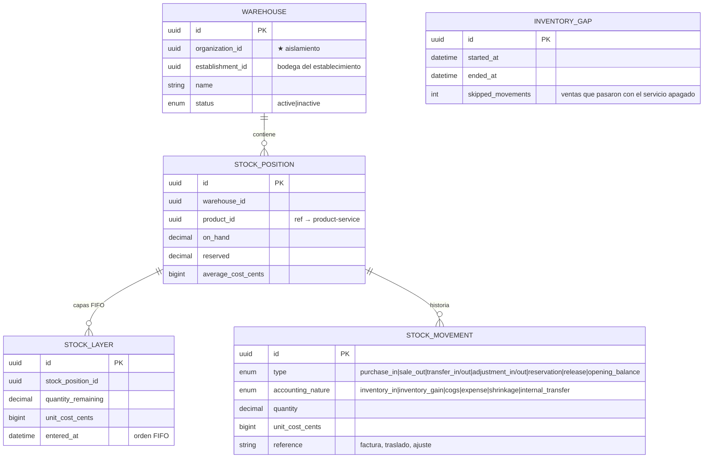

# inventory-service

[← Volver al índice](../README.md) · [product-service](./product-service.md) · [billing-service](./billing-service.md) · [plugin-catalog-service](./plugin-catalog-service.md)

> **Estado: construido, NO desplegado (2026-09-14).** El código está completo y con manifiestos de k8s, pero no corre en el clúster. El gateway ya tiene sus rutas, protegidas por los plugins `inventory.warehouses` e `inventory.kardex`.

## Responsabilidad

**Existencias y kardex**: bodegas, movimientos, posiciones de stock y costeo. Descuenta al emitir una factura y repone al anularla, consumiendo los eventos de billing.

No es dueño del producto: mantiene un **modelo de lectura** (`products`) que se alimenta de los eventos de [product-service](./product-service.md). El catálogo sigue siendo de product-service.

## Entidades (`inventory_db`)

También `organization_plugins` (réplica local de qué tiene contratado la organización) y el `products` del modelo de lectura.

## Costeo

Dos métodos, en `domain/valuation/strategy.ts`:

- **Promedio ponderado** (`weighted_average`): cada entrada recalcula el promedio.
- **FIFO**: cada entrada crea una **capa** (`stock_layer`) con su costo; cada salida consume capas por orden de entrada y el costo de ventas sale de las capas consumidas, no del promedio. El `average_cost` se sigue calculando en FIFO, pero **solo para mostrar**: la aritmética usa las capas.

Todo el dinero en **centavos (BIGINT)**, como el resto del sistema.

## El hueco de servicio apagado

`INVENTORY_GAP` es una idea que merece la pena entender: si el servicio está caído mientras se emiten facturas, esas salidas **no se pueden reconstruir** sin adivinar. En vez de fingir que el stock es correcto, se registra el intervalo y cuántos movimientos se saltaron, para que alguien haga un inventario físico y una regularización consciente.

## API REST

| Método | Ruta | Plugin |
|--------|------|--------|
| GET/POST | `/warehouses` · `/warehouses/:id` | `inventory.warehouses` |
| POST | `/warehouses/:id/deactivate` | `inventory.warehouses` |
| GET | `/stock` · `/stock/products/:productId` | `inventory.kardex` |
| GET | `/stock/movements` | `inventory.kardex` |
| POST | `/stock/adjustments` | `inventory.kardex` |
| POST | `/stock/transfers` | `inventory.kardex` |

## Eventos

**Consume:**

| Evento | Qué hace |
|---|---|
| `billing.invoice.issued` | descuenta stock (`sale_out`, naturaleza `cogs`) |
| `billing.invoice.voided` | repone |
| `product.product.created/updated/disabled` | refresca el modelo de lectura |
| `organization.establishment.created` | crea la bodega del establecimiento |
| `organization.org.updated` | datos de la organización |
| eventos de plugins | activa o apaga el módulo para esa organización |

**Publica:** `inventory.stock.entered`, `inventory.stock.consumed`, `inventory.stock.adjusted`, `inventory.stock.transferred`, `inventory.stock.negative`, `inventory.stock.stale`, `inventory.warehouse.created`.

`inventory.stock.negative` y `inventory.stock.stale` son avisos para una persona: existencias en negativo (se vendió lo que no había) y posiciones sin movimiento.

## Pendiente antes de desplegarlo

- Desplegarlo: hay `k8s/deployment.yaml` y `k8s/service.yaml`, y el CI no lo ha corrido.
- ⚠️ `INVENTORY_SERVICE_URL` del gateway apuntaba a `inventory-service` cuando el Service se llama `inventory-service-node` — ya corregido en el gateway, pero conviene verificarlo al desplegar.
- Decidir el método de costeo por organización y de dónde sale el costo de compra (hoy entra por `purchase_in` manual: no hay módulo de compras).
