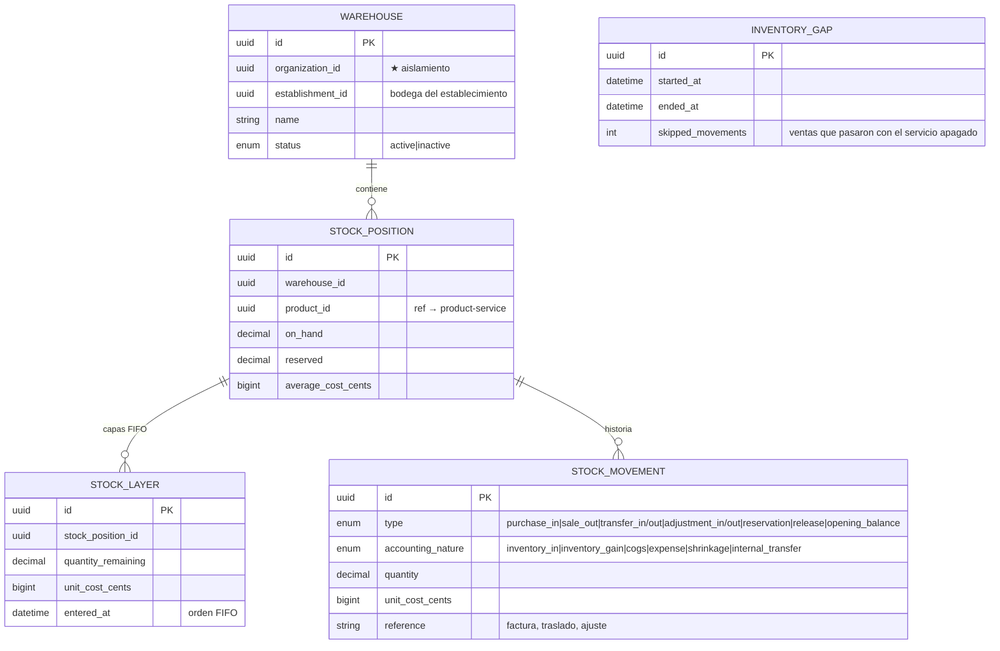

# inventory-service

[← Volver al índice](../README.md) · [product-service](./product-service.md) · [billing-service](./billing-service.md) · [plugin-catalog-service](./plugin-catalog-service.md)

> **Estado: desplegado y sano (2026-09-15).** Corre en el clúster (`inventory-service-node`, puerto 3013), con sus 10 tablas creadas por la migración, `/health` en 200 y su cola `inventory-service.events` con consumidor. El gateway ya tiene sus rutas, protegidas por los plugins `inventory.warehouses` e `inventory.kardex`.

## Responsabilidad

**Existencias y kardex**: bodegas, movimientos, posiciones de stock y costeo. Descuenta al emitir una factura y repone al anularla, consumiendo los eventos de billing.

No es dueño del producto: mantiene un **modelo de lectura** (`products`) que se alimenta de los eventos de [product-service](./product-service.md). El catálogo sigue siendo de product-service.

## Entidades (`inventory_db`)

```mermaid
erDiagram
    WAREHOUSE ||--o{ STOCK_POSITION : contiene
    STOCK_POSITION ||--o{ STOCK_LAYER : "capas FIFO"
    STOCK_POSITION ||--o{ STOCK_MOVEMENT : historia

    WAREHOUSE {
        uuid id PK
        uuid organization_id "★ aislamiento"
        uuid establishment_id "bodega del establecimiento"
        string name
        enum status "active|inactive"
    }
    STOCK_POSITION {
        uuid id PK
        uuid warehouse_id
        uuid product_id "ref → product-service"
        decimal on_hand
        decimal reserved
        bigint average_cost_cents
    }
    STOCK_LAYER {
        uuid id PK
        uuid stock_position_id
        decimal quantity_remaining
        bigint unit_cost_cents
        datetime entered_at "orden FIFO"
    }
    STOCK_MOVEMENT {
        uuid id PK
        enum type "purchase_in|sale_out|transfer_in/out|adjustment_in/out|reservation|release|opening_balance"
        enum accounting_nature "inventory_in|inventory_gain|cogs|expense|shrinkage|internal_transfer"
        decimal quantity
        bigint unit_cost_cents
        string reference "factura, traslado, ajuste"
    }
    INVENTORY_GAP {
        uuid id PK
        datetime started_at
        datetime ended_at
        int skipped_movements "ventas que pasaron con el servicio apagado"
    }
```

También `organization_plugins` (réplica local de qué tiene contratado la organización) y el `products` del modelo de lectura.

## Costeo

Dos métodos, en `domain/valuation/strategy.ts`:

- **Promedio ponderado** (`weighted_average`): cada entrada recalcula el promedio.
- **FIFO**: cada entrada crea una **capa** (`stock_layer`) con su costo; cada salida consume capas por orden de entrada y el costo de ventas sale de las capas consumidas, no del promedio. El `average_cost` se sigue calculando en FIFO, pero **solo para mostrar**: la aritmética usa las capas.

Todo el dinero en **centavos (BIGINT)**, como el resto del sistema.

## El hueco de servicio apagado

`INVENTORY_GAP` es una idea que merece la pena entender: si el servicio está caído mientras se emiten facturas, esas salidas **no se pueden reconstruir** sin adivinar. En vez de fingir que el stock es correcto, se registra el intervalo y cuántos movimientos se saltaron, para que alguien haga un inventario físico y una regularización consciente.

## API REST

Verificado contra `src/interface/http/routes.ts` el 2026-09-16.

| Método | Ruta | Permiso | Plugin (gateway) |
|--------|------|---------|--------|
| GET · POST | `/warehouses` | `inventory:read` / `inventory:manage` | `inventory.warehouses` |
| GET · PATCH | `/warehouses/:id` | `inventory:read` / `inventory:manage` | `inventory.warehouses` |
| POST | `/warehouses/:id/deactivate` | `inventory:manage` | `inventory.warehouses` |
| GET | `/stock` · `/stock/products/:productId` | `inventory:read` | `inventory.kardex` |
| GET | `/stock/movements` | `inventory:read` | `inventory.kardex` |
| POST | `/stock/adjustments` | `inventory:adjust` | `inventory.kardex` |
| POST | `/stock/transfers` | `inventory:transfer` | `inventory.kardex` |

## Eventos

**Consume:**

| Evento | Qué hace |
|---|---|
| `billing.invoice.issued` | descuenta stock (`sale_out`, naturaleza `cogs`) |
| `billing.invoice.voided` | repone |
| `product.product.created/updated/disabled` | refresca el modelo de lectura |
| `organization.establishment.created` | crea la bodega del establecimiento |
| `organization.org.updated` | datos de la organización |
| `plugin.activated` / `plugin.deactivated` | activa o apaga el módulo para esa organización |

**Publica:** `inventory.stock.entered`, `inventory.stock.consumed`, `inventory.stock.adjusted`, `inventory.stock.transferred`, `inventory.stock.negative`, `inventory.stock.stale`, `inventory.warehouse.created`.

`inventory.stock.negative` y `inventory.stock.stale` son avisos para una persona: existencias en negativo (se vendió lo que no había) y posiciones sin movimiento.

## Pendiente

**Lo que costó desplegarlo (2026-09-15), por si se repite en otro servicio nuevo:** la CI
fallaba en `npm ci` con 401 al bajar `@facturero/outbox-relay`, porque al repo le faltaban
los secretos de Actions `NODE_AUTH_TOKEN` y `SOPS_AGE_KEY`; no se pueden copiar de otro
repo (son de solo escritura), pero sus valores están en la PC de desarrollo: el token en
`cmr-proyect/.env` y la clave age en `~/.config/sops/age/keys.txt`. Además le faltaba el
patrón de SOPS entero: `config/secrets.production.enc` y los tres pasos del job de deploy
que lo descifran y crean `inventory-db` e `inventory-rabbitmq`. La base `inventory_db` y su
usuario se crearon a mano en MySQL. El manifiesto apuntaba a `plugin-catalog-service-node`,
un Service que no existe (es `plugin-catalog-service`).

- Decidir el método de costeo por organización y de dónde sale el costo de compra (hoy entra por `purchase_in` manual: no hay módulo de compras).
- El [POS](../pos/punto-de-venta.md) todavía no valida stock al vender: falta decidir qué hace la caja offline cuando no puede consultar el CRM.
