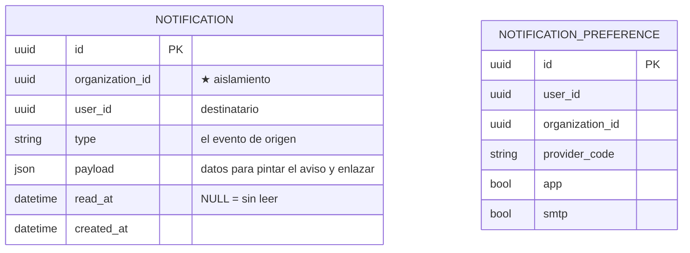

# notification-service

[← Volver al índice](../README.md) · [tiempo real](./realtime-service.md) · [api-gateway](./api-gateway.md) · [plugin-catalog-service](./plugin-catalog-service.md)

> **Estado: construido y desplegado (2026-09).** Documenta el servicio tal como está implementado.

## Responsabilidad

La **campana** del CRM y el **correo**. Consume eventos de dominio de otros servicios y los convierte en notificaciones para una persona concreta, por dos canales: `app` (la campana, en vivo) y `smtp` (email).

No inventa avisos: cada notificación nace de un evento que otro servicio publicó.

## El catálogo de proveedores

Un **proveedor** es "de qué evento nace este aviso". Está declarado en `src/provider-config.json`, no en base de datos, y cada entrada dice:

| Campo | Para qué |
|---|---|
| `code` | el evento que lo dispara (`identity.user.invited`, `fiscal.ec.invoice.attention_required`…) |
| `pluginCode` | el plugin que tiene que estar activo para que el aviso exista (`admin.users_roles`, `finance.electronic_invoicing`…) |
| `nameKey` / `descriptionKey` | claves i18n: los textos viven en el frontend |
| `channels` | canales posibles (`app`, `smtp`) |
| `defaults` | qué viene activado de fábrica en cada canal |

Que el catálogo esté ligado a plugins significa que **un usuario solo ve las preferencias de lo que su organización tiene contratado**. `GET /notifications/providers` devuelve el catálogo ya filtrado.

## Entidades (`notification_db`)

Más `processed_events` para la idempotencia del consumidor.

## API REST

| Método | Ruta | Qué hace |
|--------|------|----------|
| GET | `/notifications` | bandeja del usuario (no leídas primero) |
| PATCH | `/notifications/:id/read` | marcar una como leída |
| POST | `/notifications/read-all` | marcar todas |
| GET | `/notifications/providers` | catálogo filtrado por los plugins de la organización |
| GET/PUT | `/notifications/me/preferences` | preferencias por proveedor y canal |

## Eventos que consume

- `identity.user.invited` — invitación (solo correo)
- `identity.user.enabled` / `identity.user.disabled` — alta y baja de acceso
- `identity.user.password_reset_requested` — enlace de reseteo (solo correo)
- `billing.invoice.issued` — comprobante emitido
- **`fiscal.ec.invoice.attention_required`** — un comprobante electrónico necesita a una persona: rechazado por el SRI o atascado. Ver [facturación electrónica](../facturacion-electronica/flujo-end-to-end.md)

## Cómo llega en vivo a la pantalla

**No hay servicio de tiempo real.** El socket vive en el **api-gateway** (`/ws`, Socket.IO): el hub consume los mismos eventos, los filtra por organización y usuario y los empuja al navegador. La campana se pinta con lo que devuelve `GET /notifications`, y el socket solo la refresca.

Un evento **sin `userId` se descarta**: sin destinatario no hay a quién avisar.

## Correo

SMTP por `notification-smtp` (en desarrollo, el sandbox de Mailtrap en el puerto 2525). El workflow de CI **solo crea el secret si hay credenciales**: sin ellas el deployment no se rompe, simplemente no se envía correo.

## Notas

- El servicio no decide *si* algo es importante: eso lo decide quien publica el evento. En facturación, por ejemplo, fiscal-ecuador publica `attention_required` **solo** cuando hace falta una persona, para que los reintentos automáticos no llenen la campana.
- La plantilla de cada correo está en `src/template-config.json`.
