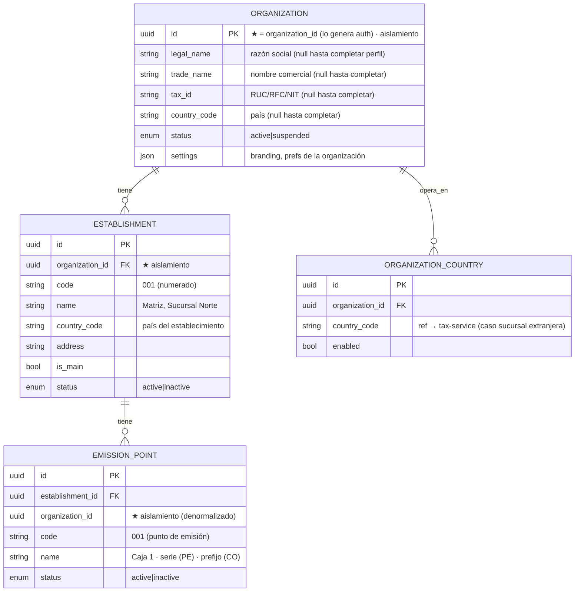
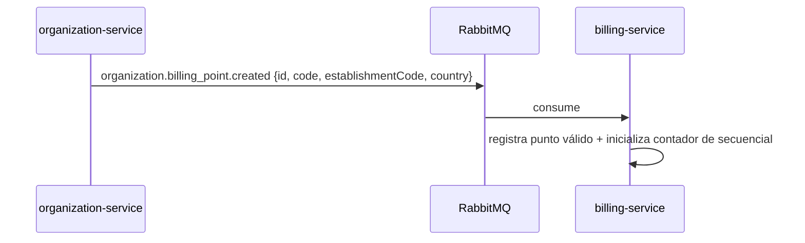

# organization-service

[← Volver al índice](../README.md) · [auth-service](./auth-service.md) · [tax-service](./tax-service.md) · [estrategia multipaís](../arquitectura/estrategia-multipais.md)

> **Modelo (multipaís):** la estructura es **organización (entidad legal)** → **establecimiento** → **punto de emisión**. La clave de **aislamiento** es **`organization_id`** (cada entidad legal está atada a **un** país vía `country_code`). Un negocio que opera en varios países crea **una organización por entidad/país**. La consolidación bajo un **grupo (`tenant`)** por encima de la organización es una **evolución futura opcional**, no el modelo actual. El término canónico del punto de emisión es `emission_point` (rutas y eventos conservan `billing_point` por compatibilidad). Fuente: [estrategia multipaís](../arquitectura/estrategia-multipais.md).

## Responsabilidad

Dueño del **perfil fiscal y la estructura** de la organización: sus **datos fiscales** (razón social, RUC, país), **establecimientos** (sucursales) y **puntos de emisión**. La clave de aislamiento transversal es **`organization_id`**.

> **Opción A (importante):** la organización **ya existe** cuando este servicio la toca. `auth-service` genera el `organization_id` y crea al fundador (usuario + rol Administrador) al **registrarse**. organization-service **no crea** la organización ni siembra roles: es dueño de su **perfil**, identificado por el `organization_id` que llega en `X-Organization-Id`. Por eso el "alta" aquí es **`PUT /organizations/me`** (completar el perfil de la org que ya tienes), no un `POST` que genere una nueva.

## Entidades dueñas (`organization_db`)



## Por qué los establecimientos y puntos de emisión importan tanto

En la facturación electrónica de LATAM (Ecuador como referencia), el número de comprobante tiene la forma:

```
   001    -    001    -   000000001
   ▲            ▲             ▲
establecimiento  punto       secuencial
   (code)      de emisión   (lo lleva billing)
```

- El **establecimiento** (`ESTABLISHMENT.code`, ej. `001`) = sucursal física.
- El **punto de emisión** (`EMISSION_POINT.code`, ej. `001`) = caja/terminal de emisión (≈ *serie* en PE, *prefijo* en CO).
- El **secuencial** lo asigna [billing-service](./billing-service.md), no este servicio (garantiza atomicidad y secuencias sin huecos).

**El formato exacto varía por país** (ver [estrategia multipaís](../arquitectura/estrategia-multipais.md#numeración-por-país)); este servicio aporta los **códigos numerados** (`001`, `002`…) y [billing-service](./billing-service.md) los **consume** vía **evento** + read-model para numerar.



## Relación con el país (multipaís)

- La **entidad legal** (`ORGANIZATION`) pertenece a **un solo país** (`country_code`); su `tax_id` es nacional (RUC/NIT/RFC). Un negocio que factura en varios países crea **una organización por país**; la consolidación bajo un **grupo** es evolución futura.
- Cada **establecimiento** hereda el `country_code` de su entidad legal.
- El `country_code` referencia el catálogo de [tax-service](./tax-service.md), que provee IVA, identificaciones, comprobantes, **moneda** y **redondeo** de ese país.
- `ORGANIZATION_COUNTRY` queda para el caso **excepcional** de sucursal de sociedad extranjera registrada localmente; no es la norma.

Detalle del modelo en [estrategia multipaís](../arquitectura/estrategia-multipais.md) y los dos ejes en [multiorganizacional](../arquitectura/multiorganizacional.md#eje-2--multipaís-configuración-fiscal).

## Flujo: onboarding fiscal (Opción A)

La organización y el rol Administrador del fundador ya los creó **auth** en el registro. Aquí el usuario **completa el perfil fiscal** de su organización (misma `organization_id`), y en esa primera vez se aprovisionan el establecimiento matriz y el punto de emisión.

```mermaid
sequenceDiagram
    participant U as SPA
    participant O as organization-service
    participant MQ as RabbitMQ
    participant A as auth-service
    participant B as billing-service

    Note over U,A: (previo) register en auth → user + org (id) + rol Administrador
    U->>O: PUT /organizations/me {legalName, taxId, countryCode}  (X-Organization-Id)
    O->>O: valida país habilitado + formato de RUC; fija perfil
    O->>O: 1.ª vez → crea establecimiento 001 (matriz) + punto de emisión 001
    O->>MQ: organization.org.updated
    O->>MQ: organization.establishment.created
    O->>MQ: organization.billing_point.created
    MQ->>A: actualiza country_code del read-model (para el token)
    MQ->>B: inicializa el secuencial del punto
```

organization-service **no emite `organization.org.created`** (auth ya creó la org). El establecimiento matriz (`001`) y el punto (`001`) se crean en la primera completación del perfil, para poder facturar de inmediato.

## API REST (resumen)

| Método | Ruta | Permiso |
|--------|------|---------|
| GET | `/organizations/me` | `organization:read` |
| PUT | `/organizations/me` | `organization:update` (completar/actualizar perfil fiscal) |
| PATCH | `/organizations/me` | `organization:update` (nombre/settings) |
| GET | `/establishments` | `establishment:read` |
| POST | `/establishments` | `establishment:create` |
| PATCH | `/establishments/:id` | `establishment:update` |
| GET | `/establishments/:id/billing-points` | `establishment:read` |
| POST | `/establishments/:id/billing-points` | `establishment:create` |
| GET | `/organizations/me/countries` | `organization:read` |
| POST | `/organizations/me/countries` | `organization:update` |

## Eventos

**Publica:**

| Evento | Cuándo | Consumido por |
|--------|--------|---------------|
| `organization.org.updated` | Perfil fiscal completado/actualizado | [auth](./auth-service.md) (country_code del token), [billing](./billing-service.md) (snapshot emisor) |
| `organization.establishment.created` | Nuevo establecimiento | [billing](./billing-service.md) |
| `organization.billing_point.created` | Nuevo punto de facturación | [billing](./billing-service.md) (inicia secuencial) |
| `organization.billing_point.disabled` | Baja de punto | [billing](./billing-service.md) |

**Consume:**

| Evento | Origen | Acción |
|--------|--------|--------|
| `tax.country.enabled` | [tax](./tax-service.md) | Validar que el país solicitado existe en el catálogo |

## Dependencias

- **tax-service**: read-model de países habilitados (vía `tax.country.enabled`) para validar el `country_code`.
- **auth-service**: crea la organización (id) + Administrador en el registro; **consume** `organization.org.updated` para el `country_code` del token.
- **billing-service**: consume `establishment.created` / `billing_point.created`.

## Validaciones (ver [validación](../arquitectura/validacion.md))

- **Borde (Zod)**: `country_code` ISO válido, `code` de establecimiento/punto con formato (3 dígitos), `tax_id` con formato del país.
- **Dominio**: el `country_code` debe existir y estar habilitado en [tax-service](./tax-service.md); el RUC/RFC/NIT matriz se valida con la estrategia del país; los `code` de establecimiento/punto son únicos dentro de su ámbito; no desactivar el establecimiento matriz.

## Lo que se añadió después del diseño (verificado 2026-09-14)

### Puntos de emisión tipo POS y emparejamiento

Un punto de emisión puede ser un **terminal POS**. Al crearlo se genera un secreto **TOTP**; el admin ve un código de 6 dígitos rotando y lo teclea en el equipo sin configurar.

| Ruta | Nota |
|---|---|
| `POST /billing-points/pair` | **público**, sin JWT: el código TOTP *es* la autenticación. Rate limit de 5/min en el gateway |
| `GET /establishments/:id/billing-points` | listado |
| `POST /establishments/:id/billing-points/:pointId/pairing-code` | ver el código |
| `POST /establishments/:id/billing-points/:pointId/unlink` | desvincular y regenerar el secreto |

Reglas del dominio: el emparejamiento es **de un solo uso** (`EmissionPoint.markPaired` / `unlinkAndRegenerate`), y `pair` valida el código contra **todos** los puntos POS sin emparejar de **cualquier** organización, porque todavía no sabe a cuál pertenece el equipo. Si acierta, llama a auth-service (`POST /internal/device-accounts`, secreto interno) para crear el usuario de servicio del equipo.

Eventos: `organization.billing_point.created`, `.paired`, `.unlinked`. El último viaja por el socket como `pos.unlink` a la sala `device:<deviceId>`, así el POS se desvincula solo. Ver [POS](../pos/punto-de-venta.md).

### `settings`: el perfil fiscal de la organización

`organizations.settings` es un **JSON libre** (`Record<string, unknown>`), y ahí viven los datos fiscales que el emisor necesita declarar, editables en Ajustes → Organización:

- régimen **RIMPE**, **contribuyente especial**, **agente de retención**;
- dirección de la **matriz**;
- **forma de pago** por defecto (Tabla 24 del SRI).

[fiscal-ecuador](./fiscal-ecuador.md) los lee al emitir y los vuelca en el XML. Que sea JSON libre es la razón de que añadir todo esto **no exigiera ningún cambio en organization-service**.

### Países de la organización

`organization_countries` y `GET/POST /organizations/me/countries`: una organización puede operar en más de un país. Evento `organization.country.added`.

## Evolución multipaís

Esta es la pieza estructural de la [estrategia multipaís](../arquitectura/estrategia-multipais.md). Decisiones:

| Tema | Decisión | Por qué |
|------|----------|---------|
| Aislamiento | **`organization_id`** (la entidad legal es la unidad de aislamiento) | Es lo que usan el gateway y el resto de servicios; simple y consistente |
| Multipaís fiscal | `country_code` por organización/establecimiento | Parametriza impuestos sin condicionales en el core |
| Varios países | **Una organización por país** | Un RUC es de un solo país; no existe entidad válida en dos países a la vez |
| Grupo/consolidación | **Evolución futura** (`tenant` sobre `organization`) | Solo si un cliente necesita consolidar varias entidades/países; no es el modelo actual |
| `billing_point` → `emission_point` | Renombre canónico | Mapea a *serie* (PE) y *prefijo* (CO); rutas/eventos conservan el nombre viejo por contrato |

- **Una entidad legal = un país.** Para facturar en otro país se crea **otra organización** (otra entidad legal).
- **Onboarding (Opción A)**: auth crea la `organization` (id) + admin en el registro; org-service completa el perfil con `PUT /organizations/me` y aprovisiona establecimiento `001` + punto `001`.
- **Compatibilidad**: el evento `organization.billing_point.created` y la ruta `/establishments/:id/billing-points` conservan el término `billing_point`; conceptualmente son el punto de emisión.
- **Futuro (grupo):** si se añade la capa `tenant`, sería un nivel por encima de `organization` con su propio id; el aislamiento podría subir a `tenant_id` en ese momento (migración acotada). Hoy **no** se implementa.

## Notas

- `settings` (JSON) guarda branding y preferencias **por organización** (logo, plantillas de correo) — base para personalización futura.
- Este servicio es deliberadamente "estructural": no factura ni gestiona clientes; solo define el árbol organización → establecimiento → punto.
