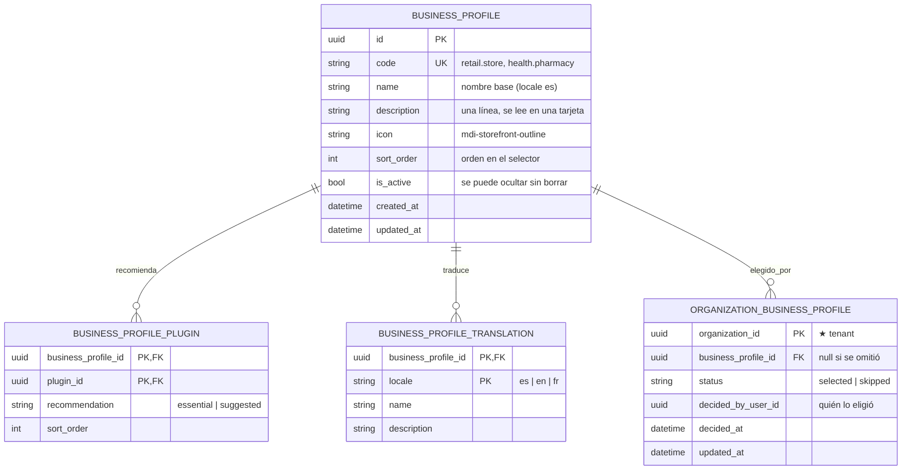

# Perfiles de negocio (recomendación de plugins)

> Análisis y diseño. Aquí no hay código: define entidades, contratos REST, eventos y el flujo de alta que hay que implementar.

## Responsabilidad

Un **perfil de negocio** es una agrupación curada de plugins: "una tienda usa
estos, una farmacia usa esos mismos más control de lotes". Existe para una sola
cosa: **que una organización recién creada no tenga que elegir entre 66 módulos
sin saber por dónde empezar**.

Es una **recomendación, no una restricción**. Elegir un perfil no limita nada:
el catálogo completo sigue disponible y cualquier plugin se puede activar o
desactivar después. Un perfil solo decide qué se propone y en qué orden.

## Dónde vive

En **plugin-catalog-service**, tanto el catálogo de perfiles como la elección de
cada organización.

Por qué ahí y no en organization-service, que es el dueño del "perfil fiscal" de
la empresa:

- La regla que hay que hacer cumplir es **"todo plugin de un perfil existe en el
  catálogo y es visible para la organización"**. Solo este servicio puede
  comprobarla sin salir a preguntar por HTTP.
- La pantalla de recomendaciones necesita, por cada plugin, su estado de
  construcción, su precio, sus dependencias transitivas y si la organización ya
  lo tiene activo. Todo eso ya vive aquí (`quote-activation` lo calcula hoy).
- La elección del perfil se consume en la misma pantalla que la produce. Nadie
  más la necesita para operar; quien quiera enterarse, escucha el evento.

Contra: alguien puede argumentar que "a qué se dedica la empresa" es dato de
organization-service. Si algún día el perfil pasa a decidir algo más que
recomendaciones (plan de precios, catálogo fiscal, plantillas), habrá que
moverlo. Mientras solo recomiende, aquí está más barato.

## Entidades dueñas (`plugin_catalog_db`)



### Claves del modelo

- **`code` es la identidad estable.** Igual que en `plugins`: la semilla, el
  frontend y los tests hablan por código (`health.pharmacy`), nunca por uuid.
- **Listas planas, sin herencia.** Farmacia **no** "extiende" tienda: repite los
  códigos que comparte y añade los suyos. Una jerarquía obliga a resolver el
  árbol en cada consulta y a decidir qué pasa cuando el padre cambia, a cambio
  de ahorrar unas filas en una semilla que se escribe una vez.
- **`recommendation`** separa lo que se marca solo (`essential`) de lo que se
  ofrece sin marcar (`suggested`). Es lo que decide el estado inicial de las
  casillas en la segunda pantalla.
- **Una organización, un perfil.** `organization_id` es clave primaria. Si algún
  día un negocio es dos cosas a la vez, la tabla se convierte en N a N sin tocar
  nada más.
- **`status = 'skipped'` se guarda.** Omitir es una decisión, no la ausencia de
  una: sin persistirla no hay forma de no volver a preguntar en cada arranque.
- **Traducciones con el mismo patrón que `plugin_translations`**: fila por
  `(perfil, locale)`, y si falta la fila se cae al texto base de la tabla
  principal. Ya hay resolución de locale con fallback en `application/localization.ts`.

## Catálogo inicial propuesto

Seis perfiles. Los códigos son los reales de `seed/plugins-dependencias.json`.
Marcados **E** los esenciales (casilla marcada) y **S** los sugeridos (casilla
sin marcar).

| Perfil | `code` | Esenciales | Sugeridos |
|---|---|---|---|
| Tienda / comercio | `retail.store` | `infra.catalog_products`, `crm.contacts`, `finance.electronic_invoicing`, `pos.core`, `pos.cash_sessions`, `pos.payment_methods` | `inventory.kardex`, `pos.discounts_promotions`, `inventory.reorder_alerts`, `bi.dashboards` |
| Farmacia | `health.pharmacy` | los seis de Tienda + `inventory.kardex`, `inventory.lot_tracking` | `inventory.reorder_alerts`, `inventory.suppliers`, `purchasing.purchase_orders`, `bi.dashboards` |
| Restaurante / cafetería | `food.restaurant` | `infra.catalog_products`, `finance.electronic_invoicing`, `pos.core`, `pos.cash_sessions`, `pos.payment_methods` | `pos.discounts_promotions`, `inventory.kardex`, `production.bom`, `hr.attendance` |
| Servicios profesionales | `services.professional` | `crm.contacts`, `finance.electronic_invoicing`, `crm.quotes`, `projects.tasks_kanban` | `projects.time_tracking`, `projects.project_billing`, `crm.leads_pipeline`, `comm.shared_documents` |
| Distribuidora / mayorista | `wholesale.distributor` | `infra.catalog_products`, `crm.contacts`, `finance.electronic_invoicing`, `inventory.warehouses`, `inventory.kardex` | `purchasing.purchase_orders`, `inventory.suppliers`, `inventory.warehouse_transfers`, `crm.quotes`, `finance.accounts_receivable_payable` |
| Otro / aún no lo sé | `general.other` | `infra.catalog_products`, `crm.contacts`, `finance.electronic_invoicing` | — |

Farmacia es literalmente Tienda más dos módulos de inventario. Ese es el caso
que el modelo tiene que soportar bien, y con listas planas se lee de un vistazo
en la semilla.

**Ojo con el estado de construcción.** De los 66 módulos vendibles solo 12 están
`disponible` hoy; el resto está `en_construccion`. Casi todos los sugeridos de
la tabla de arriba **todavía no se pueden activar**. La segunda pantalla tiene
que decirlo, no esconderlo (ver [Pantalla 2](#pantalla-2--recomendados)).

La semilla vive en `seed/perfiles-negocio.json` con la misma forma que la de
plugins, y un seeder por cada tabla, siguiendo lo que ya hay:
`seeders/*-seed-business-profiles.cjs` y `*-seed-business-profile-translations.cjs`.

## API REST

Mismo esquema que el resto del servicio: no valida JWT, confía en los headers
que inyecta el gateway (`X-User-Id`, `X-Organization-Id`, `X-Permissions`) y el
aislamiento por tenant se aplica siempre en el repositorio.

| Método | Ruta | Permiso | Descripción |
|---|---|---|---|
| GET | `/business-profiles` | — (público) | Perfiles activos, localizados. Sin datos de organización. |
| GET | `/organizations/me/business-profile` | — (miembro) | El elegido: `{ profile, status, decidedAt }` o `{ status: "pending" }`. |
| PUT | `/organizations/me/business-profile` | `plugins:manage` | Elegir (`{ "code": "health.pharmacy" }`) u omitir (`{ "code": null }`). Idempotente. |
| GET | `/organizations/me/business-profiles/:code/recommendations` | — (miembro) | Los plugins del perfil **con el estado de esta organización**. |
| POST | `/organizations/me/plugins/activate` | `plugins:manage` | Activación en lote, tolerante a fallos parciales. |

`GET /organizations/me/business-profiles/:code/recommendations` es la consulta
que alimenta la segunda pantalla. Por cada plugin devuelve lo que la pantalla
necesita para pintarse sin más llamadas:

```json
{
  "profile": { "code": "health.pharmacy", "name": "Farmacia" },
  "items": [
    {
      "plugin": { "code": "pos.core", "name": "Punto de venta", "category": "Punto de Venta",
                  "buildStatus": "disponible", "priceCents": 0, "currency": "USD" },
      "recommendation": "essential",
      "state": "activatable",
      "alreadyActive": false,
      "requires": [{ "code": "infra.catalog_products", "alreadyActive": true }]
    },
    {
      "plugin": { "code": "inventory.lot_tracking", "name": "Control de lotes y caducidad",
                  "buildStatus": "en_construccion", "priceCents": 0, "currency": "USD" },
      "recommendation": "essential",
      "state": "coming_soon",
      "alreadyActive": false,
      "requires": []
    }
  ],
  "totalMonthlyCents": 0
}
```

`state` resume en una palabra lo que la interfaz tiene que hacer con cada fila:

| `state` | Qué significa | Cómo se pinta |
|---|---|---|
| `activatable` | Disponible y no activo | Casilla marcable (marcada si es esencial) |
| `already_active` | La organización ya lo tiene | Fila en gris con "ya activo", sin casilla |
| `coming_soon` | `en_construccion` o `descontinuado` | Fila informativa, sin casilla |
| `blocked` | Le falta una dependencia que no se auto-activa | Casilla deshabilitada + qué le falta |

### Activación en lote

`POST /organizations/me/plugins/activate` con `{ "codes": ["pos.core", "crm.contacts"] }`.

La activación de hoy es de uno en uno y **lanza excepción** ante lo ya activo o
las dependencias que faltan. Para esta pantalla eso no sirve: si el usuario
marca ocho módulos y el tercero falla, los cinco siguientes no se pueden perder.

Reglas:

- Cada código se procesa **de forma independiente**, reutilizando el caso de uso
  `ActivatePluginUseCase` (con su transacción y su resolución de dependencias
  transitivas). Un fallo no aborta el lote.
- La respuesta es una lista de resultados, uno por código pedido:
  `activated` | `already_active` | `not_available` | `missing_dependencies` | `not_found`.
- **Nunca es un error global.** Devuelve `200` con el detalle aunque todos hayan
  fallado; la pantalla enseña qué entró y qué no.
- Cada activación emite su `plugin.activated` como hoy, incluidas las que entran
  arrastradas por dependencia. La bitácora de auditoría no necesita nada nuevo.

Este endpoint no es exclusivo del alta: la vista de módulos puede usarlo igual.

## Eventos

Uno nuevo, publicado por outbox como todos los demás:

| Routing key | Cuándo | Payload |
|---|---|---|
| `plugin.business_profile.selected` | Al elegir u omitir un perfil | `{ organizationId, profileCode, status, decidedByUserId, source }` |

- `status`: `selected` \| `skipped`. `profileCode` es `null` cuando se omite.
- `source`: `onboarding` \| `settings`. Distingue la elección del alta de un
  cambio posterior, que es justo lo que se querrá medir.
- Se consume solo por auditoría de momento. Hay que añadir la clave i18n
  `audit.event.plugin_business_profile_selected` en los tres idiomas, o la
  bitácora se cae al `summary` en inglés crudo del servidor.

Los `plugin.activated` que dispara la pantalla ya existen y ya se auditan.

## Autorización

- **Leer** perfiles y recomendaciones: cualquier miembro de la organización. Son
  datos de catálogo, no hay nada sensible.
- **Elegir perfil** y **activar en lote**: `plugins:manage`, el mismo permiso que
  ya protege activar y desactivar. El fundador lo tiene por su rol de
  Administrador, así que en el alta nunca falta.
- Si un usuario llega al alta **sin** `plugins:manage` (caso raro: un invitado
  que hereda una organización a medio configurar), el paso **se salta entero**.
  No se enseña una pantalla que no va a poder guardar.

## Flujo de alta

Los dos pasos nuevos se enganchan al final de la cadena que ya existe:

```
registro → bienvenida (/profile) → organización (/organization/settings)
        → perfil de negocio (/onboarding/perfil)
        → recomendados (/onboarding/recomendados)
        → inicio (/) → tour de la aplicación
```

Quien encadena es cada vista al guardar, **no un guard del router**:

- Hoy `OrganizationSettingsView.submit()` empuja a `home` cuando cierra el alta.
  Pasa a empujar a `business-profile` si la organización aún no ha decidido
  perfil, y a `home` si ya lo hizo.
- Un guard obligaría a decidir en cada navegación, y este paso es **omitible**
  por definición. Con la cadena en las vistas, quien recarga a media pantalla
  simplemente se queda donde estaba y puede seguir a mano.
- El precio de esto: si alguien abandona entre la organización y el perfil, no
  se le vuelve a preguntar sola. Lo recupera desde la vista de módulos, que
  enseña un aviso mientras el estado sea `pending`.

El frontend necesita saber el estado sin pedirlo en cada navegación. Se carga
una vez por sesión en el store de plugins, junto a `ensureMyLoaded()`, que ya
hace exactamente eso con los plugins activos.

### Pantalla 1 — perfil

Ruta `/onboarding/perfil`, nombre `business-profile`.

- Encabezado corto: "¿A qué se dedica tu negocio?" y una línea explicando que
  solo sirve para sugerir módulos y que se puede cambiar cuando quiera.
- Una tarjeta por perfil con icono, nombre y la descripción de una línea.
  Seleccionar una tarjeta continúa; no hace falta un botón aparte.
- Botón **Omitir** discreto al pie: hace `PUT` con `code: null` y va a inicio.

### Pantalla 2 — recomendados

Ruta `/onboarding/recomendados`, nombre `business-profile-plugins`.

- Título con el perfil elegido y un enlace para volver a la pantalla anterior.
- Lista agrupada por categoría. Los esenciales marcados, los sugeridos sin
  marcar, los `coming_soon` en una sección aparte ("Llegarán pronto") que no se
  puede marcar. Esconderlos sería peor: hoy son la mayoría de la tabla y el
  usuario que eligió Farmacia esperaría ver control de lotes en alguna parte.
- Cuando un plugin arrastra dependencias, se dice en la propia fila ("activa
  también Catálogo de productos"). Ese dato ya lo da `requires`.
- Dos acciones: **Activar seleccionados** (llama al lote y va a inicio) y
  **Omitir** (va a inicio sin activar nada). Omitir no cambia el perfil elegido:
  la elección ya se guardó en la pantalla anterior.
- El resultado del lote se enseña al llegar a inicio, en una alerta con el
  recuento: cuántos entraron y cuáles no, con su motivo.

### Después del alta

La vista de módulos (`/plugins`) gana una franja superior con el perfil actual y
un enlace a "cambiar perfil", que reabre la pantalla 1 con `source: settings`.
Es la única entrada al flujo una vez pasada el alta, y la red de seguridad para
quien lo omitió.

### Tour

**No se añade un tour nuevo.** Las dos pantallas se explican solas con su propio
encabezado, y el sistema de interfaz ya tiene el patrón de ayuda por campo
(`FieldHelp`) para el detalle. El tour de la aplicación sigue arrancando al
llegar a inicio, exactamente como hoy.

## i18n

- **Nombres y descripciones de perfiles**: en base de datos
  (`business_profile_translations`), como los plugins. Son datos, no interfaz:
  un perfil nuevo no puede exigir desplegar el frontend.
- **Textos de las dos pantallas**: en `src/i18n/{es,en,fr}.json` bajo
  `onboarding.businessProfile.*`.
- **Evento de auditoría**: `audit.event.plugin_business_profile_selected`.

## Qué no hace

- **No restringe.** Un perfil nunca oculta plugins del catálogo ni impide
  activar algo fuera de su lista.
- **No cobra.** El lote no pasa por ninguna pasarela: hoy activar no cobra
  (`quote` calcula un mensual informativo y nadie lo cobra todavía). Si mañana
  se cobra, el lote tendrá que pedir confirmación del total antes de activar.
- **No adivina.** No hay heurística por RUC, país ni tamaño: el usuario elige.

## Decisiones abiertas

1. **Perfiles definitivos.** Los seis de arriba son una propuesta razonada, no
   una lista cerrada. Conviene revisarla con quien conozca la cartera real.
2. **Perfil obligatorio u omitible.** Este diseño lo hace omitible, coherente
   con el botón de omitir que se pidió. Si se quiere obligatorio, se convierte
   en un guard del router como el de organización, y `skipped` desaparece.
3. **Qué pasa al cambiar de perfil.** Aquí, cambiarlo solo cambia lo que se
   recomienda: no desactiva nada de lo ya activo. La alternativa (ofrecer
   desactivar lo que sobra) es un flujo destructivo y merece su propia decisión.

## Evolución

- **N perfiles por organización**, si aparece el negocio que es dos cosas.
- **Perfiles por país**, si la recomendación cambia entre Ecuador y el siguiente
  país: se filtra por `country_code` igual que el catálogo fiscal.
- **Peso o motivo por recomendación** ("porque vendes en mostrador"), para
  explicar en la pantalla por qué se sugiere cada cosa.

## Dependencias

- **plugin-catalog-service**: dueño de todo lo de este documento.
- **api-gateway**: enrutar las rutas nuevas al servicio, igual que las de
  plugins. `/business-profiles` es la primera ruta pública sin organización
  aparte del catálogo público, que ya existe.
- **audit-log-service**: nada que implementar, consume `#`. Solo falta la
  traducción del evento nuevo.
