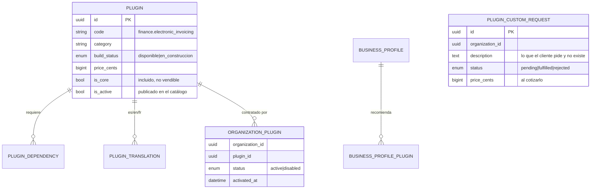

# plugin-catalog-service

[← Volver al índice](../README.md) · [perfiles de negocio](./perfiles-de-negocio.md) · [api-gateway](./api-gateway.md) · [autorización](../arquitectura/autorizacion.md)

> **Estado: construido y desplegado (2026-09).** La recomendación por tipo de negocio está documentada aparte en [perfiles de negocio](./perfiles-de-negocio.md); aquí está el catálogo y la activación.

## Responsabilidad

**Qué módulos existen, cuáles tiene contratados cada organización y cuánto cuesta activar uno.** Es el servicio que decide si una ruta del CRM está disponible: el [api-gateway](./api-gateway.md) consulta los plugins activos y devuelve 403 si la organización no tiene el que esa ruta exige.

## El catálogo

Se siembra desde `seed/plugins-dependencias.json` mediante una **migración idempotente** (no un seeder: las semillas se ejecutan una vez, no en cada despliegue). Hoy: **5 piezas de infraestructura** y **66 módulos**.

Dos clases de entrada:

- **Núcleo (`is_core`)** — `infra.gateway`, `infra.tax_catalog`, `admin.users_roles`, `admin.multitenant`, `admin.permissions`. No son vendibles: se muestran como "incluido" y existen para que nadie los publique como plugin por error.
- **Módulos** — lo vendible, por familias: `crm.*` (contactos, pipeline, tickets, cotizaciones, portal…), `finance.*` (facturación electrónica, certificado, multimoneda, cuentas por cobrar, contabilidad…), `inventory.*`, `org.*`, `admin.*`, `infra.catalog_products`.

Cada plugin lleva `build_status` (`disponible` / `en_construccion`), precio en centavos, dependencias y traducciones. La semilla **no pisa** `price_cents`, `is_active` ni `image_url`: eso lo administra el negocio, no el código.

## Entidades (`plugin_catalog_db`)

Más `business_profiles` y sus tablas de recomendación y traducción (ver [perfiles de negocio](./perfiles-de-negocio.md)).

## Dependencias y cotización

Un plugin puede depender de otros. `POST /organizations/me/plugins/:code/quote` devuelve **lo que costaría activarlo de verdad**: el precio del plugin más el de cada dependencia que aún no esté activa. Las que ya están activas no se cobran dos veces, y las de núcleo nunca suman.

Activar arrastra las dependencias: no se puede tener facturación electrónica sin el catálogo de productos.

## API REST

| Método | Ruta | Nota |
|--------|------|------|
| GET | `/plugins` | catálogo público |
| GET | `/business-profiles` | público |
| GET | `/organizations/me/plugins` · `/catalog` | lo contratado y el catálogo con su estado |
| POST | `/organizations/me/plugins/:code/quote` | cotización con dependencias |
| POST | `/organizations/me/plugins/:code/activate` · `/deactivate` | |
| POST | `/organizations/me/plugins/activate` | activación en lote (alta) |
| GET/POST | `/organizations/me/plugin-requests` | pedir un módulo que no existe |
| POST | `/admin/plugin-requests/:id/fulfill` · `/reject` | lo atiende el administrador de la plataforma |
| GET | `/organizations/me/business-profiles/:code/recommendations` | ver [perfiles de negocio](./perfiles-de-negocio.md) |

## Eventos

**Publica:** `plugin.business_profile.selected`, `plugin.custom_request.created`, `plugin.custom_request.fulfilled`, `plugin.custom_request.rejected`.

Los servicios que necesitan saber qué está contratado (por ejemplo [inventory-service](./inventory-service.md)) mantienen su propia réplica de `organization_plugins` a partir de estos eventos, en vez de preguntar en caliente.

## Dónde se nota en el resto del sistema

- **api-gateway**: cada ruta declara `requiresPlugin`. `/invoices/*` exige `finance.electronic_invoicing`, `/certificates/*` exige `finance.electronic_certificate`, `/stock/*` exige `inventory.kardex`, `/customers/*` exige `crm.contacts`.
- **notification-service**: cada proveedor de notificación declara su `pluginCode`, así que un usuario solo ve las preferencias de lo que su organización tiene.
- **Alta de organización**: el perfil de negocio elegido preselecciona los plugins recomendados.
