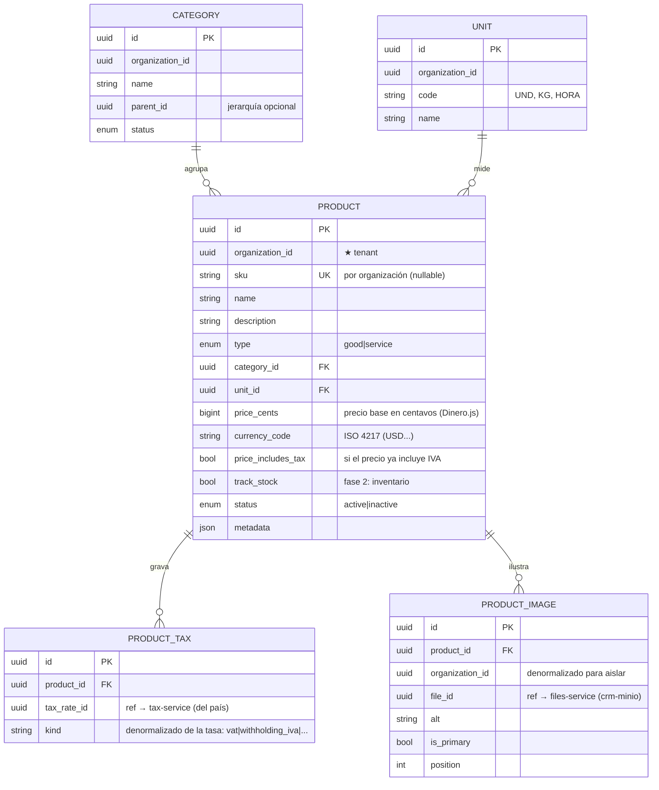

# product-service

[← Volver al índice](../README.md) · [customer-service](./customer-service.md) · [tax-service](./tax-service.md) · [billing-service](./billing-service.md)

> [!info] Estado (2026-07-06)
> **Re-especificado (v2)** — el servicio se reconstruye desde cero con los contratos de `backend/product-service/` (`IMPLEMENTATION.md` + `openapi.yaml` + `asyncapi.yaml`). Cambios v2 respecto al primer build: **precios en centavos (BIGINT) con Dinero.js**, **imágenes de producto** (referencias URL con principal + default server-side). Puerto **3006**, BD **`product_db`**.
> - ✅ **Al 2026-09-14** el `OutboxRelay` ya está cableado y los permisos `product:*` existen. Tablas reales: `products`, `categories`, `units`, `product_taxes`, `product_images`, `product_establishments`, `tax_rates`.
> - El **SKU del producto** es lo que viaja como `productCode` en `billing.invoice.issued` y acaba en el `codigoPrincipal` del XML del SRI (máx. 25 caracteres). Ver [facturación electrónica](../facturacion-electronica/flujo-end-to-end.md).
> - `product.product.*` dispara `catalog.changed` por el socket del gateway; el POS y el frontend hacen un pull autenticado (el catálogo nunca viaja por el socket).

## Responsabilidad

Dueño del **catálogo de productos** y servicios de cada organización: productos, **categorías**, **unidades de medida**, la **asignación de impuestos** (M:N con el catálogo del país) y las **imágenes** del producto. Particionado por `organization_id`.

## Convención de dinero (aplica a todo el sistema)

- **Montos** se almacenan como **enteros en la unidad mínima** de la moneda (centavos) en columnas `BIGINT`, junto a su `currency_code` (ISO 4217). La aritmética en la app usa **Dinero.js v2** (VO `Money` en el dominio). Nunca `FLOAT`/`DECIMAL` para montos.
- **Tasas/porcentajes** (ej. IVA 15.00) se almacenan como `DECIMAL` — son fracciones, no dinero.
- El API recibe/devuelve el monto en unidad principal como **string** (`"19.99"`) y además expone el entero (`priceCents: 1999`) para consumidores que calculan (billing).

Razón: los floats IEEE-754 no representan decimales exactos; los enteros + Dinero.js dan cálculo exacto, `allocate()` para distribuir sin perder centavos, y BigInt para agregaciones de reportería. Es el patrón de Stripe/Modern Treasury.

## Entidades dueñas (`product_db`)

Read-model local: `tax_rates` (alimentado por `tax.tax_rate.upserted`) + `outbox_messages` + `processed_events`.

## La pieza clave: asignación de impuestos por país (M:N)

Cada producto se asocia a **una o más** tasas (`PRODUCT_TAX → tax_rate_id`) del catálogo de [tax-service](./tax-service.md) **del país de la organización** (ej. IVA + retención). El servicio valida contra su **read-model** local que la tasa exista y pertenezca al país correcto — sin llamar a tax-service. El `kind` **no lo envía el cliente**: se copia de la tasa al asignarla. El set se gestiona con `PUT /products/:id/taxes` (reemplazo completo).

## Imágenes (v2)

- Se guardan **referencias al files-service** (`file_id`) — crm-minio gestiona la subida (presigned), el almacenamiento y la descarga; product **no** toca MinIO ni recibe binarios. Mismo patrón que la foto de perfil (`auth.users.avatar_file_id`).
- Flujo: el front sube al files-service (`POST /files/presigned` con `resourceType: product`, `category: product-image`) → obtiene `fileId` → lo registra aquí (`POST /products/:id/images { fileId }`).
- Varias imágenes por producto, con **una principal** (`is_primary`) y `position` de orden.
- Invariantes: la **primera** imagen se vuelve principal automáticamente; al borrar la principal se **promueve** la siguiente por `position`; `PUT .../images/:id/primary` la cambia.
- La respuesta expone `imageFileId` (de la principal, o `null`) e `images[].fileId`. **El front arma la URL** con el files-service (igual que los avatares); product no devuelve URLs.

## Relación con facturación

[billing-service](./billing-service.md) referencia productos por `product_id` y **congela snapshots** al emitir (nombre, `price_cents`, `currency_code`, `price_includes_tax`, set de impuestos). El payload de `product.product.*` lleva todo eso para que billing no consulte nada. Si cambia el precio/impuesto, solo se actualizan **borradores**; lo emitido es inmutable.

## API REST (resumen — contrato completo en `backend/product-service/openapi.yaml`)

| Método | Ruta | Permiso |
|--------|------|---------|
| GET | `/products?search=&status=&type=&categoryId=` | `product:read` |
| GET | `/products/:id` | `product:read` |
| POST | `/products` (acepta `taxRateIds[]` embebido) | `product:create` |
| PATCH | `/products/:id` | `product:update` |
| PUT | `/products/:id/taxes` (reemplaza el set) | `product:update` |
| POST | `/products/:id/disable` (baja lógica) | `product:update` |
| GET/POST | `/products/:id/images` · DELETE `/products/:id/images/:imageId` · PUT `.../:imageId/primary` | `product:read` / `product:update` |
| GET/POST | `/categories` · PATCH/DELETE `/categories/:id` | `product:read` / `product:create` / `product:update` / `product:delete` |
| GET/POST | `/units` · PATCH `/units/:id` | `product:read` / `product:create` / `product:update` |
| GET | `/tax-rates` (read-model, para el selector del front) | `product:read` |

Todas filtran por `organization_id` del contexto (gateway); cross-org → `404`. El precio entra como string (`price: "19.99"` + `currencyCode`) y sale dual (`price` + `priceCents`).

## Eventos

**Publica** (payload con `priceCents`, `currencyCode`, `priceIncludesTax`, `taxes[]`, `imageUrl` — snapshot completo):

| Evento | Cuándo | Consumido por |
|--------|--------|---------------|
| `product.product.created` | Nuevo producto | [realtime](./realtime-service.md) |
| `product.product.updated` | Cambio de datos/precio/impuestos/imagen principal | [billing](./billing-service.md) (borradores), realtime |
| `product.product.disabled` | Baja | [billing](./billing-service.md) |

**Consume:**

| Evento | Origen | Acción |
|--------|--------|--------|
| `tax.tax_rate.upserted` | [tax](./tax-service.md) | Upsert en el read-model local `tax_rates` |
| `billing.invoice.issued` | [billing](./billing-service.md) | (fase 2) descuenta stock si `track_stock` |

## Dependencias

- **tax-service**: validar tasas por país (vía read-model).
- Lo consumen [billing](./billing-service.md) y [realtime](./realtime-service.md).

## Validaciones (ver [validación](../arquitectura/validacion.md))

- **Borde (Zod)**: `price` string decimal válido, `type` ∈ {good, service}, `sku` formato, `url` de imagen URI válida.
- **Dominio**:
  - `Money.fromDecimalString` valida monto y moneda soportada (`InvalidMoneyAmountError` / `InvalidCurrencyError`).
  - `tax_rate_id` existe y pertenece al **país de la organización**.
  - `sku` único por organización; `unit.code` único por organización.
  - Un producto `service` no controla stock.
  - Imagen: referencia obligatoria; invariantes de principal (primera/promoción).

## Notas

- `price_includes_tax` define si el precio capturado ya trae IVA (retail) o no; billing lo usa para calcular base e impuesto.
- `track_stock` conecta con el futuro `inventory-service` (fase 2).
- Listas de precios por cliente/moneda → `pricing-service` en fase 2; aquí queda el precio base.
- Paginación de listados: pendiente de definir globalmente (aplicará a todos los servicios a la vez).
