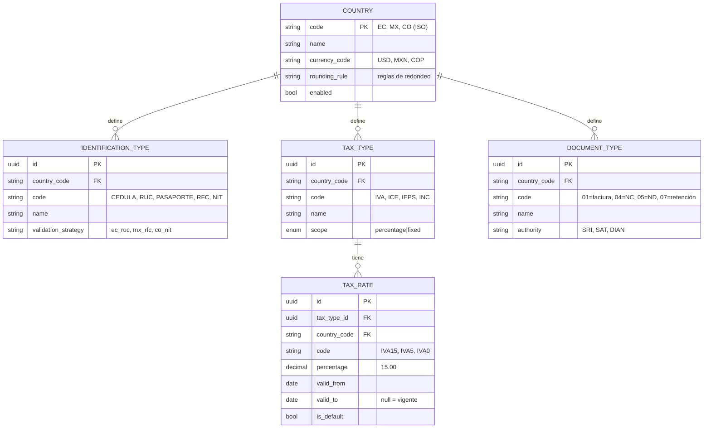
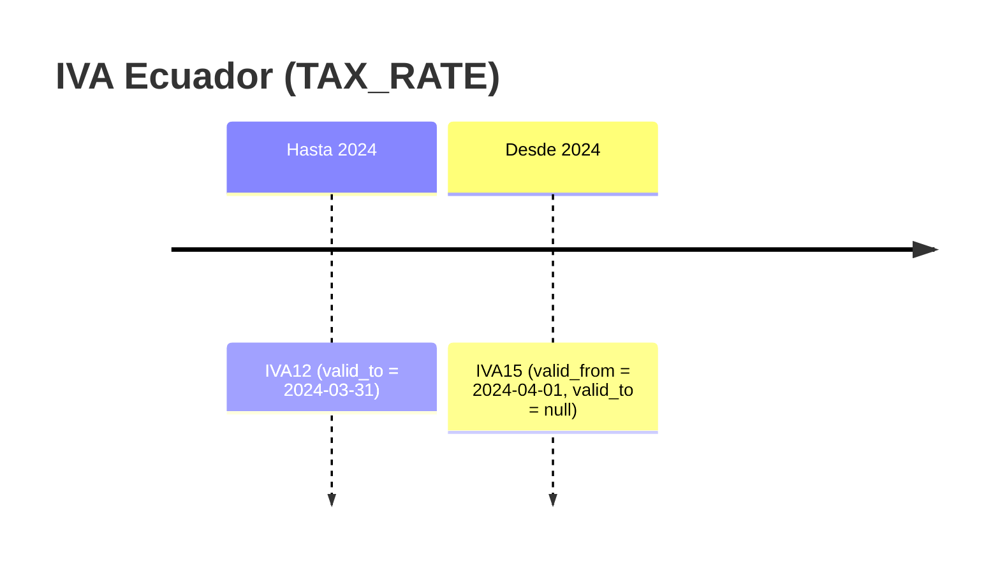
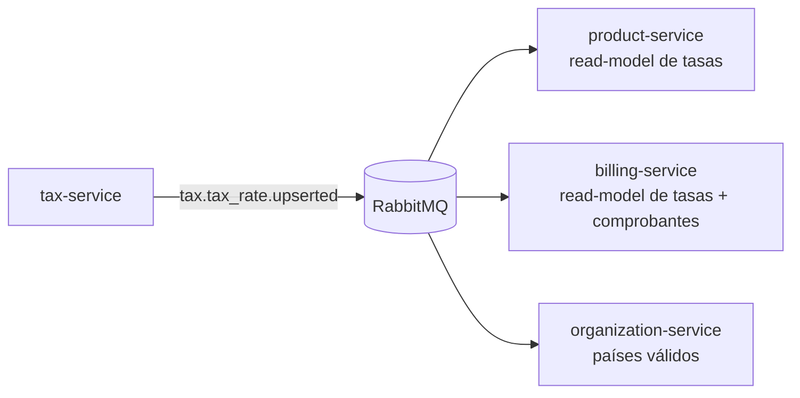
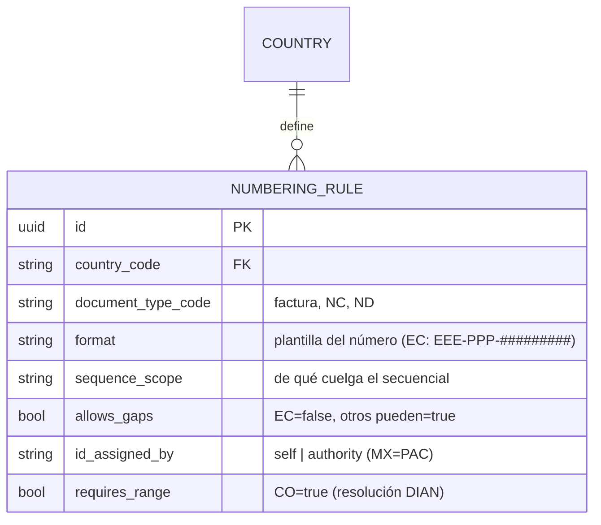

# tax-service

[← Volver al índice](../README.md) · [organization-service](./organization-service.md) · [product-service](./product-service.md) · [billing-service](./billing-service.md) · [estrategia multipaís](../arquitectura/estrategia-multipais.md)

> **Actualización (multipaís):** este catálogo es el que hace que *"agregar un país = insertar filas"*. Además de impuestos e identificaciones, gobierna por `country_code` la **moneda**, el **redondeo** y las **reglas de numeración** que la `NumberingStrategy` de [billing](./billing-service.md) consume. Fuente: [estrategia multipaís](../arquitectura/estrategia-multipais.md).

> [!info] Estado de implementación (2026-07-06)
> **Implementado** en `backend/tax-service`. La forma **real actual** difiere del diseño aspiracional de más abajo — al construir contra este servicio, usa lo siguiente:
> - **Entidades reales**: `countries` (`code, name, currency_code, decimals, enabled`), `tax_rates`, `identification_types`, `document_types`. **No** hay tabla `TAX_TYPE` separada ni `NUMBERING_RULE`.
> - **`tax_rates` real**: `{ id, country_code, code, name, percentage, kind, is_default }`, con `kind ∈ vat | withholding_iva | withholding_rent | special`. **Aún no** implementa `valid_from`/`valid_to` (versionado temporal) ni `tax_type_id`; eso es **diseño futuro** (ver más abajo).
> - **Eventos** `.upserted` (tabla de la sección [Eventos](#eventos)).
> - ✅ **Corregido el 2026-09-14:** el `OutboxRelay` **ya está cableado** en `main.ts`, igual que en el resto de servicios que publican (todos menos notification, audit y assistant, que solo consumen). Los eventos **sí se publican** al broker. El evento real de tarifas es **`tax.tax_rate.upserted`**.
> - Tablas reales confirmadas el 2026-09-14: `countries`, `tax_rates`, `identification_types`, `document_types`, `outbox_messages`. Sigue sin `TAX_TYPE` ni versionado temporal.
> - ⚠️ Los ids de `identification_types` de tax-service **no coinciden** con los de customer-service. Por eso lo que viaja entre servicios es el **código** (`04` RUC, `05` cédula, `06` pasaporte, `07` consumidor final), nunca el id. Ver [facturación electrónica](../facturacion-electronica/historial-hallazgos.md).

## Responsabilidad

Dueño de los **catálogos fiscales por país**: países, **tipos de identificación**, **tipos de impuesto y tasas (IVA)**, y **tipos de comprobante**. Es la respuesta a *"no todos los países usan la misma tabla de IVA"*.

> **Importante:** estos datos se particionan por **`country_code`**, NO por `organization_id`. Son **datos de plataforma compartidos** entre todas las organizaciones del mismo país. Ver [multiorganizacional](../arquitectura/multiorganizacional.md#eje-2--multipaís-configuración-fiscal).

## Entidades dueñas (`tax_db`)

> El ERD siguiente es el **diseño objetivo** (incluye `TAX_TYPE` y el versionado temporal de tasas). La implementación actual es más plana — ver el callout de *Estado de implementación* arriba.

## Qué cambia entre países (ejemplos cargados)

### Tasas de IVA (`TAX_RATE`)

| País | Tasas vigentes |
|------|----------------|
| Ecuador (EC) | 15%, 5%, 0% |
| México (MX) | 16%, 8%, 0% |
| Colombia (CO) | 19%, 5%, 0% |

### Tipos de identificación (`IDENTIFICATION_TYPE`)

| País | Tipos |
|------|-------|
| EC | Cédula, RUC, Pasaporte |
| MX | RFC |
| CO | NIT, Cédula de Ciudadanía |

### Tipos de comprobante (`DOCUMENT_TYPE`)

| País | Comprobantes |
|------|--------------|
| EC | Factura (01), Nota de Crédito (04), Nota de Débito (05), Comprobante de Retención (07), Guía de Remisión (06) |
| MX | CFDI: Ingreso, Egreso, Traslado, Nómina, Pago |
| CO | Factura electrónica, Nota Crédito, Nota Débito |

### Impuestos adicionales por país (`TAX_TYPE`)

| País | Adicionales a IVA |
|------|-------------------|
| EC | ICE, IRBPNR |
| MX | IEPS |
| CO | INC |

## Vigencia temporal de las tasas

Las tasas tienen `valid_from` / `valid_to`. Esto es **crítico**: cuando el IVA de Ecuador cambió de 12% a 15%, ambas tasas deben coexistir en la tabla con sus fechas. Así:

- Las facturas **nuevas** usan la tasa vigente hoy.
- Las facturas **antiguas** conservan su tasa (snapshot, ver [billing-service](./billing-service.md)).
- Los reportes históricos siguen cuadrando.

## Cómo lo consumen los demás servicios

Este servicio es mayormente de **lectura**. Los demás mantienen un **read-model local** de los catálogos (alimentado por eventos) para no depender de él en caliente:

- [product-service](./product-service.md): asigna a cada producto un `taxRateId` **del catálogo del país**.
- [billing-service](./billing-service.md): al emitir, resuelve la tasa vigente y la **congela** en la línea; usa los `DOCUMENT_TYPE` del país para el formato del comprobante.
- [organization-service](./organization-service.md): valida que el `country_code` exista al crear establecimientos.

## API REST (resumen)

Mayormente lectura (catálogos); la escritura es de **administración de plataforma**.

| Método | Ruta | Acceso |
|--------|------|--------|
| GET | `/countries` | autenticado |
| GET | `/countries/:code/tax-rates?validOn=YYYY-MM-DD` | autenticado |
| GET | `/countries/:code/identification-types` | autenticado |
| GET | `/countries/:code/document-types` | autenticado |
| POST | `/countries/:code/tax-rates` | platform admin |
| PATCH | `/tax-rates/:id` | platform admin |

## Eventos

**Publica:**

| Evento | Cuándo | Consumido por |
|--------|--------|---------------|
| `tax.country.enabled` | Se habilita un país | [organization](./organization-service.md) |
| `tax.country.updated` | Cambio en datos del país | [organization](./organization-service.md) |
| `tax.tax_rate.upserted` | Alta o cambio de una tasa | [product](./product-service.md), [billing](./billing-service.md) |
| `tax.identification_type.upserted` | Alta o cambio de tipo de ID | [customer](./customer-service.md) |
| `tax.document_type.upserted` | Alta o cambio de comprobante | [billing](./billing-service.md) |

> **Convención de nombres (implementación real):** los eventos de catálogo usan el sufijo **`.upserted`** (un solo evento cubre alta y edición), no `.created`/`.updated`. El `OutboxRelay` publica el id del evento en `headers.eventId` (idempotencia aguas abajo). Exchange `crm.events` (topic, durable).

**Consume:** prácticamente nada (es un servicio de referencia, "aguas arriba").

## Dependencias

- Ninguna hacia otros servicios de negocio (es un catálogo base). Los demás dependen de él.

## Validaciones (ver [validación](../arquitectura/validacion.md))

- **Borde (Zod)**: `country_code` ISO, porcentajes en rango, fechas coherentes (`valid_from < valid_to`).
- **Dominio**: no solapar dos tasas "default" vigentes para el mismo tipo de impuesto; `validation_strategy` debe existir.
- **Estrategias de validación de ID por país** (`ec_ruc`, `mx_rfc`, `co_nit`): se definen aquí como referencia y se usan en el dominio de otros servicios para validar identificaciones (ver [customer-service](./customer-service.md)).

## Evolución multipaís

Para sostener la [estrategia multipaís](../arquitectura/estrategia-multipais.md), el catálogo absorbe **todo lo que es dato** (el ~80% de soportar un país), dejando como código solo numeración e integración.

- **Moneda y redondeo** ya viven en `COUNTRY` (`currency_code`, `rounding_rule`). Son la base de la consolidación multipaís: [billing](./billing-service.md) guarda la moneda local + `exchange_rate` al emitir.
- **Reglas de numeración como dato** — nueva entidad `NUMBERING_RULE` por `(country_code, document_type)` que parametriza la `NumberingStrategy` sin tocar código:

| País | `format` | `sequence_scope` | `allows_gaps` | `id_assigned_by` | `requires_range` |
|------|----------|------------------|---------------|------------------|------------------|
| EC | `EEE-PPP-#########` | establecimiento+punto+tipo | no | self | no |
| PE | `serie-correlativo` | serie+tipo | sí | self | no |
| CO | `prefijo+consecutivo` | prefijo/resolución | sí | self | sí |
| MX | serie+folio interno | — | sí | authority (PAC) | no |

- **`DOCUMENT_TYPE` ya pertenece al país**: define qué comprobantes existen y, junto a `NUMBERING_RULE`, cómo se numeran.
- **Límite del catálogo**: lo que **no** se puede expresar como dato (firma, formato XML/UBL/CFDI, diálogo con la autoridad) vive en el adaptador (`FiscalAuthorityPort`) de [billing](./billing-service.md), no aquí.

## Notas

- Este servicio es lo que hace **viable** el multipaís sin condicionales esparcidos: añadir un país = cargar sus catálogos aquí, sin tocar el resto del sistema.
- Las **reglas de redondeo** por país (`COUNTRY.rounding_rule`) las consume billing al calcular totales.
- A futuro puede incorporar **actividades económicas**, **regímenes tributarios** y **catálogos SAT/SRI** completos si la integración fiscal lo requiere.
